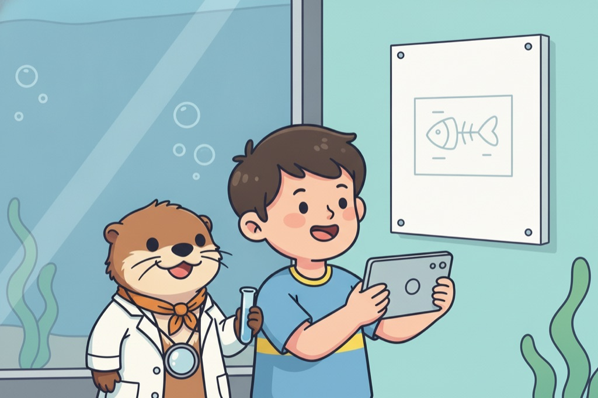
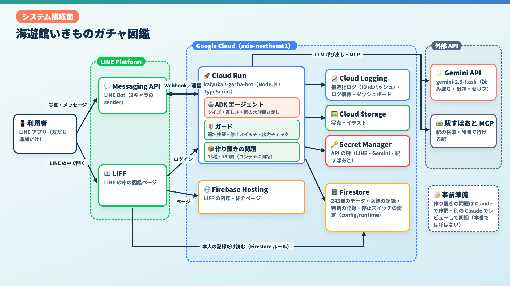

# 海遊館いきものガチャ図鑑 — 博士と助教授のひみつ研究室

水族館の**解説パネルを撮る**と、海遊館の243種から生きものを特定して LINE の図鑑に登録し、カワウソ助教授とジンベエ名誉教授の掛け合いで、仲間の生きものやクイズへ案内する LINE Bot × LIFF です。Google Cloud Japan AI Hackathon Vol.5 の提出作品（チーム「水族館。」）のアプリ本体を公開しています。

> **注意**: 海遊館の公式な作品ではありません。海遊館の公式サイトで公開されている情報をもとにした試作（PoC）です。詳しくは[データとクレジット](#データとクレジット)を参照してください。

<p align="center">
  
  
</p>

| | |
| --- | --- |
| 紹介動画（約3分） | https://youtu.be/ohgs53FnA78 |
| LINE なしで図鑑を見る（デモ） | https://kaiyukan-gacha-hackathon.web.app/zukan.html?demo=1 |
| 紹介ページ | https://kaiyukan-gacha-hackathon.web.app/ |
| 作品紹介の記事（Zenn） | https://zenn.dev/4geru/articles/ikimono-gacha-zukan-submission |

## 目次

1. [対象ユーザー](#対象ユーザー)
2. [何ができるか](#何ができるか)
3. [なぜ解説パネルを撮るのか](#なぜ解説パネルを撮るのか)
4. [試してみる](#試してみる)
5. [アーキテクチャと使っている技術](#アーキテクチャと使っている技術)
6. [エージェントの設計](#エージェントの設計)
7. [実測値](#実測値)
8. [ディレクトリ構成](#ディレクトリ構成)
9. [ローカルでの動かし方とデプロイ](#ローカルでの動かし方とデプロイ)
10. [データとクレジット](#データとクレジット)
11. [現状の制約と、これから](#現状の制約とこれから)
12. [関連記事・ライセンス](#関連記事ライセンス)

## 対象ユーザー

| だれ | 困りごと | このアプリでできること |
| --- | --- | --- |
| **水族館へ行く親子** | 解説パネルは文字が多く、子どもは読む前に次の水槽へ行ってしまう。はじめて見た生きものを残したい、遊びながら覚えたい | パネルを撮るだけで図鑑に登録され、ガチャとキャラクターの掛け合いで楽しく残せる。クイズはレベル1（ちびっこ）から選べ、まちがえても答えを言わずにヒントで導く |
| **水族館に詳しくなりたい人**（作者自身もここ） | 何度も通っていても、見た生きもののことは意外と覚えていない。旅先でも水族館を探したい | 見つけた生きものが図鑑にたまり、あとから見返せる。同じ水槽・同じ科の仲間をたどって次の水槽へ。クイズはレベル5（お魚博士）まで上がる。駅から行ける水族館も聞ける |

## 何ができるか

LINE の公式アカウント「博士と助教授のひみつ研究室」と、LINE の中で開く図鑑ページ（LIFF）です。アプリのインストールは要りません。

<p>
  
  
  
  
</p>

| 機能 | 内容 |
| --- | --- |
| 解説パネルを撮る | パネルの写真を送ると Gemini が名前を読み取り、海遊館の243種と照らし合わせて候補を返す。選ぶと図鑑に登録され、ガチャ演出とキャラクターの反応が届く |
| 名前・水槽名で探す | 「ジンベエ」のような生きものの名前や「太平洋」のような水槽の名前を文字で送ると、部分一致で探す（ひらがな・半角カナ・濁点のゆれも吸収）。写真に水槽の看板だけが写っていれば、その水槽の生きものを返す |
| 仲間をたどる | 同じ水槽にいる生きもの（すいそうの仲間）、同じ科の生きもの（しんせきの仲間）を3件ずつ見られ、「見つけた！」でそのまま登録できる |
| クイズ | 13カテゴリの三択。難易度はレベル1（ちびっこ）〜5（お魚博士）で、最初はレベル2。不正解なら答えを言わず、ヒント付きで誤答を1つ消した2択で再挑戦できる。人気の15種は作り置きの問題から出す |
| 駅から行ける水族館 | 「彦根駅から1時間くらいで行ける水族館は？」のように送ると、関西15館から最大3館を返す |
| LIFF 図鑑 | 見つけた生きものの一覧。243種のうちの達成数と、展示エリア（19か所）での絞り込み。カードには、どの水槽にいるかと、集めた知識を表示する。LINE ログインで本人の記録だけを表示する |

案内役の2人は1つの Bot ですが、LINE の `sender` 機能で吹き出しごとに名前とアイコンを切り替えています。

## なぜ解説パネルを撮るのか

魚の写真から種を当てる方法ではなく、あえて**パネルを撮る**形にしました。

1. **名前が書いてあるので、取り違えが少ない**: 泳ぐ魚を画像認識するより、パネルの文字を読むほうが確実
2. **撮るために解説を目にするので、読む習慣がつく**: 読まれずに通り過ぎる案内板を、撮る前に目を通す対象に変える
3. **図鑑に載った魚を、本物の水槽で探す体験につながる**: 名前を知ってから水槽を見ると、通り過ぎていた魚が探す対象になる

## 試してみる

| 入口 | リンク |
| --- | --- |
| LINE で友だち追加 | Bot ID `@894sfbup` / <https://line.me/R/ti/p/@894sfbup> |
| 紹介ページ | <https://kaiyukan-gacha-hackathon.web.app/> |
| 図鑑（LIFF） | <https://kaiyukan-gacha-hackathon.web.app/zukan.html> |
| LINE なしで図鑑を見る（デモ） | <https://kaiyukan-gacha-hackathon.web.app/zukan.html?demo=1> |


図鑑は LINE アプリ内で開くと、LINE ログインで自分の記録が表示されます。LINE のアカウントがなくても、デモ（見本のユーザーの図鑑。243種の8割が埋まった状態で、見るだけ）をブラウザで開けます。海遊館に行けない場合は、LINE のメニューの「水槽から探す」や、生きもの・水槽の名前を文字で送って、写真なしでも図鑑に登録できます。海遊館で撮った展示の写真の見本は [`images/samples/`](images/samples/) にあります。

## アーキテクチャと使っている技術



| 役割 | 使っているもの |
| --- | --- |
| LINE Bot の本体 | Cloud Run（Node.js / TypeScript、Express） |
| 写真の読み取り・クイズ・掛け合い | Gemini（`gemini-2.5-flash`） |
| エージェント | Agent Development Kit（ADK） |
| 駅・経路 | 駅すぱあと MCP |
| 生きものデータ・ユーザーの図鑑 | Firestore |
| 送られた写真・イラスト・演出ページ | Cloud Storage |
| 鍵の管理 | Secret Manager |
| 図鑑ページ・紹介ページ | LIFF ＋ Firebase Hosting（LINE ログインで本人を識別） |

作り置きクイズの作問とレビューには Claude（Sonnet）も使っています。出題時の選択は軽い Gemini です。

## エージェントの設計

### AI が判断する所／コードで縛る所

| AI（Gemini / ADK）に任せる | コードで決める |
| --- | --- |
| 候補カテゴリすべての完成形から「この生きものならでは」の1問を選ぶ | 選べるカテゴリの範囲（出力スキーマの enum）、不正解の間は同じカテゴリで出し直す |
| 学習状況を見て、理由付きで次の難易度を決める | 難易度は±1段・1〜5の範囲。8秒以内に答えない・失敗時は、正解の数で決める簡単な方法（2連続正解で上げ、不正解で下げ）に戻す |
| 駅名の曖昧さ（「神戸」が兵庫か愛知か）を文脈で解決し、使う検索ツールを選ぶ | ツールの引数（測地系・駅種別など）、結果の絞り込み、25秒のタイムアウト |
| 雑談への返事（どちらのキャラが何を言うか） | 意図分類での振り分け、失敗時の定型の返事 |

### 可観測性

- 検討した全候補と選んだ理由を Firestore の `pendingQuiz` に保存する。難易度の決定は、前後のレベル・理由・決めた主体（エージェント／簡単な方法）を記録する
- エージェントの実行は1行の JSON ログ（`agent_run`）に残す。ユーザー ID は SHA-256 の先頭8桁にハッシュ化している。コードが介入した場面は `guard` ログに残る
- ログベース指標（`backend/ops/metrics/`）とダッシュボード・アラート（`backend/ops/`）で、失敗率・p95・ガード件数・トークン量を見る
- Firestore の `config/runtime` に止めたいエージェントを書くと、デプロイなしで1分以内に決まった返事へ切り替わる（停止スイッチ）。判断ログは TTL で30日、Webhook の記録は1日で消える

### エージェントを安全に動かすための仕組み

#### 最小権限: エージェントは書き込めない

- どのエージェントにも、Firestore などへ**書き込むツールを渡していない**。渡すツールは読み取り専用（例: 実在する仲間の種を調べる `findRelatedSpecies`、駅すぱあと MCP を包んだ駅・到達範囲の検索）
- 図鑑登録・回答の記録などの書き込みは、エージェントの出力を受け取ったコード（`backend/src/server.ts` のトランザクション）だけが行う
- クイズの**正解はエージェントにもユーザーの画面にも渡らない**。出題中の正解は `pendingQuiz` に置き、LIFF からは読めない

#### 出力の制約: 選べる値をコードで縛り、返り値も検証する

- クイズのカテゴリは出力スキーマの enum で候補だけに絞る（`backend/src/quizAgent.ts`）。スキーマだけでは守られない場合があるため、返り値を `pickAllowedCandidate`（`backend/src/quiz.ts`）でもう一度検証し、候補外なら候補内に差し替える
- 「類似した仲間」「同じ水槽にいる魚」の問題は、海遊館のデータにある実在の種名だけで作らせる（捏造の防止）
- 駅すぱあと MCP のツール引数のうち結果を左右するもの（測地系 `gcs: "wgs84"`・駅種別 `type: "train"` など）は、LLM に決めさせずコードで固定する（`backend/src/stationAquariumAgent.ts`）
- 駅すぱあと MCP の大きなレスポンス（例: 大阪駅から60分で 770駅・84,527トークン）は、ツールの中で水族館3件（310トークン）に絞ってから LLM に渡す
- 出力は zod スキーマで型を縛り、`parse()` で検証してから LINE のメッセージに使う
- ヒントに正解の文字が入っていたらコードが弾き、定型のセリフにする
- ユーザー入力は区切りタグで囲み200文字に制限する。セリフからは URL を除き、口調の崩れや指示文の漏れがあれば決まったセリフに差し替える（プロンプトインジェクション試験 39回すべて合格）

#### 打ち切りと失敗時の返事

- 駅から水族館を探すエージェントは全体を25秒で打ち切る（`TIMEOUT_MS`）。失敗・タイムアウト時もキャラクターが「もう一度試してほしい」と返し、無応答にしない
- 時間のかかる処理（写真の識別・クイズ・駅の調査）は、先に返事をしてから結果を push で送り、LINE の応答トークンの期限切れを避ける
- Webhook の再送は二重処理しない

#### 秘密情報

- LINE のチャネルシークレット・アクセストークン、Gemini の API キー、駅すぱあとのアクセスキーは **Secret Manager** に置き、Cloud Run のデプロイ時に環境変数として渡す（`backend/Makefile` の `--set-secrets`）。コードやリポジトリに鍵を置かない

#### 入口の認証

- LINE の Webhook は、LINE SDK のミドルウェアで**署名を検証**してから処理する（`backend/src/server.ts` の `/webhook`）
- LIFF からのログイン（`/auth/line`）は、LINE の ID トークンの検証を LINE 側に任せ（署名・有効期限・aud の一致）、許可したチャネルと Origin（`AUTH_ALLOWED_ORIGINS`）からの要求だけを受け付けて、Firebase のカスタムトークンを発行する（`backend/src/lineAuth.ts`）
- デモ（`/auth/demo`）は、デモ専用ユーザー（`demo-zukan`）のトークンだけを返す。デモユーザーも Firestore ルールで自分の記録しか読めず、書き込みはできない。1分あたり60回までに制限している。デモのデータは `backend/scripts/seed-demo-user.ts` で作り、実在の利用者の ID や表示名は持ち込まない

#### データのアクセス制御（Firestore ルール）

- LIFF のブラウザからは、**本人のデータだけ**（`users/{uid}`、図鑑の `collection`、回答済みの `quizHistory`）を読み取れる。他人の一覧の取得は許可しない（`backend/firestore.rules`）
- 書き込みはすべて拒否する（Bot のバックエンドは Admin SDK なのでルールの対象外）
- 出題中の正解を含む `pendingQuiz` と、生きもののマスタなどその他のデータは読み取りも拒否する

#### プライバシー

- 位置情報から最寄りの水族館を探す機能では、**座標を保存しない**（ログのエラーにも座標を含めない）
- ユーザーがアップロードした写真は、非公開の Cloud Storage バケットに置く（キャラクター画像などの公開素材とはバケットを分けている）。`make images-lifecycle` で7日後に自動削除する設定を入れられる

## 実測値

提出記事に記載した値です（2026-10-08、本番でジンベエザメを29回出題）。

| 項目 | 値 |
| --- | --- |
| 作り置きから出題（23回）：届くまでの中央値 / p95 | **2.8 秒** / 3.3 秒 |
| その場で作る出題（6回）：届くまでの中央値 / p95 | 35.6 秒 / 43.3 秒 |
| 駅すぱあと MCP の結果（大阪駅から60分） | 84,527 → 310 トークン（約270分の1） |
| クイズ1回の費用 | $0.0173 → $0.00044（作り置きから出す場合） |
| 作り置き | 人気の15種、900問のうち790問をコンテナに同梱 |
| 選ぶエージェント（18回） | 1.1〜1.9 秒。候補外を選んで差し替えた回は0回 |

1人で同じ生きものを続けて解いた計測です。利用者が増えたときの割合は未確認です。

## ディレクトリ構成

```
backend/    LINE Bot 本体（Cloud Run、Node.js / TypeScript、Express）
  src/        server.ts（Webhook・各フロー）、quiz.ts / quizAgent.ts、identifyFish.ts、
              stationAquariumAgent.ts、lineAuth.ts、flexMessages.ts、characters.ts ほか
  data/       海遊館の生きものデータ、関西の水族館マスタ、作り置きクイズ（quiz-pool/）
  scripts/    データ取得・イラスト生成・作り置き生成・動作確認用スクリプト
  ops/        ログ指標・ダッシュボード・アラート・ライフサイクルの設定
  firestore.rules   Firestore セキュリティルール
  Makefile / env.sample
frontend/   LIFF の図鑑（zukan.html / card.html ほか）、ガチャ演出、紹介ページ（index.html）
  shared/     LIFF 初期化・Firestore 読み取りなどの共通処理
  Makefile    Firebase Hosting などへのデプロイ
docs/       仕様（specs/）・調査メモ（research/）・キャラクター設定（charactor/）・提出物（submission/。構成図・スライド）
images/     キャラクター画像、リッチメニュー、選択肢アイコン、使い方の画像（welcome/）
```

紹介動画の素材、図鑑のイラスト原本（`images/animals/`）、案内板の写真は含まれていません。

## ローカルでの動かし方とデプロイ

前提: Node.js、GCP プロジェクト（Cloud Run・Firestore・Cloud Storage・Secret Manager）、LINE Developers のチャネル、Gemini API キー、`gcloud` と `firebase-tools`。値は自分のものを用意してください。

### 環境変数（`backend/env.sample`）

| 変数 | 内容 |
| --- | --- |
| `LINE_CHANNEL_SECRET` / `LINE_CHANNEL_ACCESS_TOKEN` | LINE Developers で発行 |
| `GCS_BUCKET_NAME` | アップロード写真用の非公開バケット名 |
| `GEMINI_API_KEY` | Google AI Studio で発行 |
| `EKISPERT_API_ACCESS_KEY` | 駅すぱあと API のアクセスキー（未設定でも起動し、経路なしで返信する） |
| `GOOGLE_CLOUD_PROJECT` | Firestore の接続先プロジェクト ID |
| `LINE_LOGIN_CHANNEL_IDS` | `/auth/line` で許可する LINE チャネル ID（カンマ区切り） |
| `AUTH_ALLOWED_ORIGINS` | `/auth/line` の CORS で許可するオリジン（カンマ区切り） |
| `PORT` | 既定 `8080` |

ローカルの GCS / Firestore 認証は `gcloud auth application-default login` を使います。Cloud Run 上ではアタッチしたサービスアカウントの認証情報が使われます。

### ローカル起動

```bash
cd backend
npm install
cp env.sample .env   # 値を埋める（.env はコミットしない）
npm run seed:animal-master   # 海遊館データを Firestore の animalMaster に投入
npm run dev
```

### デプロイ（backend）

Secret Manager に次のキー名で登録しておきます（`make deploy` が環境変数として渡します）。

- `LINE_CHANNEL_SECRET`
- `LINE_CHANNEL_ACCESS_TOKEN`
- `GEMINI_API_KEY`
- `EKISPERT_API_ACCESS_KEY`

| ターゲット | 内容 |
| --- | --- |
| `make deploy` | 型チェック後、Cloud Run へソースデプロイ |
| `make deploy-rules` | Firestore セキュリティルールをデプロイ（要 `firebase login`） |
| `make typecheck` / `make dev` | 型チェック / ローカル起動 |
| `make logs` / `make url` | 直近ログ / サービス URL |
| `make metrics` / `make dashboard` / `make alerts` | ログ指標・ダッシュボード・アラートの作成（`alerts` は `NOTIFICATION_CHANNEL` が必要） |
| `make images-lifecycle` / `make ttl-policies` | アップロード写真の自動削除 / Firestore の TTL |
| `make logs-agent` / `make logs-guard` / `make logs-quiz-pool` | エージェントの判断・ガード・作り置きクイズのログ |

`backend/Makefile` の `PROJECT`・`SERVICE`・バケット名・LINE チャネル ID・許可オリジンは作者の環境の値です。自分の環境で動かす場合は書き換えてください。デプロイ後、表示される Webhook URL を LINE Developers に設定します。Dockerfile は `data/` を明示的にコピーします。

### デプロイ（frontend）

```bash
cd frontend
make deploy-liff-dev                        # 開発用 Hosting
CONFIRM_785_DONE=yes make deploy-liff       # 本番 Hosting（Firestore ルール整備済みの確認用フラグ）
```

`make deploy` はガチャ演出ページとイラストのマニフェストを Cloud Storage へ置きます。図鑑のサムネイル作成には `cwebp` と `images/animals/`（本リポジトリには含まれません）が必要で、無い場合は元画像にフォールバックします。

## データとクレジット

- **海遊館の公式な作品ではありません。** 生きものの情報（243種）は、海遊館の公式サイトで公開されている情報をもとにした PoC です。公開サービスとして運用する場合は、事前に権利者への確認が必要です
- クイズの参考資料に Wikipedia の抜粋を使っています（CC BY-SA）。出典は各記事を参照してください
- 経路・駅の検索に駅すぱあと API を使っています
- 図鑑のイラストと案内役の2人の画像は Gemini で生成したものです
- 作り置きクイズは Claude（Sonnet）が作問・レビューしたものです

## 現状の制約と、これから

制約（提出記事の「いまの状態」と同じ内容です）:

- レア度はまだ抽選していません。ガチャ演出はレア度ごとに作ってありますが、今はデモ用に演出ページでレア度を選ぶ形です
- 案内板の読み取りは取り違えることがあります（例: 「カサゴ」を「タカサゴ」と判定する）。複数候補はユーザーが選びます
- 作り置きにない場合、クイズの生成に約35秒かかります（中央値 35.6 秒）。作り置きは人気の15種だけで、それ以外の種・出し切ったマスはその場で作ります
- 自動テストは、名前・水槽名の照合と候補カードの表示だけです（`backend/` で `npm test`）。それ以外は評価用のローカルスクリプトと実機での確認が中心です
- 依存パッケージの脆弱性指摘（`npm audit`）への対応は未確認です
- エージェントの判断の質は、実際の利用者では評価できていません。効果の定量的な検証（継続率など）もまだです
- 他の水族館への展開は、データを分けてあるため理屈の上では可能ですが、未検証です

これからやりたいこと（いずれも未実装）:

1. レア度の抽選と、遊びの深まり（バックエンドで抽選して図鑑に反映）
2. 家族や友達との思い出のシェア（撮った写真から思い出の動画を自動で作る）
3. 年パスで通う人のための記録（行った日のログを残して振り返る）
4. 品質の土台（自動テストと、実際の利用者でエージェントの判断を評価する仕組み）

## 関連記事・ライセンス

- 作品紹介: [水族館の解説パネル、読んでますか？ — 撮ると図鑑がうまる LINE Bot「博士と助教授のひみつ研究室」](https://zenn.dev/4geru/articles/ikimono-gacha-zukan-submission)
- 技術解説シリーズ（Zenn）
  - [駅すぱあと MCP の結果は 8.5万トークンあった — ADK の FunctionTool で包んで 310 トークンにする](https://zenn.dev/4geru/articles/station-aquarium-adk-ekispert-mcp)
  - [並列化が効かなかったクイズ生成を「作り置き＋選ぶだけ」に分けて、作り置きから出す1回の費用を 1/40 にした](https://zenn.dev/4geru/articles/quiz-agent-adk-category-selection)
  - [案内板の文字を Gemini に読ませても、種を決めさせてはいけない — 243種との全件照合で誤マッチを分類した](https://zenn.dev/4geru/articles/guide-panel-identify-gemini-vision-scoring)
  - [LINE Bot でキャラクターの表情を変える — sender のアイコンをセリフごとに切り替えて、2キャラで掛け合う](https://zenn.dev/4geru/articles/line-bot-sender-character-dialogue)
