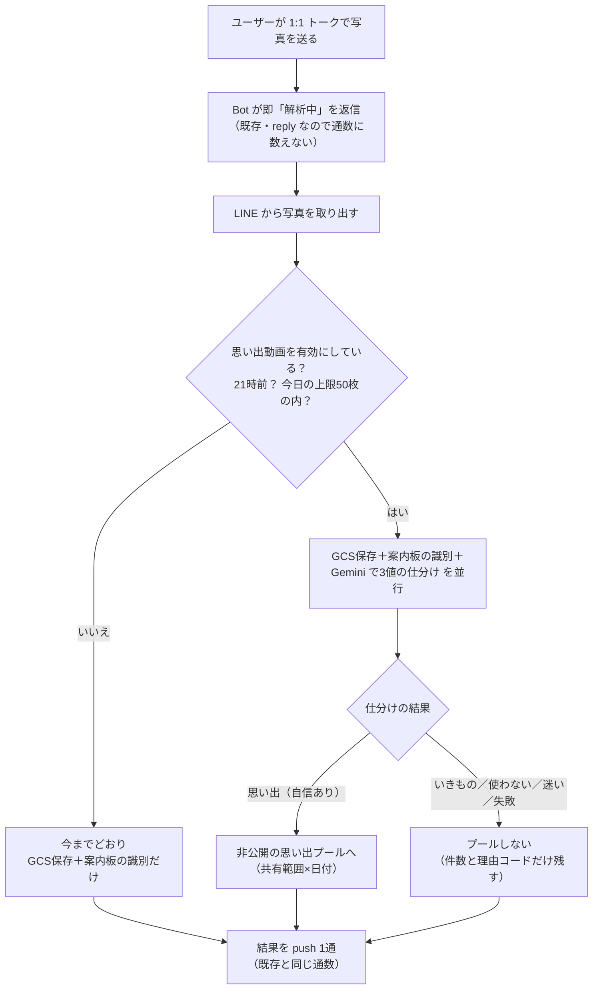
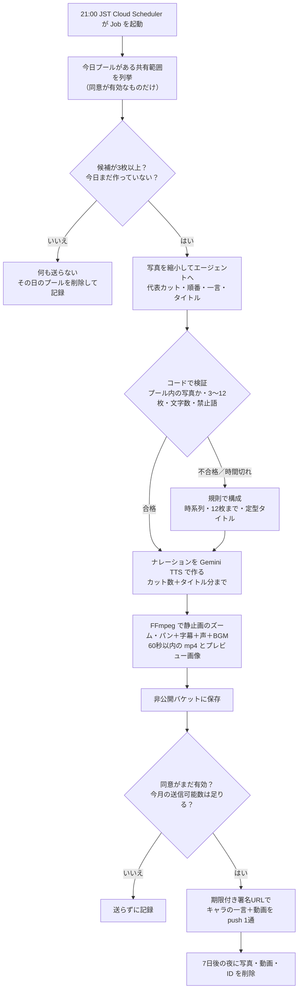
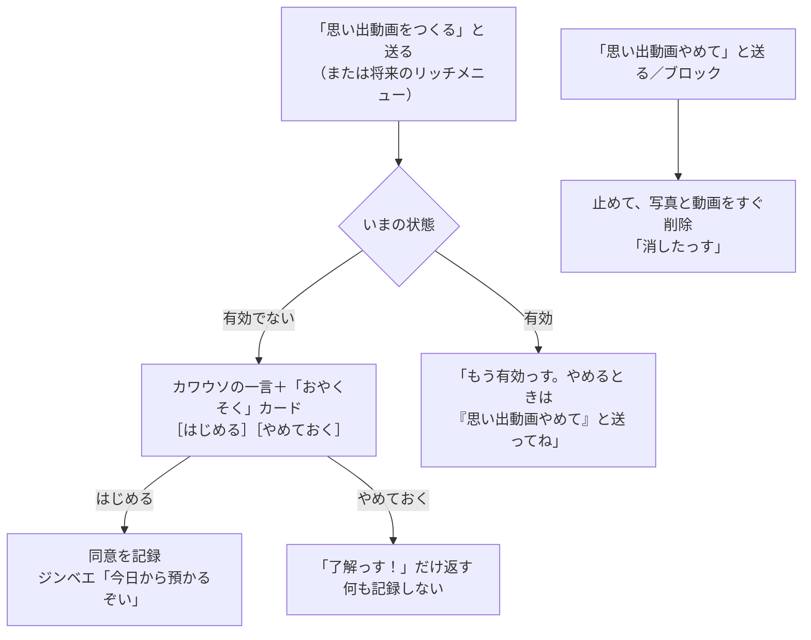

Issue: https://github.com/4geru/tweet-bookmark/issues/787

# 設計: 思い出振り返り動画（1:1 トークの写真から自動生成）

承認済みの [requirements.md](./requirements.md) を満たす設計。基準の番号は requirements.md の「受け入れ基準（EARS）」の番号。

## 1. 方針

**写真を受けるたびに「思い出かどうか」だけを仕分けて非公開でプールし、21:00 JST に Cloud Run Jobs が 1 共有範囲×1 日ずつ「エージェントで構成 → Gemini TTS → FFmpeg」で 60 秒以内の動画を作り、署名付き URL で 1 通だけ push する。同意・プールの範囲・枚数・回数・削除・配信先はすべてコードで縛り、エージェントは「どれを・どの順で・何と言うか」だけを決める。**

- 受け付け（Webhook / 既存の Cloud Run サービス）と生成（新しい Cloud Run Job）を分ける。Webhook 側は仕分けとプールまで、重い処理（エージェント・TTS・FFmpeg）は Job 側だけ
- データは「共有範囲（scope）」単位で持つ。初版の scope は `user:<userId>` だけ。グループ拡張時は `group:<groupId>` を足すだけで、プール・同意・配信先の決め方は変えない
- 構成（`MemoryPlan`）と描画（`renderMemoryVideo`）を型で分ける。描画方式を差し替えるときは `MemoryPlan` を受け取る別の描画関数を足す
- 写真の送り先は GCS・Firestore・Gemini API（既存の送信先）だけ。協賛 API・外部の動画生成は使わない

### 1.1 受け入れ基準との対応

| 基準 | 内容（要約） | 設計の該当箇所 |
| --- | --- | --- |
| 1, 2, 3 | 写真ごとの所有者・共有範囲・同意・動画の配信先 | 3 章 データモデル（`memoryScopes` / `memoryPhotos` / `memoryVideos`）、`deliveryTargetOf` |
| 4 | 有効化と同意の記録、有効化まではプールしない | 7 章 同意の流れ、4.1 の「同意の確認」 |
| 5 | 識別と並行して 3 値に振り分け | 4.1・4.2 |
| 6, 7 | 既存フローと push 通数を変えない／「見つからない」の代わりに「思い出に入れた」 | 4.3 push の出し分け表 |
| 8, 9 | 迷ったら使わない／未有効ユーザーは振り分けない | 4.2 の確定ルール、4.1 の分岐 |
| 10 | 停止・ブロックで止めて削除 | 7.3、4.4 `unfollow` |
| 11 | 配信後 7 日で自動削除 | 3.4 保存期間と削除 |
| 12 | 非公開・署名付き URL・公開バケットに置かない | 6 章 配信 |
| 13 | 配信先以外に送らない・範囲を混ぜない | 5.4 検証（許可リスト）、6.2 配信直前の再確認 |
| 14, 35 | ログに写真の中身を出さない・記録から辿れない | 8 章 記録 |
| 15 | 顔認識をしない | 4.2・5.3 のプロンプト、使うモデル呼び出しの一覧（9.2） |
| 16 | 学習・デモに流用しない | 11 章 未決 #1（Gemini API の課金ティア）、10 章 検証は運用者の写真だけ |
| 17 | 不適切な写真を使わない | 4.2 `sensitive`、5.4 `reviewed` の `sensitive` 件数 |
| 18, 19 | Google Cloud の外に送らない／外部送信の記録 | 1 章方針、9.2。外部送信が無いので 19 は「該当なし」を記録に固定値で残す |
| 20, 21, 22 | エージェントが 3〜12 枚・順番・一言・タイトルを理由付きで決める／判断材料／口調と禁止事項 | 5 章 |
| 23 | 字幕はレンダリング側で描く | 6.1 FFmpeg の `drawtext` |
| 24, 25 | 枚数の丸め・3 枚未満は作らない・60 秒以内 | 5.4、5.6 |
| 26, 27 | 1 日 1 本・呼び出し回数の上限・1 日 50 枚 | 3.2 `memoryDays`、4.1 の予約、5.4、9.1 |
| 28 | 月の利用額の上限 | 9.1 `memoryUsage`、超えたら規則構成＋TTS なし |
| 29 | エージェント失敗・タイムアウト時は規則で構成 | 5.5 |
| 30 | 生成失敗は通知しない・持ち越さない | 5.7 エラー表 |
| 31, 32, 33 | 1 回の push で届ける・1 日 1 回・送信可能数の確認・作らない日は何も送らない | 6.2 |
| 34 | 動画 1 本ごとの記録 | 8 章 `memoryVideoRuns` |
| 36 | 構成と描画の分離 | 1 章方針、5.6 `MemoryPlan` |
| 37 | 環境変数 1 つで止める | 4.5 `MEMORY_VIDEO_ENABLED` |
| 38〜43 | グループ拡張時（初版は実装しない） | 12 章 |

## 2. アーキテクチャ（リクエストの旅）

### 2.1 写真が届いてから、プールに入るまで（Webhook・既存サービス）



### 2.2 21:00 JST、動画を作って届けるまで（新しい Cloud Run Job）



## 3. データモデル

### 3.1 共有範囲（scope）のキー

| 概念 | 値 | 例 |
| --- | --- | --- |
| scope（意味上の値、基準1） | `user:<userId>` / （拡張）`group:<groupId>` | `user:U1234...` |
| scopeKey（Firestore ドキュメント ID・GCS パス用） | `:` を `_` に置き換えたもの | `user_U1234...` |

- 変換は `toScopeKey(scope)` / `fromScopeKey(key)` の 2 関数に閉じる
- 配信先は `deliveryTargetOf(scope)` で scope から導く（`user:X` → `X`、`group:G` → `G`）。動画ドキュメントの `deliverTo` はこの戻り値をそのまま書き、Job は `deliverTo` 以外に送らない（基準3・13）

### 3.2 Firestore

既存の `users/{userId}` 配下には置かない。グループ拡張時に「ユーザー」に属さない scope を持てるよう、トップレベルに scope 単位で置く。

```
memoryScopes/{scopeKey}                         同意（基準2・4）
  scope:          string        "user:U..."
  scopeType:      "user" | "group"
  userId:         string | null  scopeType=user のとき
  groupId:        string | null  （拡張時）
  enabled:        boolean
  consentVersion: string        同意文の版（例 "2026-10-v1"）。7.2 の文言を変えたら上げる
  consentedBy:    string        有効化した LINE userId
  consentedAt:    Timestamp | null
  disabledAt:     Timestamp | null
  updatedAt:      Timestamp

memoryScopes/{scopeKey}/memoryPhotos/{messageId}    写真ごと（基準1）
  ownerUserId:    string        送った人の LINE userId
  scope:          string        "user:U..."
  date:           string        "YYYY-MM-DD"（JST。0:00〜20:59 の写真の日付）
  sentAt:         Timestamp     webhook イベントの timestamp
  status:         "classifying" | "done"
  classification: "creature" | "memory" | "unused" | null
  reasonCode:     ReasonCode    4.2 の列挙（人物を特定しない語だけ）
  reason:         string        30文字以内。人物の説明を含めないよう指示したもの（ログには出さない）
  quality:        { blurry: boolean, dark: boolean }
  pooled:         boolean       プールに入ったか（classification=memory かつ confidence=high）
  gcsPath:        string | null  pooled のときだけ "memory/{scopeKey}/{date}/photos/{messageId}.jpg"
  expiresAt:      Timestamp     Firestore TTL の保険（3.4）

memoryScopes/{scopeKey}/memoryVideos/{date}       動画 1 本（基準3・26）。ID=日付なので 1 日 1 本
  scope:          string
  date:           string
  deliverTo:      { type: "user" | "group", id: string }
  status:         "composing" | "rendering" | "delivering" | "delivered"
                  | "skipped" | "failed" | "cancelled"
  skipReason:     "too_few_photos" | "consent_off" | "quota" | null
  usedPhotoIds:   string[]      使った messageId（並べた順）
  title:          string
  decidedBy:      "agent" | "rule"
  gcsVideoPath:   string | null "memory/{scopeKey}/{date}/video.mp4"
  gcsPreviewPath: string | null "memory/{scopeKey}/{date}/preview.jpg"
  durationSec:    number | null
  createdAt / deliveredAt: Timestamp
  expiresAt:      Timestamp     deliveredAt + 7日（未配信なら createdAt + 1日）

memoryDays/{date}/memoryDayScopes/{scopeKey}     日付ごとのプールの見出し（基準27）
  scope:          string
  classifyCount:  number        その日に仕分けにかけた枚数（50 で打ち止め）
  pooledCount:    number        プールに入った枚数
  expiresAt:      Timestamp     date + 14日

memoryUsage/{YYYY-MM}                            月ごとの呼び出し回数と概算額（基準26・28）
  classifyCalls / agentCalls / ttsCalls: number
  estimatedCostUsd: number
  updatedAt: Timestamp

memoryVideoRuns/{autoId}                         匿名化した記録（基準34・35。8 章）
```

- `memoryDays/{date}/memoryDayScopes` は Job が「今日対象の scope」を**インデックス無しで**列挙するための入口（コレクショングループ検索を使わない）
- `memoryPhotos` を `date` で絞る検索は単一フィールドの自動インデックスで足りる（`memoryScopes/{scopeKey}/memoryPhotos` 1 コレクション内の検索）
- Firestore のトランザクションは既存ルールどおり「読み取りをすべて先、書き込みを後」（CLAUDE.md）

### 3.3 GCS（非公開バケット `kaiyukan-gacha-hackathon-images`）

```
memory/{scopeKey}/{date}/photos/{messageId}.jpg   プールした写真
memory/{scopeKey}/{date}/video.mp4                 完成動画
memory/{scopeKey}/{date}/preview.jpg               プレビュー画像
```

- 公開バケット `kaiyukan-gacha-hackathon-public-assets` には一切置かない（基準12）
- プールした写真は、既存の `line-images/{messageId}.jpg` にも同じ写真が保存される（既存処理）。思い出に入った写真は `memory/...` に保存したあと `line-images/{messageId}.jpg` を消す（停止・保存期間で確実に消せる場所を 1 か所にするため。11 章 未決 #2）
- `storage.ts` に `deleteGcsObject(path)` / `deleteGcsPrefix(prefix)` / `downloadGcsObject(path)` / `getSignedReadUrl(path, expiresSec)` を足す。既存の `uploadImageToGCS` は変えない

### 3.4 保存期間と削除（基準10・11・30）

| 対象 | いつ消すか | 誰が |
| --- | --- | --- |
| 配信した日の写真・動画・`memoryPhotos`・`memoryVideos/{date}` | **配信した日から 7 日後の夜（D+7 の 21:00 Job）** | Job の掃除ステップ（5.2 の最初） |
| 動画にならなかった日（候補 3 枚未満・失敗・同意オフ・送信数不足）の写真 | その夜の Job の中で即削除 | Job |
| 停止・ブロック時のプール済み写真・未配信の動画 | その場で削除（配信済みの動画も消す） | Webhook（7.3・4.4） |
| 保険 | GCS ライフサイクル: `memory/` を作成から 10 日で削除。Firestore TTL: `memoryPhotos` / `memoryVideos` / `memoryDayScopes` の `expiresAt` | GCP |

- 掃除ステップは D-7 から D-14 までの日付を毎回なめる（Job が 1 日止まっても次の夜に回収する）。日付ごとに `memoryDays/{d}/memoryDayScopes` を列挙 → `memory/{scopeKey}/{d}/` を prefix 削除 → `memoryPhotos where date==d` と `memoryVideos/{d}` を削除
- 同意文で伝える値は「届けてから 7 日で消えます。動画にならなかった日の写真はその夜に消えます」。上の表の値と一致させる（基準11）。定数 `MEMORY_RETENTION_DAYS = 7` を同意文の生成と掃除の両方で参照する
- 動画の LINE 上の表示: 署名付き URL の期限も 7 日（V4 署名の上限が 7 日）。期限後に LINE 側で再生できるかは未確認なので、同意文と配信メッセージで「残したい動画は端末に保存してね」と伝える（11 章 未決 #5）

### 3.5 firestore.rules

**ルールの変更は不要**（コメントだけ足す）。新しいコレクションはすべてトップレベル（`memoryScopes` / `memoryDays` / `memoryUsage` / `memoryVideoRuns`）で、既存の `match /{document=**} { allow read, write: if false; }` で LIFF からの読み書きが拒否される。Bot と Job は Admin SDK なので対象外。初版は LIFF に思い出の画面を出さないため、本人読み取りも開けない。

- `backend/firestore.rules` 冒頭のコメントに「思い出動画（docs/specs/787-memory-video）のデータはすべてクライアントから読めない」を追記
- `scripts/verify-auth-rules.mjs` に「本人の uid でも `memoryScopes/{自分}` を get できない」ケースを足す

## 4. 受け付けと振り分け（Webhook 側）

### 4.1 `handleImageMessage` への組み込み

既存の `handleImageMessage`（`server.ts` 91〜139 行）の構造は保つ。変えるのは「並列に走らせる処理を 1 つ足す」ことと「`candidates.length === 0` の push の中身の出し分け」だけ。

```ts
// 擬似コード（server.ts）
await client.replyMessage(...解析中...);                 // 既存のまま
const [content, gate] = await Promise.all([
  blobClient.getMessageContent(messageId),               // 既存
  reserveMemoryClassification({ userId, messageId, sentAt }), // ★新規: 有効？21時前？50枚以内？未処理？
]);
const buffer = await streamToBuffer(content);
const [, candidates, memory] = await Promise.all([
  uploadImageToGCS(...line-images...),                   // 既存
  identifyFishFromImage(buffer, "image/jpeg"),           // 既存（変更しない）
  gate.reserved ? classifyAndPool(buffer, gate) : Promise.resolve(NOT_CLASSIFIED), // ★新規。例外を外に出さない
]);
// 以降の push は 4.3 の表に従う
```

- `reserveMemoryClassification`（`memoryVideo/store.ts`）は 1 回のトランザクションで
  1. 読む: `memoryScopes/user_{userId}`、`memoryDays/{date}/memoryDayScopes/{scopeKey}`、`memoryPhotos/{messageId}`
  2. 判定: 機能が環境変数で有効・`enabled === true`・送信時刻が JST 0:00〜20:59・`classifyCount < 50`・`memoryPhotos/{messageId}` が無い（Webhook 再送で二重に仕分けない）
  3. 書く: `memoryPhotos/{messageId}` を `status: "classifying"` で作成、`classifyCount` を +1
  - いずれか外れたら `{ reserved: false }`。Firestore の失敗も `{ reserved: false }` にして既存フローを止めない
- `classifyAndPool` は、仕分け（4.2）→ 結果を `memoryPhotos` に書く → `pooled` なら `memory/...` に写真を保存して `pooledCount` +1 → `line-images/{messageId}.jpg` を削除。中の例外はすべて握りつぶして `classification: "unused", reasonCode: "classify_failed"` を書く（基準8）
- 未有効ユーザーは `reserved: false` なので仕分けは呼ばれない（基準9）。読み取り 1 回ぶんの遅延だけ増える
- 21:00〜23:59 に送られた写真はどの日にも入らないので、仕分けにかけない（11 章 未決 #4）

### 4.2 仕分け（`memoryVideo/classifyPhoto.ts`）

- モデル: `gemini-2.5-flash`（`identifyFish.ts` と同じ）、`thinkingConfig: { thinkingBudget: 0 }`、`responseMimeType: "application/json"` + `responseSchema`、タイムアウト 15 秒（`Promise.race`）
- 出力スキーマ（Gemini の `Type` で定義。zod は使わず `identifyFish.ts` に合わせる）

```ts
{
  category: "creature" | "memory" | "unused",
  confidence: "high" | "low",
  reasonCode: "guide_panel" | "creature_only" | "outing_scene" | "people_scene" | "food"
            | "scenery" | "screenshot" | "document" | "sensitive" | "low_quality" | "other",
  reason: string,              // 30文字以内。人物の容姿・年齢・関係を書かない
  blurry: boolean,
  dark: boolean,
}
```

- 確定ルール（コード）:
  - `category === "memory" && confidence === "high" && reasonCode !== "sensitive"` のときだけ `pooled = true`
  - それ以外（`low`・`sensitive`・スキーマ不一致・タイムアウト・例外）はすべて `pooled = false`（基準8・17）
  - `reason` は 30 文字で切る
- プロンプトの要点:
  - 「水族館・お出かけの思い出写真か」「案内板・生きもののアップ（図鑑用）か」「それ以外（スクショ・書類・食べ物だけ等）か」の 3 つに分ける
  - **写っている人が誰か・年齢・関係・容姿を推測しない、書かない。顔の特徴を説明しない**（基準14・15）
  - 裸・けが・他人の個人情報が読める画面は `sensitive`
  - 迷ったら `confidence: "low"`
- ログ: `[memory] classified photo=<messageId> code=<reasonCode> pooled=<bool>` のみ（`reason` は出さない）

### 4.3 push の出し分け（基準6・7。通数は 1 写真 1 通のまま）

| 識別（既存） | 仕分け | 送る push（1 通） |
| --- | --- | --- |
| 候補あり | プールした／しない／未実施 | 既存どおり `[カワウソ「解析完了」, 候補 Flex]`。**プールしたときだけ** 同じ push の末尾に `カワウソ「この写真は今日の思い出アルバムにも入れたっす！」` を 1 メッセージ足す（11 章 未決 #3） |
| 候補なし | プールした | `[カワウソ「図鑑の生きものは見つからなかったっすけど、今日の思い出アルバムに入れたっす！21時ごろ動画にしてお届けするっす」]`（**「見つからない」Flex の代わり**、基準7） |
| 候補なし | プールしない／未実施 | 既存どおり `[カワウソ「うーん……」, buildNotFoundFlexMessage()]` |
| 例外（既存の catch） | — | 既存どおりジンベエのお詫び。仕分けの結果は使わない |

- 1 リクエスト内のメッセージ数は最大 3（上限 5 の内）。push は「リクエスト数×宛先数」で数えるので通数は増えない
- 文言は `flexMessages.ts` ではなく `memoryVideo/messages.ts` に置く（server.ts との衝突を減らす）

### 4.4 ブロック（`unfollow`）

`handleEvent`（`server.ts` 555 行〜）は今 `postback` と `message` しか扱わない。`getUserId` は `unfollow` でも `source.type === "user"` なら userId を返すので、`postback` 判定の前に次を足す。

```ts
if (event.type === "unfollow") { await stopMemoryVideo(userId, "unfollow"); return; }
```

`stopMemoryVideo` は 7.3 と同じ削除をする（reply はしない。replyToken が無い）。

### 4.5 機能全体の停止（基準37）

- 環境変数 `MEMORY_VIDEO_ENABLED`（`"true"` のときだけ有効。未設定は無効）をサービスと Job の両方で読む
- 無効のとき: 仕分けを呼ばない（既存と同じ動作）、「思い出動画をつくる」には「いまは準備中っす」を reply、Job は起動直後に記録だけして終了
- 停止・ブロック時の削除は無効のときも動かす（止めたのにデータが残るのを防ぐ）

## 5. エージェント（構成）と Job

### 5.1 Job の入力と起動

- Cloud Run Job 名: `memory-video`（`asia-northeast1`）。イメージは `backend/Dockerfile.memory-video`（6.3）
- 起動: Cloud Scheduler `memory-video-nightly`、`0 21 * * *`、タイムゾーン `Asia/Tokyo`。HTTP ターゲットで Cloud Run Admin API の `POST https://run.googleapis.com/v2/projects/kaiyukan-gacha-hackathon/locations/asia-northeast1/jobs/memory-video:run` を OAuth（専用サービスアカウント、`roles/run.invoker`）で叩く
- 入力（コマンドライン引数。既定は「今日（JST）・全 scope」）

| 引数 | 既定 | 用途 |
| --- | --- | --- |
| `--date YYYY-MM-DD` | 実行時の JST の日付 | 手動の再実行・検証 |
| `--scope user_U...` | 無し（＝その日の `memoryDayScopes` 全件） | 1 scope だけ作る |
| `--no-deliver` | false | 作るが push しない（検証用。`status` は `skipped`） |
| `--no-sweep` | false | 掃除ステップを飛ばす |

- 並列化: `CLOUD_RUN_TASK_INDEX` / `CLOUD_RUN_TASK_COUNT` を読み、`hash(scopeKey) % COUNT === INDEX` の scope だけ処理する。初版は `--tasks=1`（順に処理）
- リソース: `--cpu=2 --memory=2Gi --task-timeout=3600s --max-retries=0`（再試行で二重 push しないため。1 日 1 本は 5.2 の `create` でも守る）
- 環境変数・シークレットはサービスと同じ（`GCS_BUCKET_NAME`、`LINE_CHANNEL_ACCESS_TOKEN`、`GEMINI_API_KEY`）＋ `MEMORY_VIDEO_ENABLED`、`MEMORY_MONTHLY_BUDGET_USD`。サービスアカウントには署名付き URL 用に自分自身への `roles/iam.serviceAccountTokenCreator`（`signBlob`）を付ける

### 5.2 1 scope ぶんの処理

1. **掃除**（Job 全体で 1 回）: 3.4 の D-7〜D-14 を削除
2. **予約**: `memoryVideos/{date}` を `create()`（既にあれば何もしない＝1 日 1 本、基準26）。`status: "composing"`
3. **同意の確認**: `memoryScopes/{scopeKey}.enabled` が false → `skipped/consent_off`、プール削除、終了
4. **候補の取得**: `memoryPhotos where date == D` のうち `pooled === true` のもの（**これが許可リスト**、基準13）。3 枚未満 → `skipped/too_few_photos`、プール削除、何も送らない（基準24・33）
5. **素材の準備**: GCS から `/tmp/work/{scopeKey}/` に写真を落とし、FFmpeg で長辺 768px の JPEG サムネイルを作る（エージェント用）
6. **予算の確認**: `memoryUsage/{YYYY-MM}.estimatedCostUsd >= MEMORY_MONTHLY_BUDGET_USD` なら 7 を飛ばして規則構成＋TTS なし（基準28）
7. **構成**: エージェント（5.3）→ 検証（5.4）。不合格・時間切れ → 規則（5.5）
8. **ナレーション**: TTS（6.1）。呼び出しは `cuts.length + 1` 回まで
9. **描画**: FFmpeg（6.1）→ `video.mp4`・`preview.jpg` を GCS へ
10. **配信**: 6.2
11. **記録**: `memoryVideos/{date}` を更新、`memoryVideoRuns` に 1 件、`memoryUsage` を加算（8 章）
12. `/tmp/work/{scopeKey}/` を消す

### 5.3 構成エージェント（`memoryVideo/composeAgent.ts`）

`quizAgent.ts` と同じく `@google/adk` の `Agent` + `InMemoryRunner.runEphemeral` + `outputSchema`（`zod/v3`）。

- モデル: `process.env.MEMORY_AGENT_MODEL ?? "gemini-2.5-flash"`
- 入力（`newMessage.parts`）
  - テキスト: 対象日、写真の一覧（`p01`〜`pNN` の短い番号・送信時刻 `HH:MM`・`blurry` / `dark`・`reasonCode`）、その日に図鑑に登録した生きものの名前（`users/{userId}/collection` の `firstFoundAt` がその日のもの。名前だけ）
  - 画像: 各サムネイルを `inlineData`（`image/jpeg`）で番号の直後に並べる
  - messageId はエージェントに渡さない。`p01` ⇔ messageId の対応はコードだけが持つ
- ツール（読み取り専用、1 つ）
  - `lookupCreature({ name })`: `loadKaiyukanAnimals()` から名前一致の 1 件を探し `{ found, name, family, description(80字) }` を返す。その日に登録した名前以外は `{ found: false }`（ナレーションで生きものに触れるときの捏造防止。`findRelatedSpecies` と同じ考え方）
- 出力スキーマ

```ts
const PhotoRef = z.string().regex(/^p\d{2}$/);
const Speaker = z.enum(["kawauso", "jinbei"]);
const MemoryPlanSchema = z.object({
  reviewed: z.array(z.object({
    photo: PhotoRef,
    decision: z.enum(["use", "similar", "blurry", "dark", "sensitive", "off_topic"]),
  })).describe("渡した写真すべてについての判断"),
  title: z.string().describe("動画のタイトル。14文字以内。人の名前を入れない"),
  titleNarration: z.object({ speaker: Speaker, text: z.string().describe("40文字以内") }),
  cuts: z.array(z.object({
    photo: PhotoRef,
    rank: z.number().int().min(1).describe("動画に入れたい順位。1が最も入れたい"),
    caption: z.string().describe("字幕。16文字以内"),
    speaker: Speaker,
    narration: z.string().describe("40文字以内。キャラの口調"),
    motion: z.enum(["zoom_in", "zoom_out", "pan_left", "pan_right"]),
    reason: z.string().describe("選んだ理由。人物を特定しない言葉で"),
  })).describe("動画に並べる順。3〜12枚"),
  selectionReason: z.string().describe("全体の構成の理由"),
});
```

- プロンプトの要点（基準21・22）
  - 判断材料: 似た写真は 1 枚に絞る／ブレ・暗い写真を避ける／時系列の流れが分かる順に／図鑑に登録した生きものがいれば、その生きものの写真や話題でつなぐ（`lookupCreature` で確かめた内容だけ）
  - 口調: カワウソ助教授（「〜っす」、元気）とジンベエ名誉教授（「〜じゃ」「〜のう」）。`docs/charactor/dialogue-scenarios.md` の要約を埋め込む
  - **禁止**: 写っている人の名前・年齢・関係（ママ・パパ・お子さん・彼氏など）・容姿の推測、顔の特徴の説明、写真に写った文字の個人情報の読み上げ
  - 不適切な写真（裸・けが・個人情報が読める画面）は `reviewed` で `sensitive` にして使わない
  - 字幕は日本語で返すが、画像には描かせない（描画はコード側、基準23）

### 5.4 コードでの検証（`memoryVideo/validatePlan.ts`、純粋関数）

`validatePlan(raw, allowlist: Map<"pNN", messageId>) => { plan: MemoryPlan, report } | { error }`

1. zod で parse。失敗 → `error`（5.5 へ）
2. `cuts[].photo` が許可リストに無いものを捨てる（`droppedUnknown` 件数）。同じ写真の重複は先の 1 件だけ残す
3. `reviewed` で `sensitive` の写真は `cuts` から外す（エージェントの自己矛盾に備える。`excludedSensitive` 件数、基準17）
4. 12 枚を超えたら `rank` の小さい順に 12 枚を残し、残ったものは元の並び順を保つ（`truncatedFrom` を記録、基準24）
5. 3 枚未満 → `error`（5.5 へ。プールが 3 枚以上あるので規則なら作れる）
6. 文字数の丸め: `title` 14、`caption` 16、`narration` 40 文字で切り、改行を除く
7. 禁止語チェック: `narration` / `caption` / `title` に関係・年齢の語（`/(ママ|パパ|お母さん|お父さん|息子|娘|お子さん|赤ちゃん|彼氏|彼女|夫|妻|\d+\s*(歳|才))/`）があれば、そのカットのナレーションを定型（「この景色、いい感じっす！」等の配列から）に差し替え、`caption` は `HH:MM` にする（`sanitized` 件数）
8. `speaker` は `kawauso` / `jinbei` のどちらかに固定済み（スキーマ）

戻り値の `MemoryPlan`（描画との境界の型、基準36）:

```ts
interface MemoryPlan {
  scope: string; date: string; decidedBy: "agent" | "rule";
  title: string;
  titleNarration?: { speaker: "kawauso" | "jinbei"; text: string };
  cuts: { messageId: string; caption: string; narration?: { speaker: "kawauso" | "jinbei"; text: string };
          motion: "zoom_in" | "zoom_out" | "pan_left" | "pan_right" }[];
}
```

### 5.5 タイムアウトと規則での構成（基準29）

- エージェント全体を 90 秒で打ち切る（`AbortController` ＋ `Promise.race`。バッチなので quizAgent より長め）。再試行はしない（1 日 1 回の上限、基準26）
- 規則構成 `buildRulePlan(photos)`: 送信時刻順 → 12 枚を超えたら等間隔に 12 枚を間引く → `title = "M月D日の思い出"`、`titleNarration = { kawauso, "今日の思い出をふりかえるっす！" }`、各カットはナレーションなし・字幕 `HH:MM`・`motion` は交互
- 予算超過（基準28）のときは規則構成から `titleNarration` も外す（TTS 0 回、字幕と BGM だけ）
- `decidedBy: "rule"` と理由（`timeout` / `invalid_output` / `too_few_after_validation` / `budget`）を記録

### 5.6 尺の調整（基準25）

- 1 カットの長さ = `max(2.5秒, ナレーション秒 + 0.6秒)`、上限 6 秒。タイトル = `max(2.5秒, タイトルナレーション秒 + 0.8秒)`、エンド（ロゴなし・字幕「またね」）1.5 秒
- 合計が 58 秒を超えたら、`rank` の大きい（入れたい度が低い）カットから外す（3 枚は必ず残す）。規則構成のときは末尾から外す
- 12 カット × 4 秒 + タイトル 3 秒 + エンド 1.5 秒 ≒ 52 秒が想定の最大

### 5.7 エラー時・タイムアウト時の振る舞い

| どこで | 振る舞い | push |
| --- | --- | --- |
| 仕分け（Webhook） | `unused/classify_failed` として既存フローを続ける | 既存どおり 1 通 |
| 予約トランザクション（Webhook） | 仕分けしない（既存フローのみ） | 既存どおり 1 通 |
| エージェント | 規則で構成（5.5） | 動画が出来れば 1 通 |
| TTS の一部失敗 | そのカットはナレーションなし（字幕だけ）。全滅でも描画は続ける | 動画が出来れば 1 通 |
| FFmpeg・GCS 保存 | `status: "failed"`・`failureStage` を記録、その日のプールを削除（持ち越さない） | 送らない（基準30） |
| 送信数不足・同意オフ | `skipped` で記録、データ削除 | 送らない（基準32） |
| push の API エラー | `failed/delivery` を記録。同じ `X-Line-Retry-Key` で 1 回だけ再送 | 最大 1 通 |
| Job 自体の異常終了 | `--max-retries=0`。次の夜の掃除で `composing` のまま残った前日以前の分を削除 | 送らない |

## 6. 描画と配信

### 6.1 TTS と FFmpeg（`memoryVideo/tts.ts`・`memoryVideo/render.ts`）

**TTS**

- `video/scripts/generate-voice.ts` の `tts()`（`ai.interactions.create`、モデル→フォールバックモデルの順に 3 回ずつ）、`trimSilence()`、`ensureWav()`、`wavSeconds()` を `backend/src/memoryVideo/tts.ts` に**移植（コピー）**する
  - import では流用できない: `generate-voice.ts` はモジュールの末尾で `main()` を実行しているため、import すると原稿生成が走る。また `video/` は別パッケージ（`@google/genai` 2.27.0。backend は 2.23.0）。backend の 2.23.0 にも `interactions` があることは型定義で確認済み（`as any` で呼ぶのは元コードと同じ）
  - `trimSilence` は 16bit mono WAV 前提の純粋関数で、末尾の雑音を削る処理もそのまま使える
- モデルと声は `video/config/voices.json` の値を定数で持つ（`gemini-3.8-flash-tts` → `gemini-2.5-flash-preview-tts`、カワウソ `Puck`、ジンベエ `Charon` と各 `style`）
- 再試行を含めても「1 セリフ = 1 呼び出し枠」とし、`ttsCalls` は成功・失敗を問わず試行回数で数える。上限 `cuts.length + 1` を超える呼び出しはコードで止める（基準26）

**FFmpeg（Debian bookworm の `ffmpeg` パッケージ。`drawtext`・`zoompan` を使う）**

- 出力: 720×1280（縦 9:16）、30fps、H.264（`libx264 -preset veryfast -crf 23 -pix_fmt yuv420p`）、AAC 128kbps、`-movflags +faststart`
- 手順（各段を別プロセスにしてデバッグしやすくする）
  1. カットごとの無音の映像セグメント: 写真をぼかし背景（cover＋`boxblur`）の上に全体が収まるように重ね（横長写真を切りすぎない）、`zoompan` で `motion` に応じたズーム（1.0→1.12）・パン、`drawtext`（`fontfile=/usr/share/fonts/opentype/noto/NotoSansCJK-Bold.ttc`、`textfile=` で字幕を渡しエスケープ問題を避ける、半透明の帯）で字幕
  2. タイトルセグメント: 1 枚目の写真のぼかし＋タイトル文字。エンドセグメント: 同様に「またね」
  3. `concat` デマルチプレクサで映像をつなぐ（`-c copy`）
  4. 音声: 各ナレーション WAV を `adelay` で各カットの開始位置に置いて `amix`、BGM（固定素材、11 章 未決 #6）を `-stream_loop -1` で敷いて音量 0.15・最後 1.5 秒 `afade`、`loudnorm`
  5. 映像＋音声を mux（`-shortest`）
  6. プレビュー: タイトルセグメントの 1 秒目を JPEG（`-q:v 4`）で 1 枚。1MB を超えたら品質を下げて作り直す
- 文字は全部 FFmpeg 側で描く。Gemini に画像を生成させない（基準23）
- 字幕の折り返しはコード側で 12 文字ごとに改行を入れてから `textfile` に書く
- 確認事項（実装時）: スマホ写真の EXIF の向きが LINE 経由の JPEG に残るか。残る場合は `-autorotate` の効き方を検証する

### 6.2 配信（基準12・13・31・32・33）

1. 同意を**もう一度**読む（描画中に停止された場合に送らない）。オフなら削除して `cancelled`
2. 送信可能数の確認: `client.getMessageQuota()` と `client.getMessageQuotaConsumption()`。`type === "limited"` なら `value - totalUsage >= 宛先の人数`（初版は 1、拡張時は人数分、基準42）を満たすときだけ送る。満たさなければ `skipped/quota`
3. 署名付き URL: `getSignedReadUrl(path, 7日)`（V4、`action: "read"`）を mp4 とプレビューの 2 つ作る。URL はログ・Firestore に保存しない
4. push 1 リクエスト（基準31）:

```ts
await client.pushMessage({
  to: plan.deliverTo.id,                      // memoryVideos.deliverTo だけ（基準13）
  messages: [
    characterLine("kawauso", "happy", "今日の思い出、動画にまとめたっす！残したいときは7日以内に保存してほしいっす！"),
    { type: "video", originalContentUrl: mp4Url, previewImageUrl: previewUrl },
  ],
}, retryKeyOf(scope, date));                  // scope+date から決まる UUID。再送しても二重配信しない
```

5. `memoryVideos/{date}` を `delivered`・`deliveredAt`・`expiresAt = deliveredAt + 7日` に更新

- LINE の動画メッセージの要件（mp4・HTTPS・ファイルサイズ上限、プレビューは JPEG/PNG・サイズ上限）は実装時に公式リファレンス（Messaging API「動画メッセージ」）で再確認する。60 秒・720p・CRF 23 で数 MB の見込みなので、既知の上限（動画 200MB、プレビュー 1MB）には収まる
- 公開バケットは使わない。署名付き URL を知っている人は期限内なら誰でも開けるが、URL は push の中にしか出ない（基準12 の範囲）

### 6.3 Dockerfile とデプロイ

`backend/Dockerfile.memory-video`（新規。既存 `Dockerfile` はサービス用のまま変えない＝サービスのイメージに FFmpeg を入れない）

```dockerfile
# syntax=docker/dockerfile:1.7
FROM node:22.22.0-bookworm-slim AS builder
WORKDIR /app
COPY package.json package-lock.json ./
RUN npm ci --legacy-peer-deps
COPY tsconfig.json ./
COPY src ./src
RUN npm run build

FROM node:22.22.0-bookworm-slim AS runtime
RUN apt-get update \
 && apt-get install -y --no-install-recommends ffmpeg fonts-noto-cjk \
 && rm -rf /var/lib/apt/lists/*
WORKDIR /app
COPY package.json package-lock.json ./
RUN npm ci --legacy-peer-deps --omit=dev \
 && groupadd --gid 10001 app \
 && useradd --uid 10001 --gid 10001 --create-home --home-dir /home/app --shell /usr/sbin/nologin app
# data/ は lookupCreature が loadKaiyukanAnimals を使うため（ENOENT 対策、CLAUDE.md）。assets/ は BGM の固定素材
COPY --chown=10001:10001 data ./data
COPY --chown=10001:10001 assets ./assets
COPY --from=builder --chown=10001:10001 /app/dist ./dist
ENV HOME=/home/app
USER 10001:10001
CMD ["node", "dist/memoryVideo/job.js"]
```

- `gcloud run deploy --source` は `Dockerfile` という名前しか使えないので、Job は `cloudbuild.memory-video.yaml`（`docker build -f Dockerfile.memory-video` → Artifact Registry に push）でビルドし、`gcloud run jobs deploy memory-video --image=...` する
- `backend/Makefile` に追加するターゲット:
  - `deploy-memory-job`: typecheck → `gcloud builds submit --config=cloudbuild.memory-video.yaml` → `gcloud run jobs deploy memory-video --image ... --set-env-vars ... --set-secrets ... --cpu=2 --memory=2Gi --task-timeout=3600s --max-retries=0`
  - `run-memory-job`: `gcloud run jobs execute memory-video --args=...`（`ARGS` で `--scope`・`--date`・`--no-deliver` を渡す）
  - `memory-job-logs`: Job の直近ログ
  - `setup-memory-infra`（初回だけ）: Scheduler の作成、GCS ライフサイクル（`gcs-lifecycle.memory.json`: `memory/` を age 10 で削除）の適用、Firestore TTL（`memoryPhotos` / `memoryVideos` / `memoryDayScopes` の `expiresAt`）の有効化、サービスアカウントへの `serviceAccountTokenCreator` 付与
  - `deploy` の `--set-env-vars` に `MEMORY_VIDEO_ENABLED` を足す
- `src/` 配下に `job.ts` を置くので既存の `tsc`（`rootDir: src`）で `dist/memoryVideo/job.js` が出来る。サービス側は `job.ts` を import しない

## 7. 同意の取り方（基準4・10）

### 7.1 画面の流れ



- すべて reply（通数に数えない）。ブロックは返信できないので削除だけ
- 判定はテキストの完全一致（前後の空白を除く）で、`classifyStationAquariumIntent` より**前**に行う（Gemini を呼ばずに済み、既存の雑談に流れない）。受け付ける語: 有効化 `思い出動画をつくる` / `思い出動画を作る`、停止 `思い出動画やめて` / `思い出動画をやめる`
- postback: `action=memoryIntro`（リッチメニュー用。初版ではメニュー画像は変えない）、`action=memoryConsent&v=<consentVersion>`、`action=memoryDecline`、`action=memoryStop`
- `memoryConsent` の `v` が現在の `consentVersion` と違う（古いカードを押した）ときは、記録せずに 7.2 のカードを出し直す

### 7.2 「おやくそく」カードの文言（Flex bubble。`memoryVideo/messages.ts`）

- 見出し: 🎬 思い出動画のおやくそく
- 本文（箇条書き）
  1. 送ってくれた写真から、お出かけの「思い出」の写真をえらんで、その日の夜 21 時ごろに 1 分以内の動画にして届けるよ（0:00〜20:59 に送った写真が対象）
  2. 写真の仕分けや動画づくりには Google Cloud の AI（Gemini）を使うよ。ほかの会社には送らないし、AI の学習には使わないよ（11 章 未決 #1 の確認が前提）
  3. 写真と動画は、届けてから 7 日で自動で消えるよ。動画にならなかった日の写真はその夜に消えるよ。残したい動画は 7 日以内にスマホに保存してね
  4. 人が写っている写真は、写っている人（子どもは保護者）が「いいよ」と言ったものだけ送ってね。誰が写っているかを見分けること（顔認識）はしないよ
  5. やめたいときは「思い出動画やめて」と送るか、ブロックすると、預かっている写真と動画をすぐ消すよ
- ボタン: ［はじめる］（primary）／［やめておく］
- 冒頭の一言: カワウソ「研究員さんの今日の思い出を、動画にしてお届けする新機能っす！はじめる前に、おやくそくを読んでほしいっす」
- 有効化後: ジンベエ「ふむ、今日から思い出の写真を預かるぞい。夜 9 時ごろに動画を届けるからのう」
- 文言の 3 の日数は定数 `MEMORY_RETENTION_DAYS` から埋め込む（基準11）

### 7.3 停止の処理（`stopMemoryVideo(userId, cause)`）

1. `memoryScopes/{scopeKey}` を `enabled: false`・`disabledAt` に更新（先に止めて、以後のプールを止める）
2. GCS `memory/{scopeKey}/` を prefix 削除（配信済みの動画も含む）
3. `memoryPhotos` を全件、`memoryVideos` を全件削除（バッチ 500 件ずつ）
4. 記録: `memoryVideoRuns` には書かない（停止は件数だけログ）
- Job が描画中だった場合は 6.2 の 1 で送らずに終わる。Job が書いた GCS は Job 側の `cancelled` 処理で消す

## 8. 記録（可観測性、基準14・34・35）

`memoryVideoRuns/{autoId}`（写真 ID・userId・URL・文言を含めない。期限なしで残してよい）

```
scopeHash:        string   sha256(scopeKey + MEMORY_LOG_SALT) の先頭16桁
scopeType:        "user" | "group"
date:             string
candidateCount:   number   プールの枚数
usedCount:        number
unusedBreakdown:  { [reasonCode]: number }   その日の仕分けで使わなかった写真の内訳
reviewBreakdown:  { similar, blurry, dark, sensitive, off_topic: number }  エージェントが外した内訳
decidedBy:        "agent" | "rule"
ruleReason:       "timeout" | "invalid_output" | "too_few_after_validation" | "budget" | null
rounding:         { droppedUnknown, truncatedFrom, sanitized, droppedForDuration: number }
calls:            { agent: number, tts: number, ttsFailed: number }
externalSends:    []       基準19（外部送信なし。将来の描画方式の差し替え時に送り先・件数・削除結果を入れる）
estimatedCostUsd: number
timingsMs:        { compose, tts, render, upload, deliver, total }
videoSec / videoBytes: number | null
delivery:         "pushed" | "skipped_too_few" | "skipped_consent" | "skipped_quota" | "failed" | "cancelled" | "no_deliver"
createdAt:        Timestamp
```

- `memoryVideos/{date}`（`usedPhotoIds` を持つ）は保存期間で削除されるので、写真 ID が残るのは 7 日間だけ（基準35）
- エージェントの `selectionReason` と各カットの `reason` は `memoryVideos/{date}.agentTrace` に保存し、`memoryVideos` と一緒に消える（後から追えるのは保存期間内だけ。理由は人物を特定しない言葉で書かせ、禁止語チェックも通す）
- Cloud Logging には `runId`・`scopeHash`・件数・段階・所要時間だけを JSON 1 行で出す。userId・URL・`reason` の本文は出さない
- `MEMORY_LOG_SALT` は Secret Manager に置く（新規シークレット）

## 9. 費用と LINE の push 通数

### 9.1 呼び出し回数の上限（コードで固定、基準26・27・28）

| 呼び出し | 上限 | 1 回あたりの目安 |
| --- | --- | --- |
| 仕分け（`gemini-2.5-flash`、thinking 0） | 1 写真 1 回、1 scope・1 日 50 回 | 入力: 写真 1 枚（数百〜1,000 トークン台）＋プロンプト約 500、出力 約 80 |
| 構成エージェント（`gemini-2.5-flash`） | 1 scope・1 日 1 回（再試行なし） | 入力: サムネイル最大 50 枚（長辺 768px、1 枚 数百トークン）＋テキスト約 2,000 ≒ 2 万トークン前後、出力 約 3,000 ＋ thinking。ツール呼び出しで往復が数回増える |
| TTS | `cuts + 1` 回まで（最大 13） | 40 文字程度のテキスト |
| FFmpeg（Cloud Run Jobs） | 1 scope・1 日 1 回 | 2 vCPU で数分以内の見込み（実測して記録） |

- 単価はコードに直書きせず、`MEMORY_PRICE_*` の環境変数（入力・出力 100 万トークンあたり、TTS 1 回あたり）で持ち、`memoryUsage` に概算を加算する。月の上限 `MEMORY_MONTHLY_BUDGET_USD`（推奨初期値: 5）を超えたら構成エージェントと TTS を使わない（基準28）
- 仕分けの呼び出しも `memoryUsage.classifyCalls` に加算する（Webhook 側。`FieldValue.increment`）。仕分けは上限超過でも止めない（1 日 50 回の上限で十分に縛られているため）

### 9.2 写真の送り先（基準15・18）

| 送り先 | 何を送るか |
| --- | --- |
| GCS（非公開バケット） | 写真・動画・プレビュー |
| Firestore | メタデータ（写真そのものは送らない） |
| Gemini API（`gemini-2.5-flash`） | 仕分け時の写真 1 枚、構成時のサムネイル |
| Gemini TTS | テキストだけ（写真は送らない） |
| LINE | 署名付き URL（LINE が動画を取りに来る） |

顔認識・人物の名寄せをする API は呼ばない。

### 9.3 LINE の push 通数

- 受け付け: **増えない**（4.3。push の本数は 1 写真 1 通のまま、中のメッセージ数だけ最大 3）
- 配信: 動画が出来た日だけ **1 scope・1 日 1 通**（初版は 1:1 なので 1 ユーザー 1 日最大 1 通）。作らない日は 0 通
- 有効化・停止・説明は reply だけ

## 10. テスト・検証方法

自動テストの仕組みは無い（CLAUDE.md）ので、純粋関数はローカルスクリプトで、全体は実機で確かめる。**検証に使う写真は運用者が自分で用意した写真だけ**（基準16）。

| スクリプト（`backend/scripts/`） | 内容 |
| --- | --- |
| `try-memory-classify.ts <画像...>` | 仕分けを 1 枚ずつ呼び、`category / confidence / reasonCode / pooled` を表で出す。案内板写真（`images/` の既存サンプル）が `creature`、運用者のお出かけ写真が `memory` になるか |
| `try-memory-plan.ts` | `validatePlan` と `buildRulePlan` を固定入力で検証（許可リスト外の写真・重複・13 枚・2 枚・禁止語・長すぎる字幕）。期待値を `assert` で確かめる |
| `try-memory-compose.ts <写真ディレクトリ>` | サムネイル作成 → エージェント → 検証まで。`MemoryPlan` と `report` を JSON で出す。`--rule` で規則構成だけ |
| `try-memory-render.ts <plan.json> <写真ディレクトリ>` | TTS → FFmpeg でローカルに `out/memory/video.mp4`・`preview.jpg` を作る（Mac の Homebrew FFmpeg。フォントは `MEMORY_FONT_FILE` で差し替え）。尺 60 秒以内・ファイルサイズを表示 |

実機の手順:

1. `docker build -f Dockerfile.memory-video .` → コンテナ内で `fc-list :lang=ja` と `ffmpeg -filters | grep -E "drawtext|zoompan"` を確認
2. `make deploy`（`MEMORY_VIDEO_ENABLED=true`）→ LINE で「思い出動画をつくる」→ カードの文言・［はじめる］を確認
3. 案内板の写真 1 枚・お出かけの写真 4 枚・スクショ 1 枚を送る。それぞれ push が 1 通ずつで、案内板は既存どおり候補、お出かけは「思い出に入れた」になること。Firestore の `memoryPhotos`・GCS の `memory/` を確認し、`line-images/` から思い出の写真が消えていること
4. `make run-memory-job ARGS="--scope user_U... --no-deliver"` → GCS の `video.mp4` を落として再生確認 → `memoryVideoRuns` の記録を確認
5. `make run-memory-job ARGS="--scope user_U..."` で配信 → LINE で再生・保存できること。同じコマンドをもう一度実行して二重に届かないこと
6. 「思い出動画やめて」→ GCS `memory/{scopeKey}/`・`memoryPhotos`・`memoryVideos` が空になること
7. ブロック → 解除してから同じく空であること
8. `MEMORY_VIDEO_ENABLED` を外してデプロイ → 写真を送っても仕分けが走らない（ログに `[memory]` が出ない）こと
9. 掃除: `--date` を 7 日後にして `--no-deliver` で実行し、D-7 のデータが消えること
10. `node scripts/verify-auth-rules.mjs` で `memoryScopes` が本人からも読めないこと

## 11. 未決の論点（推奨案つき）

| # | 論点 | 推奨案 |
| --- | --- | --- |
| 1 | **Gemini API の学習利用（基準16）**: 既存は AI Studio の API キー（`env.sample`）。Gemini API は無料枠ではプロンプトが製品改善に使われうるので、「学習に使わない」と約束できるのは有料枠（請求先あり）か Vertex AI のとき | API キーの Google Cloud プロジェクトに課金が有効（有料枠）であることを確認してから公開する。確認できなければ、仕分け・構成・TTS を Vertex AI 経由（`GoogleGenAI({ vertexai: true })`）にする。同意文の 2 はこの確認が前提 |
| 2 | 思い出に入った写真の `line-images/` の原本を消すか | 消す（停止・保存期間で確実に消せる場所を `memory/` 1 か所にする）。既存の `line-images/` は誰も読んでいないことを確認済み（`rg line-images` は `server.ts` の保存 1 か所だけ） |
| 3 | 識別で候補が出た写真が「思い出」でもあるとき | プールし、同じ push に 1 行足す（通数は同じ）。足さない案もあるが、本人がプールされたことを知れないのは同意の趣旨に反する |
| 4 | 21:00〜23:59 に送った写真 | どの日にも入れず、仕分けもしない（requirements の決定どおり）。同意文の 1 に「0:00〜20:59」と書いて伝える |
| 5 | 署名付き URL の期限切れ後に LINE 上の動画が再生できるか | 期限は上限の 7 日（保存期間と同じ）。期限後の挙動は実機で確認し、同意文と配信メッセージで「7 日以内に保存」を伝える |
| 6 | BGM の固定素材 | `video/public/bgm/bgm.mp3`（紹介動画用に一度だけ Lyria で作った 3 分の曲、`meta.json` に SynthID の表記あり）を `backend/assets/memory-bgm.mp3` にコピーして使う。毎回の生成はしない。表記が気になる場合はフリー素材に差し替え |

## 12. グループ拡張時（初版では実装しない。基準38〜43）

- `getUserId` の代わりに「scope を返す」関数を足し、`source.type === "group"` なら `group:<groupId>` を返す。既存の図鑑・クイズの処理は今までどおり `user` のときだけ動かす（基準43）
- `join` イベントで説明を reply（基準38）。`memoryScopes/group_{groupId}` を `enabled: false` で作り、誰かが「思い出動画をつくる」で有効化。文言に「子どもが写る場合は保護者が有効にする」を足す
- 拒否: `memoryScopes/{scopeKey}/optOuts/{userId}` を作り、`reserveMemoryClassification` の判定に「送った人が optOut していない」を足す。拒否時はその人の `memoryPhotos`（`ownerUserId` で検索）と GCS を削除（基準39）
- `leave` イベント・「思い出動画やめて」で 7.3 と同じ削除（基準40）
- グループの写真への返信は reply のみ、その日の最初の 1 枚だけ（`memoryDayScopes.classifyCount === 1` のときだけ reply、基準41）
- 配信前の送信可能数の確認を `getGroupMemberCount` の人数分で行う（基準42）
- データモデル・Job・エージェント・描画は変更しない（`deliveryTargetOf` が group を返すだけ）

## 13. 変更・新規ファイル

| ファイル | 種別 | 内容 |
| --- | --- | --- |
| `backend/src/memoryVideo/types.ts` | 新規 | `Scope` / `ScopeKey` / `ReasonCode` / `MemoryPhoto` / `MemoryPlan` / `MemoryVideoRun` の型、`toScopeKey` / `fromScopeKey` / `deliveryTargetOf`、定数（`MEMORY_RETENTION_DAYS=7`、`MAX_CLASSIFY_PER_DAY=50`、`MIN_CUTS=3`、`MAX_CUTS=12`、`MAX_VIDEO_SEC=58`、`CONSENT_VERSION`）、`isMemoryVideoEnabled()`、JST の日付・時刻ヘルパ |
| `backend/src/memoryVideo/store.ts` | 新規 | Firestore の読み書き: `reserveMemoryClassification` / `saveClassification` / `getScope` / `enableScope` / `stopMemoryVideo` / `listDayScopes` / `listPooledPhotos` / `createVideoRecord` / `updateVideoRecord` / `addUsage` / `writeRun` / `sweepExpired` |
| `backend/src/memoryVideo/classifyPhoto.ts` | 新規 | 4.2 の仕分け（Gemini Vision、15 秒タイムアウト） |
| `backend/src/memoryVideo/intake.ts` | 新規 | `classifyAndPool`（仕分け → 記録 → `memory/` 保存 → `line-images` 削除。例外を外に出さない） |
| `backend/src/memoryVideo/messages.ts` | 新規 | 4.3 の文言、7.2 の同意カード（Flex）、有効化・停止・準備中の返信、配信時の一言 |
| `backend/src/memoryVideo/composeAgent.ts` | 新規 | 5.3 の ADK エージェント（`lookupCreature` ツール、90 秒タイムアウト） |
| `backend/src/memoryVideo/validatePlan.ts` | 新規 | 5.4 の検証と 5.5 の `buildRulePlan`、5.6 の尺調整（純粋関数） |
| `backend/src/memoryVideo/tts.ts` | 新規 | `generate-voice.ts` から `tts` / `trimSilence` / `ensureWav` / `wavSeconds` を移植 |
| `backend/src/memoryVideo/render.ts` | 新規 | 6.1 の FFmpeg（サムネイル作成・セグメント・連結・音声・プレビュー）。`child_process.execFile` で呼ぶ。フォントパスは `MEMORY_FONT_FILE` で上書き可 |
| `backend/src/memoryVideo/deliver.ts` | 新規 | 6.2（同意の再確認・送信可能数・署名付き URL・push・retry key） |
| `backend/src/memoryVideo/job.ts` | 新規 | Job のエントリ（引数の解釈・タスク分割・5.2 の流れ・記録） |
| `backend/src/storage.ts` | 変更 | `deleteGcsObject` / `deleteGcsPrefix` / `downloadGcsObject` / `getSignedReadUrl` を追加（既存関数は変えない） |
| `backend/src/server.ts` | 変更 | `handleImageMessage` に予約と仕分けの並列実行・push の出し分け（4.1・4.3）、`handleEvent` に `unfollow`（4.4）とテキストの完全一致コマンド（7.1、`classifyStationAquariumIntent` の前）、`handlePostback` に `memoryIntro` / `memoryConsent` / `memoryDecline` / `memoryStop` |
| `backend/firestore.rules` | 変更 | コメントの追記のみ（3.5） |
| `backend/Dockerfile.memory-video` | 新規 | 6.3 |
| `backend/cloudbuild.memory-video.yaml` | 新規 | `docker build -f Dockerfile.memory-video` と Artifact Registry への push |
| `backend/gcs-lifecycle.memory.json` | 新規 | `memory/` を age 10 で削除 |
| `backend/assets/memory-bgm.mp3` | 新規 | 固定 BGM（11 章 #6） |
| `backend/Makefile` | 変更 | `deploy` に `MEMORY_VIDEO_ENABLED`、`deploy-memory-job` / `run-memory-job` / `memory-job-logs` / `setup-memory-infra` を追加 |
| `backend/env.sample` | 変更 | `MEMORY_VIDEO_ENABLED` / `MEMORY_AGENT_MODEL` / `MEMORY_MONTHLY_BUDGET_USD` / `MEMORY_PRICE_*` / `MEMORY_FONT_FILE` / `MEMORY_LOG_SALT` |
| `backend/scripts/try-memory-*.ts`（4 本） | 新規 | 10 章 |
| `backend/scripts/verify-auth-rules.mjs` | 変更 | `memoryScopes` の拒否ケース |
| `CLAUDE.md`（プロジェクト） | 変更（実装完了後） | 構成・GCP インフラ（Job・Scheduler・`memory/`）・保存期間の確定事項を転記 |

`video/scripts/generate-voice.ts` は変更しない（移植元として参照するだけ）。`identifyFish.ts` も変更しない。

## 14. 実装の分担案（並列実装の単位）

先に **U0 を 1 人で作って型と関数の形を固定**し、そのあと U1〜U6 を並列に進める。各単位が触るファイルは重ならない。

| 単位 | 担当モデル | ファイル | 依存 |
| --- | --- | --- | --- |
| U0 型と定数 | Sonnet | `memoryVideo/types.ts`、`storage.ts`（関数追加） | なし（最初に完了させる） |
| U1 Firestore 層 | Sonnet | `memoryVideo/store.ts`、`firestore.rules`（コメント）、`scripts/verify-auth-rules.mjs` | U0 |
| U2 仕分けと受け付け | Sonnet | `memoryVideo/classifyPhoto.ts`、`memoryVideo/intake.ts`、`scripts/try-memory-classify.ts` | U0（`store.ts` は関数シグネチャだけ参照） |
| U3 LINE の文言と server.ts 組み込み | Sonnet | `memoryVideo/messages.ts`、`server.ts` | U0（U1・U2 は関数シグネチャだけ参照） |
| U4 構成エージェントと検証 | Sonnet | `memoryVideo/composeAgent.ts`、`memoryVideo/validatePlan.ts`、`scripts/try-memory-plan.ts`、`scripts/try-memory-compose.ts` | U0 |
| U5 TTS の移植 | Haiku | `memoryVideo/tts.ts` | U0 |
| U6 描画とイメージ | Sonnet | `memoryVideo/render.ts`、`Dockerfile.memory-video`、`assets/memory-bgm.mp3`、`scripts/try-memory-render.ts` | U0（U5 は関数シグネチャだけ参照） |
| U7 Job と配信・インフラ | Sonnet | `memoryVideo/job.ts`、`memoryVideo/deliver.ts`、`cloudbuild.memory-video.yaml`、`gcs-lifecycle.memory.json`、`Makefile`、`env.sample` | U1〜U6 の完了後（最後に結合） |

- U0 で各モジュールの公開関数のシグネチャ（13 章の関数名と引数・戻り値）を `types.ts` のコメントに列挙しておけば、U1〜U6 はスタブを相手に型チェックを通せる
- 結合後の `make typecheck` と 10 章の実機手順は PM（メイン）が行う


## 決定事項（2026-10-08 ユーザー回答）

- Gemini への写真送信: 本番の Gemini API キーが課金有効（有料ティア）かを Google AI Studio の「API キー」画面のプラン列で確認する。有料ティアならそのまま使い、無料のままならこの機能だけ Vertex AI 経由にする
- その他の推奨案（思い出に入った写真の line-images/ の原本は削除／21時以降の写真は対象外／署名付き URL の期限内に保存するよう案内／BGM は既存の bgm.mp3 を流用）を採用
