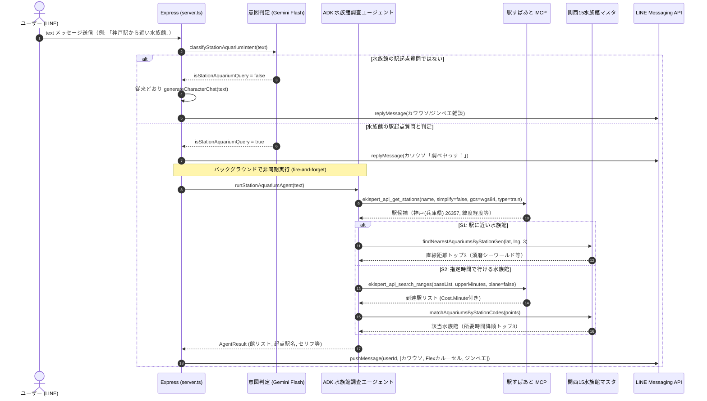

Issue: https://github.com/4geru/tweet-bookmark/issues/790

# 設計: 駅・地名を起点にした水族館の質問にADKマルチエージェントで答える

前提の要件は [requirements.md](requirements.md)、検証スクリプトは `backend/scripts/try-ekispert-agent.ts` および `backend/scripts/try-ekispert-ranges.ts`。

## 0. このdesignで決めること

requirements.md 末尾の「未確定事項」5点に結論を出す。

| # | 論点 | 結論 |
| --- | --- | --- |
| 1 | 自由文の振り分け方法（意図判定） | **軽量な Gemini Flash 構造化呼び出しによる意図判定**。該当時は即座に replyToken で「調べ中っす！」を返し、非同期バックグラウンドでエージェントを実行 |
| 2 | エージェント構成とマスタ RAG | **ADK Agent + 駅すぱあと MCPToolset + FunctionTool**。駅の同名・表記ゆれ解決は MCP `get_stations` でエージェントが自律判断し、大量駅データとマスタの突き合わせ・計算は FunctionTool で決定論的に処理 |
| 3 | 駅すぱあと MCP のセッション管理とタイムアウト | **リクエストごとに MCPToolset を生成し `finally` で確実に `close()`**。全体タイムアウトは 25 秒 |
| 4 | LINE push メッセージと返信構成 | **カワウソセリフ + Flex カルーセル（最大3館） + ジンベエセリフ**。S1/S2 用の専用 FlexMessage ビルダーを追加し、電車のみの所要時間である旨や時間を延ばす提案をセリフで補う |
| 5 | `search_ranges` と所要時間 | **`ResultSet.Point[].Cost.Minute` を使用**。マスタ15館の `stationCode` と突き合わせ、降順（上限に近い順）ソート |

---

## 1. 全体アーキテクチャとデータフロー

### 1.1 シーケンス図



---

## 2. 意図判定（Intent Classifier）

### 2.1 判定方式

- `server.ts` の `message.type === "text"` ハンドラ内で、雑談呼び出しの直前に実行する。
- 軽量な Gemini Flash 呼び出し（`gemini-2.5-flash`、低レイテンシ・構造化出力）で判定する。
- 判定プロンプトとスキーマ:
  - ユーザーの発話が「駅・地名を起点にして水族館を尋ねる意図（近い水族館、○分で行ける水族館）」であるかを判定。
  - 単なる雑談（「カワウソ可愛い」「魚教えて」）や水族館以外の場所案内は `false` とする。
- 誤判定防止:
  - 判定が `false` の場合は、そのまま既存の `generateCharacterChat(text)` に落ちるため、既存の雑談・生きもの会話を一切阻害しない。
  - 万一エージェント実行中に駅が特定できない等のエラーが発生した場合は、pushMessage でジンベエが優しく回答する（無応答を防ぐ）。

### 2.2 待ち時間への対応（2段階応答）

LINE の `replyToken` は有効期限が短く（約1分）、またユーザーの体感待ち時間を低減するため、2段階で応答する:
1. **第1段階（即時返信）**:
   - `replyToken` を消費し、カワウソ助教授のセリフを即座に返す:
     `characterLine("kawauso", "think", "駅からの水族館調査っすね！ただいま調査中っす、ちょっと待っててほしいっす！")`
2. **第2段階（完了後 push 返信）**:
   - `userId` に対して `client.pushMessage(userId, messages)` を実行。
   - 失敗・タイムアウト時も `client.pushMessage(userId, [characterLine("dr-jinbei", "think", "すまんな、うまく調べられなんだ。駅名を変えてもう一度試してみておくれ。")])` で必ず返信する。

---

## 3. ADK 水族館調査エージェント設計

### 3.1 エージェント構成とハイブリッド設計

LLM（エージェント）の強みである「自然言語の曖昧さ解消・意図解釈・文脈判断」と、コード（FunctionTool）の強みである「決定論的計算・大量データ高速フィルタリング・引数固定」を分離する。

| 責務 | 担当 | 理由 |
| --- | --- | --- |
| 起点駅の曖昧さ解決 | **ADK Agent + MCP `get_stations`** | 「神戸」「大阪」「彦根駅」などの表記ゆれ・同名駅（愛知の神戸か兵庫の神戸か）を、関西水族館の文脈を踏まえてエージェントが判断する（requirements.md 66行目） |
| 引数の決定性・固定 | **コード側 (FunctionTool / ツールラッパー)** | `gcs: "wgs84"`, `type: "train"`, `plane: "false"` など必須パラメータをコードで固定し、LLMのぶれを防ぐ（requirements.md 72行目） |
| S1 直線距離計算・ソート | **FunctionTool (`findAquariumsNearGeo`)** | 起点駅座標とマスタ15館の Haversine 距離を計算し、近い順に3館選ぶ（計算の確実性） |
| S2 到達範囲検索・マスタ突合 | **FunctionTool (`findAquariumsByTravelTime`)** | `search_ranges` の到達駅数（数十〜数百件、数万字JSON）を LLM に読ませず、コード側でマスタの `stationCode` と突合して所要時間降順にソート（コンテキスト浪費・ハルシネーションの撲滅） |
| 時間の丸め・許容範囲チェック | **FunctionTool 内** | 指定時間が 10〜200分 の範囲外の場合、10または200に丸め、丸めた事実をフラグ/注記としてエージェントに返す |
| セリフ・説明の生成 | **ADK Agent (OutputSchema)** | 実際に起点にした駅名、電車のみの所要時間である旨、時間を延ばす提案などをキャラ口調でまとめる |

### 3.2 提供ツール

1. `ekispert_api_get_stations`:
   - 駅すぱあと MCP のツール。
   - エージェントが駅名候補を検索するために呼び出す。
   - `simplify: "false"`, `gcs: "wgs84"`, `type: "train"` をコード側で保証。
2. `findAquariumsNearStationGeo` (FunctionTool):
   - 引数: `latitude: number, longitude: number, stationName: string`
   - マスタ15館との直線距離を Haversine で計算し、近い順トップ3を返す。
3. `findAquariumsByTravelTime` (FunctionTool):
   - 引数: `stationNameOrCode: string, upperMinutes: number`
   - `upperMinutes` を 10〜200分にクランプ（丸めが発生した場合は `clampedMinutes` と `clampedNotice` を返す）。
   - 駅すぱあと MCP の `search_ranges` を実行（`baseList: [stationNameOrCode]`, `upperMinutes: [clampedMinutes]`, `plane: "false"`）。
   - 返された `ResultSet.Point` とマスタ15館の `stationCode` を突合。
   - `Cost.Minute` の降順（指定時間上限に近い順）にソートして最大3館を返す。
   - 0件の場合は `foundCount: 0` を返し、時間を延ばす提案を促す。

### 3.3 エージェントの出力スキーマ（OutputSchema）

```ts
const outputSchema = z.object({
  scenario: z.enum(["nearest", "travel_time", "not_found"]).describe("実行したシナリオ"),
  baseStationName: z.string().describe("実際に起点として使った駅名（例: 神戸(兵庫県)、大阪、彦根など）"),
  minutes: z.number().optional().describe("S2の場合の上限所要時間（分）"),
  clampedNotice: z.string().optional().describe("S2で時間を丸めた場合の注記メッセージ"),
  aquariums: z.array(
    z.object({
      name: z.string().describe("水族館名（マスタの値のみ使用）"),
      prefecture: z.string(),
      address: z.string(),
      station: z.string().describe("玄関口駅"),
      stationCode: z.number().nullable(),
      access: z.string(),
      url: string(),
      distanceKm: z.number().optional().describe("S1の場合の起点駅からの直線距離(km)"),
      travelMinutes: z.number().optional().describe("S2の場合の起点駅からの所要時間(分)"),
      transferCount: z.number().optional().describe("S2の場合の乗換回数"),
    })
  ).max(3),
  kawausoLine: z.string().describe("カワウソ助教授のセリフ（テンポよく元気、語尾「〜っす」）"),
  jinbeiLine: z.string().describe("ジンベエ名誉教授のセリフ（長老、語尾「〜じゃ」「〜のう」。電車のみの所要時間である旨や、遠い場合の注意、0件時の時間延長提案などを含む）"),
});
```

---

## 4. LINE メッセージ表示（UI/UX）

### 4.1 Flex カルーセル（`buildStationAquariumFlexMessage`）

既存の `buildAquariumFlexMessage`（#789 位置情報用）は変更せず、`flexMessages.ts` に新規関数を追加する。

- S1（近い水族館）:
  - ヘッダー: `🌊 1番目に近い水族館` / `ほかの候補`
  - サブタイトル: `${aquarium.prefecture} ・ 直線 ${formatDistance(aquarium.distanceKm)}`
  - 本文: 住所、`🚉 ${aquarium.access}`
  - フッター: 公式サイトボタン
- S2（所要時間で行ける水族館）:
  - ヘッダー: `🚃 所要時間 約${aquarium.travelMinutes}分`
  - サブタイトル: `${aquarium.prefecture} ・ 乗換${aquarium.transferCount}回`
  - 本文: 住所、`🚉 ${aquarium.access}`、`🚃 ${baseStationName}から 約${aquarium.travelMinutes}分（乗換${aquarium.transferCount}回）`
  - フッター: 公式サイトボタン
- 最大3館のカルーセル表示。0件の場合は Flex は送らず、セリフのみで案内する。

### 4.2 セリフと注記

- カワウソ助教授:
  - S1: `「${baseStationName}」から近い水族館を調べたっすよ！`
  - S2: `「${baseStationName}」から約${minutes}分で行ける水族館を見つけてきたっす！`
  - 0件: `うーん、「${baseStationName}」から${minutes}分以内で行ける水族館は見つからなかったっす…`
- ジンベエ名誉教授:
  - S1: 直線距離での順位付けであること、各館の見どころやアドバイス。
  - S2: **「起点駅からの電車の所要時間じゃ。玄関口駅からのバスや徒歩の時間は含んでおらんので気をつけるのじゃぞ。」**（requirements.md 60行目準拠）
  - 時間丸め時: `「駅すぱあとでは10分〜200分の範囲でしか調べられんので、${minutes}分で探したぞい。」`（requirements.md 62行目準拠）
  - 0件時: `「もう少し時間を延ばして探してみてはどうじゃろうな。」`（requirements.md 61行目準拠）

---

## 5. 運用・セキュリティ・リソース管理

- **アクセスキーの管理**: `process.env.EKISPERT_API_ACCESS_KEY` を使用（#789 と共通）。未設定時はエラーログを出力しフォールバック。
- **MCPセッション**: 各リクエスト処理内で `new MCPToolset(...)` を生成し、`try-finally` で確実に `toolset.close()` を呼ぶ。
- **タイムアウト**: エージェント呼び出し全体に 25 秒のタイムアウトを設定。タイムアウト時は pushMessage で失敗案内を送信。
- **個人情報・プライバシー**: ユーザーの自由文や特定した駅名はログや Firestore に永続化しない。
