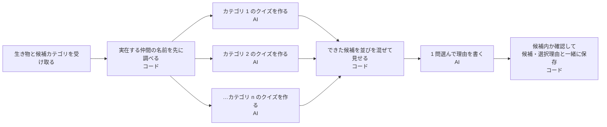

# Design — クイズエージェントの複数候補生成を並列化して速くする（コード＋記事）

Issue: [#824](https://github.com/4geru/tweet-bookmark/issues/824) / requirements: [requirements.md](./requirements.md)

## 0. コードで確認した事実（Design 時点）

| 事実 | 出典 |
| --- | --- |
| 単一 `Agent`＋`findRelatedSpecies` ツール 1 つ。出力スキーマは `consideredCategories`（配列）＋`category`＋`selectionReason`。`runEphemeral` で実行 | `backend/src/quizAgent.ts` 124〜175 行 |
| エージェントの既定モデルは `gemini-2.5-flash`（`QUIZ_AGENT_MODEL` で上書き可） | 同 136 行 |
| 単発経路 `generateQuizForAnimal` のモデルは **`gemini-flash-latest`**（別モデル）。`@google/genai` の `generateContent` ＋ `responseSchema`（question/choices/correctIndex）で、`groundingNames` 引数を受ける | `backend/src/quiz.ts` 32 行、218〜 行 |
| 実在種の材料は `findFamilyMateNames` / `findTankmateNames`（決定論的、既定 5 件）。出し直し経路は既にこれを LLM 呼び出し前に実行している | `backend/src/kaiyukanData.ts` 96〜115 行、`server.ts` 320〜326 行 |
| `CATEGORY_BRIEFS`（カテゴリごとの切り口・避けること）は export 済みで、単発経路とエージェントの両方が使う。`COMMON_QUIZ_RULES` に「他カテゴリと答えの種類・事実を被らせない」というカテゴリ横断ルールがある | `quiz.ts` 93 行〜、`quiz.ts` の `COMMON_QUIZ_RULES` |
| `pickAllowedCandidate(considered, selected, allowed)` は候補外を除き、選択カテゴリが無ければランダムに差し替える | `quiz.ts` 309〜319 行 |
| 呼び出し側は `generateQuizWithAgent(animal, plan.candidates)` の戻り値 3 項目を `savePendingQuiz` に渡すだけ | `server.ts` 333〜341 行 |
| `try-quiz-agent.ts` は 1 回だけ実行して `elapsedMs` を表示する（複数回・中央値の機能は無い） | `backend/scripts/try-quiz-agent.ts` |
| `@google/adk` 2.1.0 に `ParallelAgent` / `SequentialAgent` は存在し、`index` から export されている。ただし **どちらも `@deprecated`（「`Workflow` を使え」）** と型定義に明記。`ParallelAgent` の説明は「サブエージェントを隔離して並列実行。複数案を作り、後続の評価エージェントで選ぶ用途」 | `node_modules/@google/adk/dist/types/agents/parallel_agent.d.ts`、`sequential_agent.d.ts`、`common.d.ts` 20・31 行。`package.json` の version は 2.1.0 |
| `LlmAgent` に `outputKey` / `outputSchema` / `includeContents` があり、`Workflow`（`dist/types/workflow/`）も存在する | `agents/llm_agent.d.ts` |
| backend に `*.test.ts` は見つからない（`package.json` に test スクリプトも無い） | `find` / `package.json` |

注意: `ParallelAgent` の実行時挙動（イベント順・状態の渡し方）は型定義の説明文しか確認していない。方式比較で採用しないため、Design 段階では動作検証しない。

## 1. 未決論点への推奨案

### 論点 3: 並列化の方式（最重要）

| 方式 | 中身 | 長所 | 短所 |
| --- | --- | --- | --- |
| A. ADK `ParallelAgent`（＋選ぶ `LlmAgent` を `SequentialAgent` で後置） | カテゴリごとの `LlmAgent` を並列実行し `outputKey` 経由で選ぶ役へ渡す | ADK らしい構成で記事の見せ場になる | 両クラスとも **型定義で非推奨**。13 エージェント分の Runner・セッション生成のオーバーヘッドがある。`Workflow` への移行が前提になり、`LlmAgent` のサブエージェントにできない旨の注記もある。ツール（`findRelatedSpecies`）を 13 エージェントに配る必要 |
| **B. カテゴリごとに既存の `generateQuizForAnimal` を `Promise.all`（allSettled）で並列 → 選ぶ役を 1 回 LLM 呼び出し** | 既存の単発生成をそのまま再利用。選ぶ段階だけ新規 | 既存コード最大活用（`CATEGORY_BRIEFS`・グラウンディング引数・JSON 検証が既にある）。差分が小さく、因果（並列化）が記事で明瞭 | 「ADK のエージェント」要素が選ぶ段階だけになる（記事で正直に書く）。モデルが違う（下記） |
| C. 1 Agent のまま、スキーマ・指示を変えずに内部の `generateContent` だけ並列 | 不可。エージェント内の 1 回の LLM 出力を分割できない | ― | 方式として成立しない（比較表に載せて理由を書く） |
| D. 13 件を数グループ（例: 4 グループ）にまとめ、グループごとに 1 回の生成 | 呼び出し回数を減らす | レート・トークン重複を抑える | 実装が最も複雑。1 グループ内の逐次生成は残る。効果の因果が混ざる |

**推奨: B**。理由は「既存コードを最大限活用」「改善要因を並列化に絞れる」「ParallelAgent は非推奨で 2.x 系の将来に乗れない」。A を採らなかった理由（非推奨・オーバーヘッド）自体を記事の比較表にする。
- 並列度は **候補全件（8〜13 件）を一斉**。`planQuizCategory` は候補が常に 8 件以上（`quiz.ts` のコメント）。レート制限が出たら同時実行数の上限（例: 6）を足す。**429 が出るかは計測で確認**する（未確認事項）。
- B の落とし穴: `generateQuizForAnimal` は `gemini-flash-latest`、現エージェントは `gemini-2.5-flash`。**比較条件を揃えるため、段階計測の中でモデルを明示的に揃える**（論点 6 参照）。

### 論点 4: 選ぶ役の実装

| 案 | 内容 | 判定 |
| --- | --- | --- |
| **LLM に任せる（軽量 1 回）** | 生成済み候補（カテゴリ・問題文・選択肢のみ）を渡し、`{category, selectionReason}` だけ出させる。スキーマの enum は候補カテゴリ | **推奨**。「自律的に選ぶ」見せ方（要件 5）を維持し、`selectionReason` が本物の理由として残る。出力が短く速い |
| コードで選ぶ（ランダム等） | LLM 往復ゼロ | `selectionReason` が作れず自律性の可視化が崩れる。不採用 |

- 選ぶ段階では**候補の並びを毎回シャッフル**して渡す（要件 8。現状と同じ提示順バイアス対策を「選ぶ段階」に移す）。生成段階の順序はバイアスと無関係。
- 選択が候補外／失敗した場合は既存の `pickAllowedCandidate` で差し替え（要件 6）。選ぶ LLM 呼び出し自体が失敗した場合は、`pickAllowedCandidate` のランダム選択にフォールバックし `selectionReason` に「自動選択」と明記して続行する。

### 論点 5: `findRelatedSpecies` の扱い

**推奨: 先に決定論的に実行**。方式 B では、`類似した仲間`＝`findFamilyMateNames`、`同じ水槽にいる魚`＝`findTankmateNames` の結果を、LLM 呼び出し前に `groundingNames` として該当カテゴリの生成へ渡す（server.ts の出し直し経路と同じやり方）。ツール呼び出しの往復（LLM→ツール→LLM）が消え、実在種の捏造防止（要件 9）はプロンプトへの実名リスト注入で満たす。

- 副作用: `findRelatedSpecies` の「LLM が呼ぶ」自律性は無くなる。記事の「実在種のグラウンディング」章は「ツール呼び出し→事前の決定論的取得に変えた」という変更として書き直す（既存下書きの該当章を差し替え）。
- 注意: ツール版は `slice(0, 8)`、既存の補助関数は既定 5 件で件数が異なる。差分は品質確認で見る。`quizAgent.ts` の `buildRelatedSpeciesTool` は不要になれば削除（未使用コードを残さない）。

### 論点 6: モデル・スキーマの軽量化と段階計測

並列化と同時にはやらず、**1 段階ずつ測る**。段階は変更を累積する。

| 段階 | 変更 | 見たいこと |
| --- | --- | --- |
| S0 | 改善前（現行コード・変更なし） | 基準。同条件で複数回 |
| S1 | `findRelatedSpecies` を事前の決定論的取得に変更（1 Agent・1 回出力のまま） | ツール往復の寄与 |
| S2 | カテゴリ別に並列生成＋選ぶ 1 回（方式 B）。**モデルは S0 と同じ `gemini-2.5-flash` に揃える** | 並列化の寄与（本命） |
| S3 | S2 のモデルを `gemini-flash-latest`（`generateQuizForAnimal` 既定）または軽量モデルに変更 | モデルの寄与 |

- S2 のモデル統一は `generateQuizForAnimal` に任意のモデル引数（または `QUIZ_AGENT_MODEL` の参照）を追加して行う（最小変更）。出し直し経路の既定動作は変えない。
- 本番採用は S2 か S3 のうち、計測結果と品質確認で決める。記事には全段階を載せる。

### 論点 2: 性能目標値

**推奨: (c) 数値目標は置かない**。ただし後出しを避けるため、**計測前に「理論下限」を予想として記録**する: 並列版の所要時間 ≒ 最も遅い 1 カテゴリの生成時間 ＋ 選ぶ 1 回。S0 の中央値を測ってから、この予想を design.md に追記（計測前に書くことが重要）。届かなければ理由を書く（要件 3）。

### 論点 7: 計測の粒度

- **対象**: ジンベエザメ固定を主軸（既存下書き・過去記録と同じ）に、**追加で 2 種**（Wikipedia 抜粋がある種とない種を各 1。`kaiyukanData` の `wikipedia` 有無で選ぶ。種名は計測時に確定）。
- **候補**: 全 13 件（除外なし）と、`planQuizCategory` の最小に近い 8 件（`try-quiz-agent.ts` の除外引数で作る）の 2 条件。ジンベエザメのみ両条件、他の 2 種は 13 件のみ。
- **回数**: ジンベエザメは各段階×条件 **5 回**、他 2 種は **3 回**。LLM の応答時間はばらつくため中央値・最小・最大を出す。段階をラウンドロビンで交互に実行（S0→S1→S2→S3→S0…）して時間帯・混雑の偏りを均す。ウォームアップとして最初の 1 回は捨てる（捨てた旨を記録）。
- **記録する段階時間**: 生成（並列部）の最大・各カテゴリ別、選ぶ段階、全体。S0 は全体のみ（内部は分割できない）。
- ローカル実行のみ。Cloud Run の値は載せない（要件 12）。

### 論点 8: 品質の確認

最小限の客観指標のみ記事に載せる（主観評価は載せない）。

| 指標 | 方法 |
| --- | --- |
| 有効率 | 並列生成の成功件数／候補数、JSON 形式不正の件数（要件 7 の分岐が何回発動したか） |
| 選択カテゴリの分布 | 同じ生き物・同じ候補で S0 と S2 を各 10 回回し、選ばれたカテゴリの度数を表にする（特に「ダジャレ」への収束＝提示順バイアスが再発していないか） |
| カテゴリ間の被り | 13 件の候補を 1 回分目視し、同じ事実を使い回した組を数える。**並列生成は `COMMON_QUIZ_RULES` の「他カテゴリと事実を被らせない」を生成中に守れない**（候補同士を見ていないため）。ここが並列化の質の面でのトレードオフとして記事の中心的な注意点になる |
| グラウンディング | 「類似した仲間」「同じ水槽にいる魚」の選択肢が `groundingNames` の実在種に含まれるかをコードで照合 |

被りが目立つ場合の緩和案（実装前に決めない・選ぶ段階で「事実が被る候補は避ける」と指示する程度）は、計測後に判断する。

### 論点 1（決定済み）と周辺

- 既存下書き `articles/quiz-agent-adk-category-selection.md` は本記事に**統合して 1 本**。ファイル名は下書きを `git mv` せず、`articles/` 内で新 slug の 1 ファイルにまとめ、旧下書きは統合後に削除する（削除は実装フェーズで行う。このフェーズではしない）。

## 2. リファクタ後のデータフロー（旅の図の案）

段階単位。クラス名・メソッド名・ツール名は図に書かない。

- 改善前は「B 以降の C1〜Cn と E が **1 回の長い AI 出力**」。記事では前後 2 枚の図（または 1 枚の図の前後比較）で見せる。
- `classDef` の配色は Zenn で無視される事例（Slidev の別件）があるため、図中のラベルに「AI」「コード」と文字で書いて区別する。

## 3. 変更ファイル

| ファイル | 変更 | 備考 |
| --- | --- | --- |
| `backend/src/quizAgent.ts` | `generateQuizWithAgent` の中身を差し替え（シグネチャ・`AgentQuizResult` 不変） | ツール定義・1 回出力スキーマは削除、選ぶ役のスキーマ（category＋selectionReason）に置換 |
| `backend/src/quiz.ts` | `generateQuizForAnimal` に任意のモデル指定（省略時は従来どおり）を追加。必要なら成功/失敗を扱う小さな補助 | 出し直し経路の挙動は変えない |
| `backend/scripts/bench-quiz-agent.ts`（新規） | 計測スクリプト（下記） | `scripts/` は使用後も残す（リポジトリ方針） |
| `backend/scripts/try-quiz-agent.ts` | 変更しない（要件 10 の動作確認に使う）。ただし 13 固定の表示文言「13カテゴリ分」は候補数に追従させる軽微な修正は任意 | |
| `backend/package.json` | `bench:quiz-agent` スクリプトを追加 | |
| `articles/` | 統合記事 1 本（`published: false`）。旧下書きは統合後に削除 | |
| `server.ts` | **変更なし**（要件 4） | |

## 4. 互換性

- `AgentQuizResult.consideredCategories`: 並列生成で成功した候補を `AgentQuizCandidate`（category / groundedInOfficialData / question / choices / correctIndex / speakerPersona）に詰める。`groundedInOfficialData` は単発経路では返らないため、**コードで決める**（`ダジャレ`＝false、それ以外＝true を基本とし、グラウンディング名が空だった 2 カテゴリは false）。値の意味は従来の説明（公式データ・ツール結果に基づく事実か）に合わせて実装時に確認する。
- `speakerPersona`: `ダジャレ` のみ「ジンベエ名誉教授」（`generateQuizForAnimal` が既に設定）。
- `selectionReason`: 選ぶ役の出力。差し替え時は従来どおり末尾に注記。
- `savePendingQuiz` の型は変更しない。pendingQuiz に保存済みの過去データは影響を受けない。
- 失敗時方針（論点 7 相当、要件 7）: 全候補を `Promise.allSettled` で待つ。**成功が 2 件以上なら続行**（選ぶ意味が残る最小値）、1 件以下ならエラーを投げる。続行時は失敗カテゴリを警告ログに出す。

## 5. 計測計画

### スクリプト案 `backend/scripts/bench-quiz-agent.ts`

- 引数: 生き物名、段階（`s0|s1|s2|s3`）、回数、除外カテゴリ。出力: 各回の所要時間・段階内訳・選ばれたカテゴリ・失敗件数を JSON で標準出力、集計（中央値・最小・最大）を表で表示。
- 段階ごとの実装切り替え: **S0 は現行コードの `generateQuizWithAgent` を公開 API 経由で測る**ため、リファクタ前に S0 の計測だけを先に実施して結果 JSON を `docs/specs/824-.../measurements/` に保存する（リファクタ後は旧コードが消えるため）。S1〜S3 は実装中に段階ごとにコミット相当の状態で測る（コミット・PR はユーザーが行う）。
- 内訳計測のため、`generateQuizWithAgent` の本体を「所要内訳を返す内部関数」と「公開ラッパー」に分け、スクリプトは内部関数を呼ぶ（公開シグネチャは不変）。
- 環境: ローカル、モデル・API キーは環境変数、`QUIZ_AGENT_MODEL` を結果 JSON に記録。実行日時・Node バージョンも記録。

### 実行順

1. S0 を計測（コード変更前）。結果と「並列版の理論下限の予想」を記録
2. S1 → S2 → S3 を実装し、各段階で同条件計測
3. 品質確認（論点 8）
4. `tsc --noEmit` と `try-quiz-agent.ts` で 1 問生成を確認（既存テストは見つからないため「テストは存在しない」旨を記録）

## 6. 記事の章立て案（統合後 1 本）

シリーズ共通方針（`823` の design「記事の方向性」）に従う: 結果入りタイトル、冒頭 TL;DR 3 行、対象読者節、比較は表、図は旅の図。

**タイトル候補**（数値は計測後に埋める）
- 「ADK のクイズエージェントを並列化したら ○○ 秒が △△ 秒になった — 13 案を作らせて選ぶ設計の作り方」
- 「13 カテゴリ全部作って選ぶエージェントが ○○ 秒かかった。並列化で △△ 秒、代わりに失ったもの」

| 章 | 内容 | 既存下書きからの扱い |
| --- | --- | --- |
| TL;DR（3 行） | 何が遅かったか / どう速くしたか / ○秒→△△秒＋代償 | 新規 |
| 対象読者 | ADK 入門者、「複数案を作って選ぶ」が遅い人 | 新規 |
| シリーズの導線 | #821 親・#822 提出記事・#823 駅すぱあと記事（未公開はタイトルのみ、リンクは後で差し替え） | 新規 |
| 2 つの出題経路 | 出し直し＝決定論、新カテゴリ＝エージェント | 下書きから流用 |
| 設計: 「1 つ選ぶ」ではなく「全部作ってから選ぶ」 | 自律性の見せ方、`consideredCategories` | 下書きから流用 |
| 提示順バイアス | 実測でダジャレに収束した話。並列化後は「選ぶ段階」でシャッフル | 流用＋追記 |
| 候補外選択への防御 | `pickAllowedCandidate`、スキーマ enum | 流用 |
| 改善前の計測 | S0 の中央値・ばらつきの表。「過去記録の約 24 秒」は参考扱いに留め、本記事の値は S0 の実測のみ | 下書きの「実測レイテンシ」章を差し替え |
| なぜ遅いのか | 1 回の長い出力＋ツール往復、が直列に積まれている。旅の図（前） | 新規 |
| 並列化の方式を比べる | 方式 A〜D の比較表（ParallelAgent は非推奨と型定義に明記、を一次情報として引用） | 新規 |
| 実装 | 事前の決定論的取得 → 並列生成 → 選ぶ 1 回。旅の図（後）。コード抜粋は実コードと一致 | 新規（グラウンディング章は書き換え） |
| 段階計測の結果 | S0〜S3 の表（中央値/最小/最大、条件併記）。届かなかった場合は理由 | 新規 |
| 並列化の代償 | 呼び出し回数 1→(n+1)、トークン消費（測れたら数値、未計測は明記）、カテゴリ間の被り、レート制限の有無 | 新規 |
| 品質は変わったか | 選択カテゴリ分布・有効率・グラウンディング照合 | 新規 |
| 2 段階応答 | reply → push。待ち時間が縮んでも残す理由 | 下書きから流用 |
| 決定論的経路との使い分け | 変更なし | 流用 |
| まとめ・参考 | | 流用＋更新 |

- 記事のコード・数値・カテゴリ数・モデル名は、実装後の実コードと計測 JSON に合わせる（要件 11）。
- 公開前に `/article-review`（要件 19）。`published: false` のまま置く（要件 21）。

## 7. リスクと未確認事項

- 並列 13 リクエストで Gemini API が 429 を返すか: **未確認**（計測時に確認）
- `generateQuizForAnimal` と現エージェントのプロンプトが同一でない（エージェントは「全カテゴリを一度に作る」文脈、単発は 1 カテゴリ文脈）ため、S0→S2 の差は「並列化」だけでなくプロンプト構造の違いを含む。記事で注記する
- `gemini-flash-latest` は別名のため、時期によって実体モデルが変わり得る。計測時の応答メタデータ（取れれば）を記録
- 既存テスト・`tsc` は、テストが無い場合は型チェックと実行確認のみで要件 10 を満たすと整理する（ユーザー確認事項）

## 8. 決定事項（2026-10-07）

ユーザー決定により、上記 1〜7 章の推奨案を次のとおり更新する。矛盾する箇所は本章が優先。

- 並列化は **2 方式を両方実装して比べる**: 方式 B（`Promise.allSettled` で並列生成 → 選ぶ LLM 1 回）と、方式 W（ADK 2.1.0 の `Workflow` で同じ構成）。論点 3 の「A. `ParallelAgent`」は採らない（`@deprecated`、後継が `Workflow`）。その代わり方式 W が ADK らしい版の位置づけになる。
- `findRelatedSpecies` は **LLM を呼ぶ前にコードで取得**する（論点 5 を確定）。`類似した仲間`＝`findFamilyMateNames`、`同じ水槽にいる魚`＝`findTankmateNames`。
- 数値目標は置かない。改善前・B・W を同じ条件で測って正直に書く（論点 2 を確定。理論下限の予想は計測前に measurement.md へ記載する）。
- 既存下書き `articles/quiz-agent-adk-category-selection.md` は統合して 1 本にする。このファイルを書き換えてよい。
- 実装は既存 `generateQuizWithAgent`（改善前・S0）を残し、新方式は別モジュールに置く（`src/quizAgentParallel.ts`、`src/quizAgentWorkflow.ts`、共通部は `src/quizAgentShared.ts`）。返り値は `AgentQuizResult` と互換。**`server.ts` の切り替えはしない**（ユーザー判断待ち）。3 章の「`quizAgent.ts` の中身を差し替え」は行わない。
- 計測スクリプトは `scripts/measure-quiz-agent-latency.ts`（5 章の `bench-quiz-agent.ts` から名称変更）。段階は S0（改善前）・B・W の 3 つに絞る（S1/S3 の単独計測は行わない）。モデルは 3 者とも `QUIZ_AGENT_MODEL`（既定 `gemini-2.5-flash`）に揃える。

### 方式 W の設計（`.d.ts` で確認した API のみ）

確認元: `node_modules/@google/adk/dist/types/workflow/*.d.ts`、`common.d.ts` 183 行、`runner/in_memory_runner.d.ts`。

| 項目 | 確認した内容 |
| --- | --- |
| export | `Workflow` / `FunctionNode` / `JoinNode` / `START` / `node` / `ParallelWorker` が `@google/adk` から export される（`common.d.ts`） |
| 構築 | `new Workflow({ name, edges })`。`edges` はチェーン配列（例 `['START', nodeA, nodeB]`）。ノード要素は node / agent / tool / 関数。静的グラフ（`edges`）か `dynamicEntry` のどちらか一方 |
| 並列 | ファンアウトはチェーン配列の要素に配列を置くか、同じノードから複数エッジを張る（`graph.d.ts`。グラフ検証はノードの同一性で重複排除）。`maxConcurrency` で同時実行上限（未指定は無制限） |
| 合流 | `JoinNode` は全先行ノードの完了まで待ち、「先行ノード名 → 出力」のマップを入力として流す（`join_node.d.ts`） |
| LLM ノード | `LlmAgent` は `BaseNode` なのでそのままグラフに入る。既定 `mode: 'single_turn'` はノード入力に対して 1 回実行。`outputSchema`（Zod）でノード出力が構造化される。ワークフロー内では会話履歴を読まない（`includeContents` を明示しない限り） |
| 関数ノード | `FunctionNode(name, handler)`。`handler(ctx, input)` の戻り値が出力。`ctx.state` でセッション状態を読み書き |
| 実行 | `InMemoryRunner({ agent })` の `agent` は `RunnableRoot`（`BaseAgent \| Workflow`）。`Workflow` を渡せば `runEphemeral` で実行できる（`runner.d.ts`・`in_memory_runner.d.ts`） |
| 失敗 | `ParallelWorker` は「1 件でも例外なら全体が失敗」（`parallel_worker.d.ts`）。静的グラフでの兄弟ノード失敗時の挙動は型定義の説明が薄く、**実行して確認する**（measurement.md に結果を書く） |
| 未確認 | 静的グラフで LlmAgent ノードの入力に前ノード出力（文字列）が渡る経路の実行時挙動、`JoinNode` の出力マップの実際の形、ファンアウト時の同時実行の実測。実装時に実行して確認する |

方式 W のグラフ（呼び出しごとに候補数ぶんのノードを動的に組み立てる）:

1. `prepare`（`FunctionNode`）: 生き物情報と実在名リストからプロンプト文字列を作る（コード）
2. `gen_<カテゴリ>`（`LlmAgent`、候補数ぶん）: 各カテゴリの切り口を `instruction` に持ち、`outputSchema` は question / choices / correctIndex。ファンアウト
3. `join`（`JoinNode`）: 全カテゴリの完了を待つ
4. `build_selection`（`FunctionNode`）: 候補を並べ替えて選択用のプロンプトにする（コード）
5. `select`（`LlmAgent`）: `outputSchema` が category（enum）＋ selectionReason
6. `finalize`（`FunctionNode`）: 候補内か確認し `AgentQuizResult` を組み立てる（コード）

方式 B との違いは「並列化と合流の仕組みを ADK のグラフに任せるか、自前の `Promise.allSettled` か」だけに揃える。生成プロンプトは両方式とも同じ文面（`quizAgentShared.ts`）を使う。ただし B は Gemini API 直接呼び出し、W は ADK 経由（`LlmAgent`）という経路差は残る（記事で注記する）。

### 実装方針の補足

- 生成プロンプト: 方式 B・W とも `CATEGORY_BRIEFS`＋`COMMON_QUIZ_RULES`（被り禁止は他カテゴリを見られないため生成中には守れない）＋参考資料＋実在名リストで組む。B は既存 `generateQuizForAnimal` を再利用せず共通プロンプトを使う（W と文面を揃えるため）。`quiz.ts` への変更は不要（`getClient` の export のみ）。
- 失敗時: B は `allSettled`、成功 2 件以上で続行。W は上記のとおり実行して確認し、結果に応じて失敗許容の仕方を決める。
