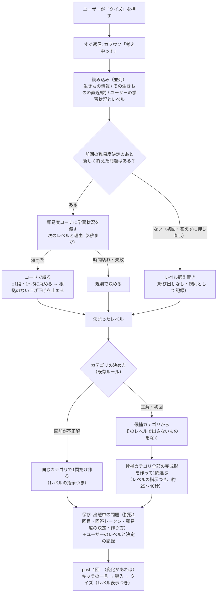
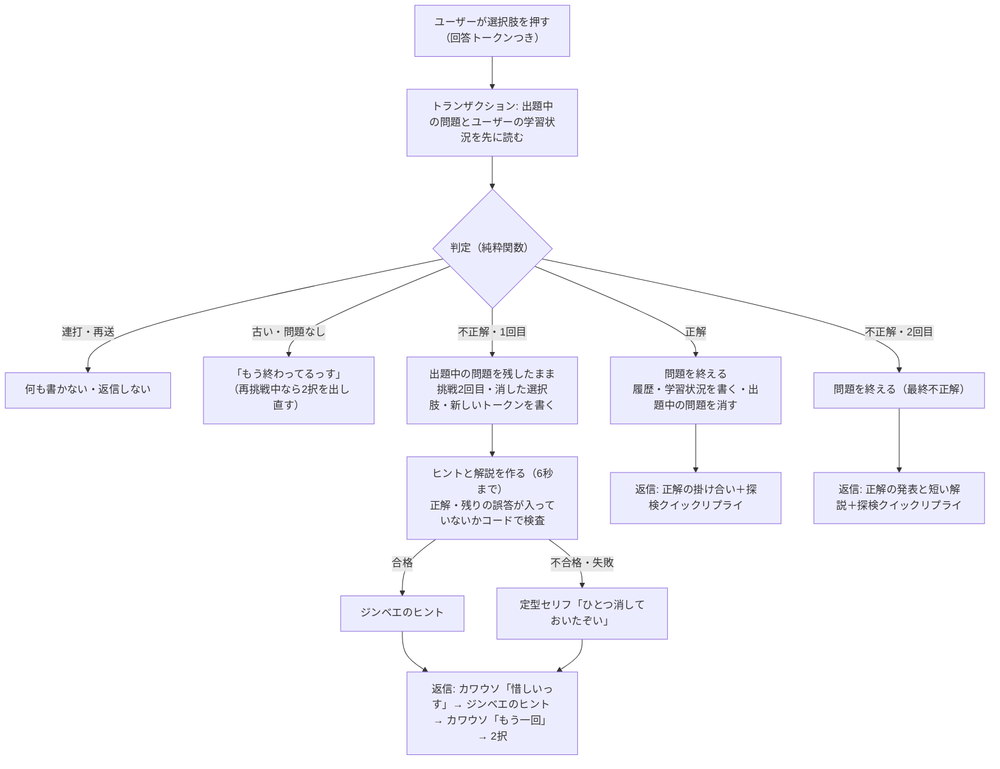
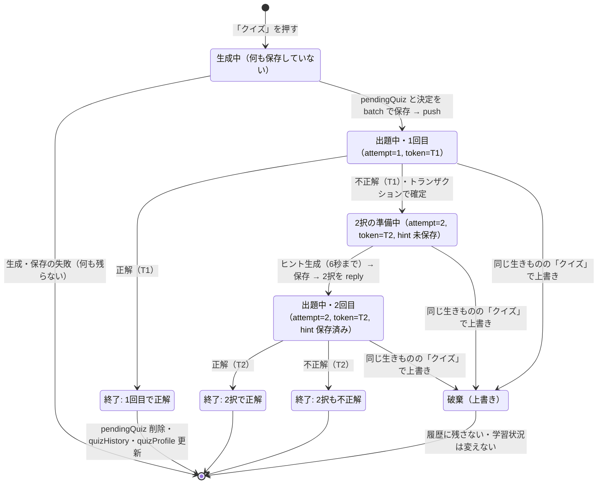

Issue: https://github.com/4geru/tweet-bookmark/issues/829

# 設計: クイズの難易度レベルとヒント付き再挑戦

承認済みの [requirements.md](./requirements.md) を満たす設計。2026-10-08 に深掘り改訂（プロンプトの中身・難易度コーチの判断・ヒント検査・状態遷移・観測・評価・作り置き #831 との境界を追加）。改訂前の「未保存なら 3」等の記述は、決定事項どおり **初期値 2** に直してある。

## 1. 方針

**難易度は「出題の前に、軽いエージェント（難易度コーチ）が1回で決め、コードで縛る」。ヒントは「不正解のときだけ、軽い呼び出しで作ってコードで検査する」。どちらも失敗したら規則・定型セリフで必ず先へ進む。**

- 難易度の決定は、既存のクイズエージェント（全部作ってから選ぶ）に混ぜず、**別の軽い呼び出しで先に決める**（比較は 6.1）。決まったレベルを、新しいカテゴリの経路（`generateQuizWithAgent`）と出し直しの経路（`generateQuizForAnimal`）の両方へ同じ引数で渡す
- 難易度はユーザー全体で1つ。`users/{userId}.quizProfile` に「学習状況（直近5問）」と「現在のレベル」を置く（本人だけ読める既存ルールの範囲内。正解は置かない）
- 再挑戦中は `pendingQuiz` を消さずに「挑戦2回目・消した選択肢・新しい回答トークン」を書き足す。問題を終えるときにだけ `pendingQuiz` を消して `quizHistory` を書く
- 2択は既存のクイズ Flex を流用し、消した選択肢を灰色・取り消し線・押せない行にする。回答 postback の形式は変えない
- **問題を作る関数は利用者の状態を受け取らない**（受け取るのは生きもの・カテゴリ・レベルだけ）。これにより、作り置き（#831）がバッチで同じ関数を呼んでも、その場で作っても、#829 は同じように成り立つ（8章）

### 受け入れ基準との対応

| 基準 | 対応する設計 |
| --- | --- |
| 1 5段階・ユーザーごと・初期値2 | 4.1 `quizProfile.level`、未保存は2 |
| 2 3観点でレベルを定義 | 5.1 `QUIZ_LEVELS`、5.2 レベルごとの指示文 |
| 3 学習状況を渡して次の難易度と理由を決める | 6.2 入力の信号、6.3 プロンプト、6.4 出力 |
| 4 2段以上・範囲外は丸めて記録 | 6.5 丸めとガード（`clamped`・`guard`） |
| 5 8秒で返らない・失敗は規則で決めて記録 | 6.5 時間制限と規則（`decidedBy: "rule"`） |
| 6 レベルと呼び名を表示 | 9.1 クイズ Flex のヘッダー |
| 6b 変化をキャラの一言で告げる | 5.6 変化のセリフ |
| 7 レベルで言葉づかいと深さを変える | 5.2〜5.5（カテゴリの除外・言い換えを含む） |
| 8 1回目不正解でヒント＋選んだ誤答を消した2択 | 2.2、3章、4.2、9.2 |
| 9 2択も不正解なら正解と短い解説 | 7.6 解説 |
| 10 2択で正解なら正解扱い＋ヒント使用を記録 | 4.3 `hintUsed` |
| 11 ヒントは LLM、選択肢の除去はコード | 7章、3.4 `decideAnswerOutcome` |
| 12 正解を含む・失敗は定型セリフ | 7.4 `checkHint` |
| 13 ヒントは不正解時だけ・数秒以内 | 7.1（6秒で打ち切り） |
| 14 次の出題の流れにつなげる | 4.3 `isCorrect` は最終の正誤 |
| 15 難易度の決定ごとに記録 | 4.1 `lastLevelDecision`、4.2・4.3 `levelDecision`、10章 構造化ログ |
| 16 `quizHistory` に難易度・ヒント段階・挑戦回数・最終正誤 | 4.3 |
| 17 正解を LIFF から読める場所へ書かない | 4.4 rules は変更なし |
| 18 古い回答を弾く（再挑戦中も） | 3.2〜3.4 |
| 19 既存の操作を変えない | 9章 postback 形式・クイックリプライ「クイズ」は不変 |
| 20 未保存は2 | 4.1 `normalizeProfile` |

## 2. アーキテクチャ（リクエストの旅）

### 2.1 出題の旅（「クイズ」を押してから問題が届くまで）



### 2.2 回答の旅（選択肢を押してから返事が届くまで）



- ヒントの LLM 呼び出しはトランザクションの**外**で行う（トランザクションは再試行されうるため、遅い外部呼び出しを中に入れない）。トランザクションで「2回目に進めた」ことを確定させてから作る
- 返信はすべて replyMessage（無料枠）。不正解→2択の往復でも push は増えない

## 3. 1問のライフサイクル（状態遷移）

### 3.1 状態遷移図



- Firestore に残る状態は `pendingQuiz` の有無・`attempt`・`answerToken`・`hint` の有無だけ。「2択の準備中」と「出題中・2回目」の違いは `hint` が保存済みかどうか（`hint === null` なら準備中）
- `pendingQuiz` は **生きものごと**（`users/{uid}/pendingQuiz/{animalId}`）。別の生きもののクイズは独立に並行して進む。レベルはユーザー全体で1つなので、終わった順に `quizProfile.recent` に積まれる

### 3.2 回答トークン

- `pendingQuiz.answerToken`（ミリ秒）。出題時は `askedAt.toMillis()`（今の `quizToken` と同じ値）、2択へ進むときに新しい値（`Date.now()`）へ更新し、古い値を `prevAnswerToken` に、更新時刻を `retryStartedAt` に残す
- 照合は `pendingQuiz.answerToken ?? pendingQuiz.askedAt.toMillis()`（本変更前に出した問題との互換）
- postback の `t` が無い（識別子導入前の Flex）ときは今どおり受け付ける

### 3.3 並行操作の扱い

| 状況 | 判定 | 返信 | 書き込み |
| --- | --- | --- | --- |
| 1回目の選択肢を連打（同じ・別の選択肢とも） | 1回目の押下が `retry`。2回目は `t == prevAnswerToken` かつ `retryStartedAt` から10秒以内 → `duplicate` | 2回目は返信しない（1回目の2択が届く） | なし |
| 2択の前に、上に残った最初の3択を押す（10秒以上あと） | `t == prevAnswerToken`・10秒超 → `stale`（`retryInProgress: true`） | 「下の2択で答えてほしいっす」＋保存済みのヒントで2択を出し直す（ヒント未保存なら定型）。2択の返信が失敗していた場合の復旧も兼ねる | なし |
| 最後の回答（正解 or 2択）を連打 | 1回目で終了・pending 削除。2回目は pending が無く、`quizProfile.lastFinished` のトークン一致・10秒以内 → `duplicate` | 返信しない | なし |
| 終わった問題の Flex を後で押す | pending なし（または別トークン） → `stale` | 「そのクイズはもう終わってるっす」（今と同じ） | なし |
| 2択で消した選択肢を押す | 2択の Flex では押せない（action なし）。古い3択からは `t` が古いので上の行に当たる。偽の postback（`t` 最新・消した番号）は `invalid` | 返信しない | なし |
| `choiceIndex` が範囲外 | `invalid` | 返信しない | なし |
| 再挑戦中に同じ生きものの「クイズ」 | 新しい問題で `pendingQuiz` を上書き（今と同じ）。学習状況は変わらないのでレベルは据え置き（`no_new_answers`） | 新しい問題 | 上書きされた問題は履歴に残らない（許容） |
| 再挑戦中に別の生きものの「クイズ」 | 別ドキュメントなので両方生きている。レベルの決定は「終えた問題」だけを見る | 新しい問題 | 前の問題の2択もそのまま答えられる |
| 「クイズ」を連打（同じ生きもの、生成が2本並走） | 両方が決定・生成し、後に保存した方が勝つ。先に届いた Flex は `t` が古くなり `stale` | 2問届く（今と同じ） | pending と決定は同じ batch なので、勝った方の問題と決定の組み合わせは必ず一致する |
| Webhook の再送（`deliveryContext.isRedelivery: true`） | トークンで冪等（上の連打と同じ判定になる）。加えて再送イベントで `stale`/`duplicate` なら返信しない | 再送で終わった回答には返信しない | なし |

- Webhook は即座に 200 を返してから非同期で処理している（`server.ts` の `/webhook`）ので再送自体はまれ。連打は実機でよく起きるため、`duplicate` の判定は【必須】に含める
- 10秒（`DUPLICATE_WINDOW_MS`）は「ヒント生成の最大6秒＋返信」より長く、人が「2択が来ないので古い3択を押し直す」より短い値として決めた

### 3.4 回答の判定（`quizAnswer.ts` の純粋関数）

```ts
export const DUPLICATE_WINDOW_MS = 10_000;
export interface PendingAnswerState {
  correctIndex: number; attempt: 1 | 2; eliminatedIndex: number | null;
  answerToken: number;                 // = pendingQuiz.answerToken ?? askedAt.toMillis()
  prevAnswerToken: number | null;      // 2択へ進む前のトークン
  retryStartedAt: number | null;       // 2択へ進んだ時刻（ミリ秒）
}
export interface LastFinished { animalId: string; answerToken: number; at: number }
export type AnswerOutcome =
  | { kind: "duplicate" }                          // 連打・再送。何もしない
  | { kind: "stale"; retryInProgress: boolean }
  | { kind: "invalid" }
  | { kind: "retry"; eliminatedIndex: number }
  | { kind: "finished"; isCorrect: boolean; attempts: 1 | 2; hintUsed: boolean; eliminatedIndex: number | null };
export function decideAnswerOutcome(args: {
  pending: PendingAnswerState | null; animalId: string; choiceIndex: number;
  token: number | undefined; now: number; lastFinished: LastFinished | null;
}): AnswerOutcome;
```

判定の順:

1. `pending` が無い → `lastFinished` が同じ生きもの・同じトークン・10秒以内なら `duplicate`、それ以外は `stale(false)`
2. `token` が `undefined` → 最新として扱う（互換）
3. `token !== pending.answerToken` → `token === prevAnswerToken` かつ `now - retryStartedAt <= 10秒` なら `duplicate`、それ以外は `stale(pending.attempt === 2)`
4. `choiceIndex` が 0〜2 でない、または `eliminatedIndex` と同じ → `invalid`
5. 正解 → `finished(true, attempt, attempt === 2)`／不正解かつ1回目 → `retry(choiceIndex)`／不正解かつ2回目 → `finished(false, 2, true)`

## 4. データモデル

### 4.1 `users/{userId}`（既存ドキュメント・本人のみ読める。フィールド追加）

```
users/{userId}
  quizProfile: {
    level:        number        1〜5。未保存・壊れた値はレベル2（基準1・20）
    recent: [                   直近の「終えた問題」最大5件、新しい順（全生きもの横断）
      { level: number, category: string, isCorrect: boolean, hintUsed: boolean, attempts: 1|2, at: Timestamp }
    ]
    answeredCount: number       終えた問題の累計
    lastChangeDirection: "up" | "down" | null   直近でレベルが動いた向き（ガードの冷却期間に使う）
    levelChangedAtCount: number | null          そのとき answeredCount が幾つだったか
    lastFinished: { animalId, answerToken, at } 最後に終えた問題（3.3 の連打判定）
    lastLevelDecision: LevelDecision & { at: Timestamp }   直近の難易度の決定（基準15、6.5 の形）
    updatedAt: Timestamp
  }
```

- `recent` に `category` を持たせるのは、コーチが「外したのはダジャレだけ」を判断できるようにするため（6.6 の例 S4）
- 正解（choices/correctIndex）・ヒント・解説は入れない。LIFF から読めても答えは漏れない（基準17）
- 書き込み: 出題時（`level`・`lastLevelDecision`・変化したときだけ `lastChangeDirection`・`levelChangedAtCount`。pending と同じ WriteBatch、`set(…, {merge: true})`）と回答の終了時（`recent`・`answeredCount`・`lastFinished`、トランザクション内）

### 4.2 `users/{userId}/pendingQuiz/{animalId}`（既存・読み取り不可。フィールド追加）

| フィールド | 型 | 説明 |
| --- | --- | --- |
| （既存）animalId / category / question / choices / correctIndex / speakerPersona / selectionReason / consideredCategories / askedAt | | 変更なし |
| `level` | number | この問題のレベル |
| `generatedBy` | "live-single" \| "live-agent" \| "pool" | 問題の作り方（8章。#829 では live の2種だけ書く） |
| `promptVersion` | string | 問題を作ったプロンプトの版（`QUIZ_PROMPT_VERSION`、例 `"829-v1"`） |
| `levelDecision` | object | 6.5 の `LevelDecision`。終了時に `quizHistory` へ写す |
| `attempt` | 1 \| 2 | 何回目の挑戦中か。出題時は1 |
| `answerToken` | number | 回答 postback の `t` と照合する値（3.2） |
| `prevAnswerToken` | number \| null | 2択へ進む前のトークン（3.3 の連打判定） |
| `retryStartedAt` | number \| null | 2択へ進んだ時刻（ミリ秒） |
| `eliminatedIndex` | number \| null | 2択で消した選択肢（＝1回目に選んだ誤答） |
| `hint` | string \| null | 2択で見せたヒントの一言（定型セリフ含む）。出し直しに使う |
| `hintSource` | "llm" \| "fallback" \| null | ヒントの出どころ（`"pool"` は #831 用に予約） |
| `hintRejectReason` | 7.4 の理由 \| null | フォールバックした理由 |
| `explanation` | string \| null | 2回目も不正解のときの短い解説（7.6）。正解を含むので読み取り不可のここにだけ置く |

### 4.3 `users/{userId}/animals/{animalId}/quizHistory/{id}`（既存・本人のみ読める。フィールド追加）

| フィールド | 型 | 説明 |
| --- | --- | --- |
| （既存）category / question / choices / correctIndex / askedAt / isCorrect | | `isCorrect` は**最終の正誤**（2択で正解なら true）。`planQuizCategory` は今どおりこれを読む（基準14） |
| `level` | number | 出題時のレベル |
| `attempts` | 1 \| 2 | 挑戦回数 |
| `hintUsed` | boolean | ヒント付き2択に進んだか |
| `hintStage` | 0 \| 1 | 0=なし、1=ヒントの一言＋50:50（要件で2段階を1回にまとめたため最大1） |
| `hintSource` | "llm" \| "fallback" \| null | |
| `hintRejectReason` | string \| null | |
| `eliminatedIndex` | number \| null | |
| `levelDecision` | object | 出題時の難易度の決定 |
| `generatedBy` / `promptVersion` | string | 作り方と版（作り置きとその場生成の正答率を後で比べるため） |

- 問題を終えた後にだけ書く（今と同じ）。ヒントの一言は残さない（LIFF 表示はスコープ外）
- 既存の履歴にはこれらのフィールドが無い。読む側（`getRecentQuizHistory`）は `category` と `isCorrect` だけを読むので影響なし

### 4.4 `firestore.rules`

- **ルールの変更はしない**。`users/{userId}` は既に `allow get: if isOwner(userId)`、`pendingQuiz` は許可していないので読めない、書き込みはすべて拒否、のまま要件を満たす
- 冒頭コメントだけ更新する（`quizProfile` に正解は含まない／`pendingQuiz` に解説・ヒントが入る）
- `scripts/verify-auth-rules.mjs` に「自分の users ドキュメント（`quizProfile` 入り）は get できる・他人は 403」「`pendingQuiz/1`（`explanation` 入り）は本人も 403」を追加

### 4.5 トランザクション（回答）の読み→書きの順

```
tx.get(pendingRef)        ┐ 読み取りを全部先に（CLAUDE.md の制約）
tx.get(userRef)           ┘
--- 判定（decideAnswerOutcome、3.4） ---
duplicate / stale / invalid: 何も書かない
finished:
  tx.delete(pendingRef)
  tx.set(historyRef, {...})                      historyRef はトランザクションの外で採番（今と同じ）
  tx.set(colRef, { updatedAt }, { merge: true })
  tx.set(userRef, { quizProfile: { recent, answeredCount, lastFinished, updatedAt } }, { merge: true })
retry:
  tx.update(pendingRef, { attempt: 2, eliminatedIndex, prevAnswerToken: 旧値, answerToken: 新値, retryStartedAt: now })
```

- トランザクションの関数は戻り値として「判定結果」と「返信に要る値（正解の文字列・explanation・hint・level など）」を返し、返信はトランザクションの外で組み立てる
- ヒントと解説は、トランザクション確定後に `pendingRef.update({ hint, hintSource, hintRejectReason, explanation })`（失敗してもログだけで先へ進む）

## 5. レベルの定義とクイズのプロンプト

### 5.1 `QUIZ_LEVELS`（`quizLevel.ts`）

| レベル | 呼び名 | 表示（ヘッダー） | 言葉づかい | 問う事実 | 誤答 |
| --- | --- | --- | --- | --- | --- |
| 1 | ちびっこ | `レベル1 ちびっこ ★☆☆☆☆` | ひらがな中心・ひとこと程度の短い文 | 見てわかること（色・形・大きさ・どこを泳ぐか） | はっきり違うもの |
| 2 | みならい研究員 | `レベル2 みならい研究員 ★★☆☆☆` | やさしい言葉・短い文 | 公式の説明にそのまま書いてある基本（すみか・食べもの） | 違いがわかりやすいもの |
| 3 | 研究員 | `レベル3 研究員 ★★★☆☆` | 小学生にも分かる言葉 | 広く知られている一般常識（説明と参考資料で確かめられるもの） | もっともらしいもの |
| 4 | ベテラン研究員 | `レベル4 ベテラン研究員 ★★★★☆` | ふつうの言葉 | 理由・比較・生態のしくみ（なぜ？ どっちが？） | 近いもの |
| 5 | お魚博士 | `レベル5 お魚博士 ★★★★★` | 専門用語も可（科名・学名など） | 分類・近縁種との違い・細かい数値 | ごく近いもの（近縁種・近い値） |

- 呼び名は既存のセリフでユーザーを「研究員さん」と呼んでいる世界観に合わせた。レベル4は UC-E（未実装）の称号「上級研究員」と重ならない「ベテラン研究員」（2026-10-08 決定）

### 5.2 レベルごとの指示文（`buildLevelGuidance(level, category)` が返す節）

プロンプトに差し込む文面を**そのまま**定数で持つ（実装者が言い回しを考えなくてよいように）。共通の書式:

```
# 難易度: レベル{n}「{呼び名}」（{想定}）
- 言葉づかい: {言葉づかいの指示}
- 問う事実: {問う事実の指示}
- 誤答: {誤答の指示}
{カテゴリ別の補足があれば1行（5.4）}
- 事実と正解の正しさはレベルによらず同じ基準で守ること（レベルで変えるのは言い回しと深さだけ）
```

| レベル | 想定 | 言葉づかいの指示 | 問う事実の指示 | 誤答の指示 |
| --- | --- | --- | --- | --- |
| 1 | ようちえん〜小学1年生 | ひらがなとカタカナだけで書く（漢字を使わない）。問題文は1文・30文字以内、選択肢は10文字以内。ことばのあいだに空白を入れてよい | 水族館で見てわかること（色・形・大きさ・どこを泳ぐか・何を食べるか）。数字は使わず「おおきい／ちいさい」「つめたい／あたたかい」のような比べることばにする | 子どもでもはっきり違うとわかるもの。正解と同じ種類の答えにする |
| 2 | 小学校低学年 | やさしい言葉。漢字は小学2年生までに習う程度にし、むずかしい漢字はひらがなにする。問題文は40文字以内 | 公式の説明にそのまま書いてある基本（すみか・食べもの・大きさ）。数字を使うなら「約10m」のような丸い数だけ | 違いがわかりやすいもの（正解と並べて迷わない程度） |
| 3 | 一般（一般常識） | 小学生にも分かる言葉。問題文は60文字以内 | その生きものについて広く知られている一般常識（説明と参考資料で確かめられるもの） | もっともらしいもの（その生きものを知らないと迷う程度） |
| 4 | 中高生〜大人 | ふつうの言葉 | 理由・比較・しくみ（「なぜ？」「どっちが？」「どうやって？」）。答えの理由が説明か参考資料で確かめられるものに限る | 近いもの（同じ理屈で考えると迷うもの） |
| 5 | お魚博士 | 専門用語を使ってよい（科名・目名・学名・器官名）。専門用語にはかっこで短い言い換えを添えてもよい | 分類・近縁種との違い・細かい数値。確信の持てない細かい数値は使わず、分類や比較の問いに切り替える | ごく近いもの（近縁種・近い値・同じ分類階級の別の名前）。ただし誤答が「実は正しい」にならないよう、資料で否定できるものだけ |

- レベル3の文面は改訂前のプロンプト（「小学生にも分かる言葉で」）と同じ水準にする。既存の問題の雰囲気は3に残る
- レベル1の「漢字を使わない」は評価スクリプトで機械的に確認できる（11.3。本番では検査しない）

### 5.3 レベル×カテゴリの出題例（ジンベエザメ／ナンヨウマンタ）

方向性の見本（誤答に使った生きものは `kaiyukan-animals.json` で展示エリアを確認済み）。プロンプトには入れない（例をそのまま真似されると問題が固定化するため）。評価（11.3）で「実際の生成がこの方向に寄っているか」を目視する基準として使う。事実は `kaiyukan-animals.json` の説明（「世界中の暖かい海域に生息」「12m以上になる世界最大の魚類」「プランクトンを食べます」）と一般知識による。

**生息地（ジンベエザメ）**

| レベル | 問題例 | 正解 | 誤答例 |
| --- | --- | --- | --- |
| 1 | ジンベエザメが すんでいるのは どんな うみ？ | あたたかい うみ | こおりの うみ／かわ |
| 2 | ジンベエザメが すんでいるのは どんな海？ | 世界中のあたたかい海 | 北きょくの冷たい海／日本の川や池 |
| 3 | ジンベエザメが野生で見られるのは？ | 世界中の熱帯・亜熱帯の海 | 南極のまわりの海だけ／日本海だけ |
| 4 | ジンベエザメが見られる大洋の組み合わせとして正しいのは？ | 太平洋・インド洋・大西洋 | 太平洋とインド洋だけ／太平洋だけ |
| 5 | 毎年ジンベエザメが集まることで知られる、西オーストラリアのサンゴ礁は？ | ニンガルー・リーフ | グレート・バリア・リーフ（東オーストラリア）／トレス海峡 |

**特徴（ジンベエザメ）**

| レベル | 問題例 | 正解 | 誤答例 |
| --- | --- | --- | --- |
| 1 | ジンベエザメの からだは どれくらい？ | とっても おおきい | てのひらくらい／ねこくらい |
| 2 | ジンベエザメの せなかの もようは？ | 白い 点々（水玉もよう） | もようはない／黒い しまもようだけ |
| 3 | ジンベエザメの口があるのは頭のどこ？ | 頭の先（正面） | 頭の下側／頭の上 |
| 4 | 大きな口で小さなプランクトンを食べられるのはなぜ？ | 海水ごと吸いこんで、えらでこしとるから | 歯でかみくだくから／舌でなめとるから |
| 5 | プランクトンをこしとる、えらにある構造は？ | ろ過パッド（鰓のふるい状の構造） | 鰓蓋（えらぶた）／側線 |

**同じ水槽にいる魚（ジンベエザメ。グラウンディング: 太平洋水槽の実在種）**

| レベル | 問題例 | 正解 | 誤答例 |
| --- | --- | --- | --- |
| 1 | （出さない。5.4 の除外） | | |
| 2 | ジンベエザメと 同じ 大きな水そうに いるのは？ | シロワニ | ペンギン／クラゲ |
| 3 | ジンベエザメと同じ水槽で泳いでいるのは？ | トンガリサカタザメ | ネコザメ（別の水槽）／カクレクマノミ |
| 4 | ジンベエザメと同じ水槽にいるサメは？ | シロワニ | ネコザメ（別の水槽）／サンゴトラザメ（別の水槽） |
| 5 | ジンベエザメと同じ「太平洋」水槽にいるエイの仲間は？ | ヒョウモンオトメエイ | クロガネウシバナトビエイ（別の水槽）／ポートジャクソンネコザメ（別の水槽） |

- レベル4〜5は「別の水槽の近い生きもの」を誤答にするので、**同じ水槽の全種を「誤答に使ってはいけない名前」としてプロンプトに渡す**（今は先頭5件だけ渡しているため、6件目以降の同居種＝例えばドチザメを誤答に使われると正解が2つになる）

**類似した仲間（ナンヨウマンタ。ジンベエザメはデータ上の同科がいないため「別の切り口へ」になる）**

| レベル | 問題例 | 正解 | 誤答例 |
| --- | --- | --- | --- |
| 1 | （出さない。5.4 の除外） | | |
| 2 | ナンヨウマンタの なかまは どれ？ | イトマキエイ | マンボウ／ロウニンアジ |
| 3 | ナンヨウマンタと同じ科の生きものは？ | イトマキエイ | アカエイ／シロワニ |
| 4 | ナンヨウマンタと同じ「イトマキエイ科」なのは？ | イトマキエイ | アカエイ（アカエイ科）／マダラエイ（アカエイ科） |
| 5 | ナンヨウマンタと最も近い仲間は？ | イトマキエイ | マダラトビエイ（トビエイ科）／ウシバナトビエイ（トビエイ科） |

- レベル5の誤答は「ごく近い」ほど分類の流派で正誤が揺れる（トビエイ科とイトマキエイ科を同じ科にまとめる分類もある）。**「科は海遊館データの科名に従う」をレベル4〜5の補足に入れる**（5.4）

**ダジャレ（ジンベエザメ。ジンベエ名誉教授のセリフ調）**

| レベル | 問題例 | 正解 | 誤答例 |
| --- | --- | --- | --- |
| 1 | ワシの すきな ふくは なんじゃ？ | じんべえ | ながぐつ／ぼうし |
| 2 | ワシが夏に着たくなる服は何じゃと思う？ | じんべい | セーター／コート |
| 3 | ワシが夏祭りに着ていく服は何じゃ？ | 甚平 | 浴衣／法被 |
| 4 | ワシの名前のもとになったと言われる服は何じゃ？ | 甚平（背中のもようが似ている） | 浴衣／作務衣 |
| 5 | 英語で Whale shark のワシ、クジラかサメか聞かれたら？ | サメじゃ（軟骨魚類） | クジラじゃ（哺乳類）／どっちもじゃ |

- ダジャレはレベルで「言葉づかい」と「オチを解くのに要る知識」だけを変える（レベル5は英名・分類名を使った言葉遊びにしてよい）

### 5.4 カテゴリの扱い（除外と補足。コードで持つ）

レベル1で成り立ちにくいカテゴリは、プロンプトの指示に頼らず**コードで候補から外す**。外さないカテゴリでも、レベルによって答えの形を変える補足を1行足す。

```ts
// quizLevel.ts
export const LEVEL_EXCLUDED_CATEGORIES: Record<QuizLevel, readonly QuizCategory[]> = {
  1: ["進化の歴史", "海外の小ネタ", "類似した仲間", "同じ水槽にいる魚", "郷土料理"],
  2: [], 3: [], 4: [], 5: [],
};
export const LEVEL_CATEGORY_NOTES: Partial<Record<QuizLevel, Partial<Record<QuizCategory, string>>>> = {
  1: {
    生息地: "地名は使わず「あたたかい うみ」「つめたい うみ」のような ことばで答えにする",
    水温: "数字は使わず「つめたい／あたたかい」で答えにする",
    深度: "数字は使わず「うみの うえのほう／まんなか／そこのほう」で答えにする",
    ダジャレ: "子どもが知っている ことばだけで オチをつくる",
    // 除外カテゴリが出し直し（retry）で来たときの言い換え
    進化の歴史: "「ずっと むかしから いる？」のような かたちにし、時代は「きょうりゅうの ころ」のような たとえにする",
    海外の小ネタ: "「ほかの くにでは なんて よばれている？」のような かたちにし、答えは カタカナ ひとこと",
    類似した仲間: "答えは なまえ だけ。問題文は「なかまは どれ？」のように みじかく",
    同じ水槽にいる魚: "答えは なまえ だけ。問題文は「いっしょに およいでいるのは どれ？」のように みじかく",
    郷土料理: "「たべものとして」ではなく「この いきものは なにを たべる？」に寄せてよい",
  },
  2: { 進化の歴史: "時代は「恐竜のころ」のようなたとえにする" },
  4: { 類似した仲間: "科は海遊館データの科名に従う", 同じ水槽にいる魚: "誤答は別の水槽の生きものにする" },
  5: { 類似した仲間: "科は海遊館データの科名に従う", 同じ水槽にいる魚: "誤答は別の水槽の近い生きものにする", ダジャレ: "英名・学名・分類名を使った言葉遊びにしてよい" },
};
export function filterCategoriesForLevel(candidates: readonly QuizCategory[], level: QuizLevel): QuizCategory[];
// 除外後が0件なら元の candidates を返す（出題を止めない）
```

- **新しいカテゴリの出題（fresh）**: `planQuizCategory` の候補（過去5問と被らない8件以上）から `filterCategoriesForLevel` で外す。レベル1でも最低3件残る（8−5）。0件になったら元の候補に戻す
- **出し直し（retry）**: 「不正解の間は同じカテゴリ」（基準14）を優先し、除外カテゴリでも外さない。代わりに上の補足（言い換え）を付けて作る。例: レベル2で「進化の歴史」を外し、レベル1に下がった → 次も「進化の歴史」を、レベル1の言い換えで出す
- 除外は `planQuizCategory`（791 の純粋関数）を変えず、`server.ts` で plan の後に掛ける（791 のテストに影響しない）
- 除外したカテゴリはログ（`quiz_generated.excludedCategories`）に残す

### 5.5 `quiz.ts` / `quizAgent.ts` への差し込み

| 箇所 | 変更 |
| --- | --- |
| `quiz.ts` `buildPrompt(animal, category, groundingNames, level = DEFAULT_QUIZ_LEVEL, avoidNames = [])` | 冒頭の「小学生にも分かる言葉で、」を消し、「# このカテゴリの出題方針」の後に `buildLevelGuidance(level, category)` の節を入れる。出力ルールの「もっともらしい誤答2つ」を「誤答2つ（近さはレベルの指定に従う）」にする。`avoidNames` があれば「誤答に使ってはいけない名前（同じ水槽・同じ科の実在種）: …」を足す |
| `quiz.ts` `generateQuizForAnimal(animal, category, groundingNames = [], model = MODEL, level = DEFAULT_QUIZ_LEVEL, avoidNames = [])` | `level`・`avoidNames` を `buildPrompt` へ。戻り値に `level` と `generatedBy: "live-single"`・`promptVersion` を付ける |
| `quiz.ts` `quizResponseSchema` | `question.description` から「小学生にも分かる言葉で書かれた、」を外す。`choices.description` を「3つの選択肢。誤答の近さは指定のレベルに従う」に |
| `quiz.ts` `COMMON_QUIZ_RULES` | 「誤答は、正解と同じ種類の答え…にして、もっともらしくする」を「誤答は、正解と同じ種類の答え…にし、近さはレベルの指定に従う」に（レベル1の「はっきり違うもの」と矛盾させない） |
| `quiz.ts` `QUIZ_PROMPT_VERSION = "829-v1"` | 新設。プロンプトやレベル定義を変えたら上げる（作り置きの入れ替え判定・評価の比較に使う） |
| `quizAgent.ts` `generateQuizWithAgent(animal, candidateCategories, level = DEFAULT_QUIZ_LEVEL)` | `buildInstruction` の「# 共通ルール」の前に `buildLevelGuidance(level)`（カテゴリ補足なし）＋「各カテゴリの補足」として `LEVEL_CATEGORY_NOTES[level]` のうち候補にあるものを並べる。出力スキーマ・選び方は変えない |
| `quizAgentWorkflow.ts` / `quizAgentParallel.ts` | 変更しない（本番では使っていない。既定値で動く） |

- 生成した問題がレベルに合っているかは本番では検査しない（作り直すと待ち時間が倍になる）。評価スクリプトで確かめる（11.3）

- `quizLevel.ts` は `QuizCategory` 型を `quiz.ts` から `import type` する。`quiz.ts` は `quizLevel.ts` から値（`buildLevelGuidance`）を import する。型だけの import なので循環しても実行時は問題ない

### 5.6 レベルが変わったときの一言（定型。LLM は使わない）

| 変化 | 話し手・表情 | セリフ |
| --- | --- | --- |
| 上がる（→4 以下） | ジンベエ・happy | 「ほう、なかなかやるのう。次はレベル{n}「{呼び名}」の問題じゃ。ちょっと難しくなるぞい」 |
| 上がる（→5） | ジンベエ・happy | 「見事じゃ！ここからはレベル5「お魚博士」の問題じゃ。ワシも本気を出すぞい」 |
| 下がる | カワウソ・normal | 「次はレベル{n}「{呼び名}」でいくっす！肩の力を抜いて、じっくり観察するっすよ！」 |

- 出題の push の先頭に1通だけ足す（変化がないときは足さない）。下がるときは励ます側のカワウソに言わせる
- 規則で決めた・丸めた・ガードで止めたかはユーザーには見せない（記録にだけ残す）

## 6. 難易度コーチ（`quizLevelAgent.ts`）

### 6.1 なぜ別の軽い呼び出しか（決定済み: B 案）

| 観点 | A: 既存クイズエージェントの入力に足す | B: 別の軽い呼び出しで先に決める（採用） |
| --- | --- | --- |
| 待ち時間 | 追加の往復なし | +約2〜3秒（thinking 0 の1回）。「考え中」の後なので体感の増分は小さい。初回・答えずに押し直したときは呼ばない |
| 制御 | 作り終えた問題は丸める前のレベルで書かれているので、縛りが効かない | レベルが確定してから問題を作るので、丸め・規則が必ず問題文に反映される |
| 出し直し経路 | 別の決め方が要る（2系統） | 両経路の手前で1回だけ決める（1系統） |
| 失敗の巻き込み | 難易度の失敗がクイズ全体の失敗になる | 難易度が失敗しても規則で決めてクイズは出る |
| 記録・説明 | 選択理由とレベルの理由が混ざる | 「難易度コーチが決め、クイズ作りのエージェントがそのレベルで作って選ぶ」役割分担として説明できる |

### 6.2 入力（コードが学習状況から計算して渡す）

生の `recent` だけを渡すと、LLM が「連続何問」を数え間違える。**数える・比べるはコードで済ませ、エージェントには「解釈」だけをさせる**。

```ts
// quizLevel.ts（純粋関数 buildCoachInput(profile, now) が作る）
export interface LevelCoachInput {
  currentLevel: QuizLevel;
  recent: Array<{                                   // 新しい順・最大5
    level: QuizLevel; category: string;
    result: "correct" | "correct_with_hint" | "wrong";
    hoursAgo: number;                                // 整数に丸める
  }>;
  signals: {
    noHintCorrectStreakAtLevel: number;   // 直近から数えた「今のレベルでヒントなし正解」の連続
    wrongStreak: number;                  // 直近から数えた最終不正解の連続
    hintCorrectInRecent: number;          // recent のうちヒントを使って正解した数
    answersAtCurrentLevel: number;        // recent のうち今のレベルで解いた数
    answersSinceLastChange: number | null;// 最後にレベルが動いてから終えた数（動いたことがなければ null）
    lastChangeDirection: "up" | "down" | null;
    oscillating: boolean;                 // recent の level が直近4件で上下を2回以上繰り返している
    hoursSinceLastAnswer: number | null;
    answeredCount: number;
  };
  ruleSuggestion: { level: QuizLevel; reason: string };  // 同じ入力で規則ならどうするか（参考）
}
```

- プロンプトには `JSON.stringify(input, null, 2)` をそのまま載せる（ラベルは英語のキーのままでよい。説明はプロンプト側に書く）
- 利用者の識別子・生きものの名前・問題文は渡さない（判断に不要で、ログや学習への持ち出しを減らす）
- `ruleSuggestion` を渡すのは、規則で十分な場面ではそのまま採用させて判断を安定させるため。どれだけ規則と違う判断をしたかは `ruleTo` との比較で記録する（10章）

### 6.3 プロンプト（`instruction`。`QUIZ_LEVEL_COACH_INSTRUCTION` として定数で持つ）

```
あなたは海遊館の LINE クイズの「難易度コーチ」です。研究員さん（利用者）の直近の回答の記録を見て、次の1問のレベルを決めます。

# レベル（1〜5）
1 ちびっこ: 見てわかること。ひらがな中心。誤答ははっきり違う
2 みならい研究員: 公式の説明にある基本。誤答は違いがわかりやすい
3 研究員: 広く知られた一般常識。誤答はもっともらしい
4 ベテラン研究員: 理由・比較・しくみ。誤答は近い
5 お魚博士: 分類・近縁種・細かい数値。誤答はごく近い

# 目的
正解し続けて退屈にも、外し続けて嫌にもならない「ちょうどよい手応え」を保つこと（目安: ヒントなしで6〜8割正解できるレベル）。

# 判断のしかた
- 根拠は、渡された学習状況の JSON だけ。書かれていないことを推測しない
- 動かすのは1回に1段まで（上げる・据え置き・下げる）
- 上げる目安: 今のレベルで、ヒントなしの正解が続いている
- 下げる目安: 最終的に外した、またはヒントを使ってやっと正解する問題が続いている
- 直近でヒント付き正解が複数あり、ヒントなし正解の連続が0なら、据え置きより下げを優先する
- 次のときは、目安どおりに動かさなくてよい（理由に書く）
  - 外したのが「ダジャレ」だけ（言葉遊びは知識の深さと関係が薄い）
  - 上げ下げを繰り返している（oscillating）。今のレベルで落ち着かせる
  - 前回の回答から何日も空いている。いきなり上げない
  - 今のレベルで解いた問題がまだ少ない。様子を見る
- ruleSuggestion は機械的な目安。状況に合っていればそのまま採用し、合っていなければ変えてよい
- 迷ったら据え置き

# 出力
JSON のみ。
- level: 次のレベル（整数）
- reason: 理由。40字以内。記録用（利用者には見せない）
- basis: 判断の根拠にしたものを、決められたラベルから1〜3個
```

ユーザーメッセージは `# 学習状況\n{input の JSON}`。

### 6.4 出力スキーマ（zod）

```ts
export const COACH_BASIS = [
  "no_hint_streak",   // ヒントなし正解の連続
  "wrong",            // 最終不正解
  "hint_reliance",    // ヒント頼みの正解が続く
  "pun_only_miss",    // 外したのはダジャレだけ
  "oscillation",      // 上げ下げの繰り返し
  "time_gap",         // 久しぶり
  "few_answers",      // 今のレベルの回答が少ない
  "at_bound",         // 上限・下限
  "rule_agreed",      // 規則の案に同意
] as const;
const levelCoachOutputSchema = z.object({
  level: z.number().int().describe("次の問題のレベル（1〜5）。今のレベルから最大1段だけ動かす"),
  reason: z.string().describe("そのレベルにした理由（記録用、40字以内）"),
  basis: z.array(z.enum(COACH_BASIS)).describe("判断の根拠のラベル（1〜3個）"),
});
```

- `min/max`・`enum` を書いても Gemini 側で強制されない前例がある（`quiz.ts` の `pickAllowedCandidate` の注記）ので、`level` の範囲はコード（6.5）で縛り、`basis` は知らないラベルを捨てる。`reason` は40字を超えたら切る（記録用なので不合格にはしない）

### 6.5 コードの縛り（丸め・ガード・時間・規則）と記録の形

`decideQuizLevel(profile, deps = { now: Date.now(), coach: runLevelCoach })` の流れ。`deps.coach` は評価・テストで偽物に差し替えるための引数。

1. **据え置き（呼ばない）**: `answeredCount === 0`、または `answeredCount === lastLevelDecision?.answeredCountAtDecision` → `decidedBy: "rule", fallbackCause: "no_new_answers"`
2. **コーチ**: `buildCoachInput` → `runLevelCoach`（8秒の `Promise.race`）。時間切れ → `timeout`、例外 → `error`、`level` が数値でない・JSON 不正 → `invalid_output`。いずれも規則へ
3. **丸め**（基準4、`clampLevel`）: 非整数は四捨五入 → 1〜5 → `from ± 1`。元と違えば `clamped: true`、`guard: "clamp"`、`proposed` に生の値
4. **ガード**（`applyLevelGuards(input, to)`、純粋関数）: 根拠のない動きを止めて据え置きに戻す

| ガード | 条件（どれかに当たれば据え置き） | 防ぐもの |
| --- | --- | --- |
| `raise_without_evidence` | 上げる提案なのに、直近1件が「今のレベルでのヒントなし正解」でない | 外した直後に上げる・ヒント頼みなのに上げる |
| `lower_without_evidence` | 下げる提案なのに、直近2件に「最終不正解」も「ヒントあり正解」も無い | 正解しているのに下げる |
| `cooldown` | 上げる提案で、前回の変化も「上げ」かつ、その後に終えた問題が2問未満 | 1問ごとに上げ続ける（最速でも2問に1段） |

   上限・下限は丸めで止まる。規則（下）も同じガードを満たすように作ってあるので、規則で決めたときはガードを掛けない

5. **規則**（`ruleLevel`）: 直近1件が最終不正解 → `from − 1`／直近2件がどちらも「今のレベルでのヒントなし正解」→ `from + 1`／それ以外 → 据え置き（ヒントあり正解は上げも下げもしない）

```ts
export type LevelGuard = "clamp" | "raise_without_evidence" | "lower_without_evidence" | "cooldown";
export interface LevelDecision {
  from: QuizLevel; to: QuizLevel;
  direction: "up" | "keep" | "down";
  reason: string;                     // エージェントの理由 or 規則の理由。ガードで変えたら末尾に「（ガード: cooldown）」
  decidedBy: "agent" | "rule";
  fallbackCause: "no_new_answers" | "timeout" | "error" | "invalid_output" | null;
  proposed: number | null;            // エージェントの生の提案
  clamped: boolean;                   // guard === "clamp"（基準4 の記録。互換のため残す）
  guard: LevelGuard | null;
  basis: string[];                    // エージェントの根拠ラベル（規則なら []）
  ruleTo: QuizLevel;                  // 同じ入力で規則なら何にしたか（比較用）
  answeredCountAtDecision: number;
  latencyMs: number;
  model: string | null;               // 呼ばなかったら null
  promptVersion: string;              // QUIZ_LEVEL_COACH_VERSION（例 "829-coach-v1"）
}
```

- **偏りの監視**: 実行時は上の3つのガードで「上げ続ける」「理由なく下げる」を止める。運用では 10.3 のクエリで `direction` の割合と `guard` の発生数を見る（ガードが頻発するならプロンプトを直すサイン）

### 6.6 判断例（状況 → 規則 → エージェントの期待 → 理由）

評価（11.1）のシナリオと同じ。「規則と違う」行がエージェントを置く理由。

| # | 状況（新しい順。L=レベル、○=ヒントなし正解、△=ヒントあり正解、×=最終不正解） | 規則 | エージェントの期待 | 理由の例 |
| --- | --- | --- | --- | --- |
| S1 | 初回（answeredCount 0） | 2据え置き | 呼ばない | 記録なし。初期値で様子を見る |
| S2 | L2。○L2(特徴)・○L2(生息地) | 3へ | 3へ | ヒントなしで2問続けて正解。1段上げる |
| S3 | L3。×L3(水温) | 2へ | 2へ | 直前で外した。1段下げて自信を取り戻す |
| S4 | L3。×L3(ダジャレ)・○L3・○L3・○L3 | **2へ** | **3据え置き** | 外したのは言葉遊びだけ。知識問題は安定している |
| S5 | L3。△L3・△L3・△L3 | **3据え置き** | **2へ** | 3問続けてヒント頼み。少しやさしくする |
| S6 | L3（前回 4→3 に下げた）。○L3・○L3・×L4・○L4 | 4へ | 3据え置き か 4へ | レベル4で外して下がったばかり。もう1問様子を見る（どちらも可） |
| S7 | L4。○L4・○L4（最後の回答は14日前） | 5へ | 4据え置き か 5へ | 久しぶりなので、まず同じレベルで確かめる（どちらも可） |
| S8 | L5。○L5×5 | 5据え置き | 5据え置き（6を提案したら丸め） | 最上位。このまま |
| S9 | L1。×L1・×L1・×L1 | 1据え置き | 1据え置き | 最下位。レベルではなく励ましで支える |
| S10 | L3。○L3・△L3 | 3据え置き | 3据え置き | ヒントなしの正解はまだ1問 |
| S11 | L3（直前に 2→3 に上げた）。○L3・○L2・○L2 | 3据え置き | 3据え置き（4を提案したら cooldown） | 上げたばかり。新しいレベルで1問しか解いていない |
| S12 | L2。×L2・○L2 | 1へ | 1へ（3を提案したら raise_without_evidence） | 直前で外した |

### 6.7 規則と何が違うのか（「単純な自動化を超える」点）

- **規則が見ているのは「正誤の並び」だけ**。エージェントは同じ並びでも「何を外したか（ダジャレか知識か）」「ヒントにどれだけ頼ったか」「上げ下げを繰り返していないか」「どれだけ間が空いたか」を合わせて解釈する（S4・S5・S6・S7）。これらを規則で書こうとすると条件の組み合わせが増え続けるが、エージェントには目的（ちょうどよい手応え）と判断の目安を渡すだけで済む
- **エージェントに任せるのは「解釈」だけ**。数える・範囲に収める・根拠のない動きを止めるはコードが行う（6.2・6.5）。審査では「エージェントが状況を判断し、コードが管理・制御し、その両方がログに残る」と説明する
- 記録には毎回 `ruleTo`（規則ならどうしたか）を残すので、「エージェントが規則と違う判断をした回」をログから抜き出して見せられる（10.3 のクエリ③）

## 7. ヒントと解説（`quizHint.ts`）

### 7.1 呼び出し

```ts
export interface QuizHintResult {
  hint: string;
  hintSource: "llm" | "fallback";      // "pool" は #831 用に予約（8.3）
  hintRejectReason: "contains_answer" | "reveals_other" | "too_long" | "empty" | "timeout" | "error" | null;
  explanation: string | null;
  latencyMs: number;
}
export async function generateQuizHint(
  animal: KaiyukanAnimal, quiz: QuizQuestion, eliminatedIndex: number, level: QuizLevel,
): Promise<QuizHintResult>;                       // 例外を投げない
export function checkHint(hint: string, quiz: Pick<QuizQuestion, "question" | "choices" | "correctIndex">, eliminatedIndex: number):
  QuizHintResult["hintRejectReason"];            // 純粋関数
export const FALLBACK_HINT = "ふむ、ひとつ消しておいたぞい。残りの2つから、よーく考えてみるのじゃ。";
export const FALLBACK_HINT_LEVEL1 = "ふむ、ひとつ けしておいたぞい。のこりの ふたつから えらんでみるのじゃ。";
```

- `@google/genai` の `generateContent` を1回（ADK にしない。ツールも分岐もない一発の生成で待ち時間を最小にする）。`gemini-2.5-flash`、`thinkingBudget: 0`、`responseMimeType: "application/json"`、`responseSchema {hint, explanation}`、6秒の `Promise.race`
- 定型セリフはレベル1だけひらがな版を使う（`fallbackHint(level)`）

### 7.2 プロンプト（`buildHintPrompt(animal, quiz, eliminatedIndex, level)`）

```
あなたは海遊館の「ジンベエ名誉教授」（ジンベエザメの名誉教授）です。クイズで研究員さんが答えを外したので、もう一度考えるための「ヒント」と、答えを発表するときに使う「解説」を作ります。

# 話し方
一人称は「ワシ」。語尾は「〜じゃ」「〜のう」「〜ぞい」。やさしく、楽しそうに。
{7.3 のレベル別の言い回し}

# 問題
カテゴリ: {category}
問題文: {question}
選択肢: {A. … / B. … / C. …}
正解: {正解の選択肢}
研究員さんが選んだ答え（画面から消す）: {選んだ選択肢}
残るもう1つの選択肢: {残りの誤答}

# 生きもの
名前: {name}（{family}）
説明: {description}

# ヒント（hint）のルール
- 1〜2文。{レベル別の字数}以内
- 正解の言葉を書かない。言い換え・一部・読みだけを変えたものも書かない
- 残るもう1つの選択肢の言葉を書かない。「〇〇ではない」とも言わない（答えが1つに決まってしまうため）
- 選んだ答えがなぜ違うか、または正解に近づくために注目するところを、1つだけ言う
- ダジャレのときは、言葉のどこ（音・名前の一部）に注目するとよいかを言う
- 「よく考えるのじゃ」だけのような、中身のないヒントにしない

# 解説（explanation）のルール
- 正解とその理由を1文、60字以内。答えを発表したあとに使うので、正解を書いてよい
- 生きものの説明か確実な一般知識だけを使う（ダジャレはオチの意味を説明する）

JSON のみで出力する。
```

- 参考資料（Wikipedia 抜粋）は入れない（入力を短く保ち、6秒に収める）
- 「残るもう1つの選択肢」をプロンプトに明示するのは、書いてはいけない言葉をモデルに意識させるため

### 7.3 レベル別の言い回し

| レベル | 言い回しの指示 | 字数 | 例（ジンベエザメ） |
| --- | --- | --- | --- |
| 1 | ひらがなとカタカナだけ。「よーく みてごらん」のような観察の声かけ | 30字 | 「ワシの からだは すいそうで いちばん めだつぞい。よーく みてごらん」 |
| 2 | やさしい言葉。身近なものにたとえる | 40字 | 「ワシのごはんは、目に見えないくらい小さいものじゃ。そこがポイントじゃぞい」 |
| 3 | 理由をひとこと | 60字 | 「ふむ、多くのサメと違って、ワシは泳ぎながら海水をまっすぐ吸いこむのじゃ」 |
| 4 | 比べる・「なぜ」を考えさせる | 60字 | 「歯でかむには、ごはんが小さすぎるのう。水ごと口に入れたら、どこで分けると思う？」 |
| 5 | 分類・器官・近縁種の違いに注目させる | 60字 | 「ワシはサメの仲間じゃから、硬骨魚のような鰓のふたは持っておらんのう」 |

### 7.4 正解漏れの検査（`checkHint`）

**正規化** `normalizeForCheck(s)`:

1. `NFKC`（全角英数→半角、`１２ｍ`→`12m`、`㍍` 等の合成文字を分解）
2. 英字を小文字に
3. カタカナ→ひらがな（U+30A1〜U+30F6 を −0x60）
4. 簡易の漢数字→算用数字（「一〜九十九」「百」「千」程度。「十二」→`12`）
5. 空白・記号を除去（`「」『』（）()［］・、。,.!?！？〜~…ー－-` と長音「ー」）

**検査する語（トークン）**: 正解の選択肢と残る誤答それぞれから作る。

- 選択肢の文字列全体（正規化後）
- 数字の並び（`\d+(\.\d+)?`。`12m` と `12メートル` の両方を `12` で捕まえる）
- カタカナが3文字以上続く部分（元の表記で抜き出してから正規化。「プランクトン」「インド」）
- 漢字が2文字以上続く部分（「甚平」「熱帯」）
- ただし **問題文にも出てくる語は除く**（問題文の言葉をヒントで使うのは漏れではない）。正解と残る誤答の**両方に出てくる語**も除く（区別に役立たない）

**判定**（上から順に）:

| 結果 | 条件 |
| --- | --- |
| `empty` | 正規化後が空 |
| `contains_answer` | 正解のトークンのどれかが、正規化したヒントに含まれる |
| `reveals_other` | 残る誤答のトークンのどれかが含まれる（「Bではない」で答えが決まるのを防ぐ） |
| `too_long` | NFKC 後の文字数が 80 を超える（指示は最大60字。多少のはみ出しは許す） |
| `null` | 合格 |

- 1文字の正解（「3」など）も全体一致で判定する。誤って弾くのは許容（漏らすよりよい）
- **検査の限界**: 「鮫」と「サメ」のような漢字とかなの違い、「頭の先」を「前」と言い換えるような意味の漏れは捕まえられない。プロンプトで言い換えも禁じ、評価（11.2）で目視する。不合格ヒントと合格ヒントの本文はどちらもログに出して後から点検する
- `explanation` は検査しない（答えを発表した後にしか使わない）

### 7.5 良いヒント・悪いヒント

問題（レベル3・特徴）「ジンベエザメの口があるのは頭のどこ？」 A 頭の先（正面）／B 頭の下側／C 頭の上。研究員さんは **B** を選んだ（消す）。残るのは A（正解）と C。

| ヒント | 判定 | 理由 |
| --- | --- | --- |
| 「ふむ、多くのサメは口が下にあるが、ワシは泳ぎながら海水をまっすぐ吸いこむのじゃ」 | 合格・良い | 選んだ答え（下側）がなぜ違うかを言い、正解に近づく観察点（まっすぐ）を1つ |
| 「正解は頭の先じゃ」 | `contains_answer` | 正解の全体を含む |
| 「頭の上ではないぞい」 | `reveals_other` | 残る誤答を否定して答えが決まる |
| 「よーく考えるのじゃ」 | 合格・悪い | 検査は通るが中身がない。プロンプトで禁止し、評価の目視で数える |
| 「ワシの口は顔の前にあるのじゃ」 | 合格・悪い | 意味の漏れ（前＝先・正面）。検査の限界。評価の目視で数える |
| （90字の長い説明） | `too_long` | |

### 7.6 2回目も不正解のときの解説

- ヒント呼び出しで一緒に作った `explanation` を `pendingQuiz` に保存し、2回目の不正解で「ふむ、正解は「X」じゃ。{explanation}」と出す。**追加の LLM 呼び出しはしない**
- `explanation` が無い（ヒント生成の失敗・保存の失敗）ときは、生きもの説明の先頭80文字を添える

## 8. 問題の作り方の境界と、作り置き（#831）との関係

#831「クイズの作り置き」は別の担当が requirements を書いている。ここでは #831 の結論を先取りせず、**#829 がどちらの作り方でも成り立つための境界**を決める。

### 8.1 生成の境界（#829 で守る約束）

- **問題を作る関数は利用者の状態を受け取らない**: `generateQuizForAnimal(animal, category, groundingNames, model, level, avoidNames)` は生きもの・カテゴリ・レベル（＋実在種名）だけで決まる。学習状況・履歴・利用者 ID はプロンプトに入れない。作り置きのバッチが同じ関数をそのまま呼べる
- **問題には作り方の情報を持たせる**:

```ts
// quiz.ts（QuizQuestion に追加。すべて任意フィールドなので既存の呼び出しは壊れない）
export interface QuizQuestion {
  /* 既存 */
  level?: QuizLevel;
  generatedBy?: "live-single" | "live-agent" | "pool";
  promptVersion?: string;
}
```

- **server.ts の取得口を1か所にする**: `obtainQuiz({ animal, plan, level, candidates })` → `{ quiz, generatedBy, selectionReason?, consideredCategories? }`。#829 では中身は今の2経路（retry なら `generateQuizForAnimal`、fresh なら `generateQuizWithAgent`）だけ。#831 はこの関数の先頭に「プールから取る」を差し込めばよい
- **レベルの意味を変えない**: どちらの作り方でも、`quiz.level` は難易度コーチが決めたレベルと一致させる（プールに無いレベルを近いレベルで代用しない）

### 8.2 プールから出す場合／その場で作る場合

| 観点 | その場で作る（#829 の実装） | プールから出す（#831 で検討） |
| --- | --- | --- |
| レベルの決定 | 生成の前に決める（6章） | 同じ。決まったレベルでプールを引く |
| カテゴリ | retry は同じカテゴリ、fresh は除外後の候補（5.4） | 同じ条件でプールを引く。fresh で「全部作ってから選ぶ」の代わりに「プールの候補から選ぶ」にするかは #831 の判断 |
| 問題に残る記録 | `generatedBy: live-single / live-agent`、`promptVersion` | `generatedBy: pool`、`promptVersion`（作った時点の版）、プール内の ID |
| 待ち時間 | 出し直し約3〜8秒、新カテゴリ約25〜40秒 | ほぼコーチの時間だけ |
| プールに無いとき | — | その場で作る（`obtainQuiz` が live に落ちる）。代用レベルは使わない |
| プロンプトを変えたとき | 次の出題から反映 | `promptVersion` が古いものを出さない／入れ替える（#831） |

### 8.3 ヒントも作り置きできるか（選択肢と推奨）

1問の誤答は2つしかないので、「どの誤答を選んで外したか」は2通りに尽きる。つまり**ヒントは問題ごとに2つ作っておけば全部の場合をまかなえる**。

| 案 | 内容 | 長所 | 短所 |
| --- | --- | --- | --- |
| A | ヒントは常にその場で作る（#829 の実装） | 作り置きと無関係に動く | 不正解の返信に2〜6秒 |
| B | プールの問題に `hintsByWrongIndex`（誤答2つ分のヒント）と `explanation` を持たせ、作るときに `checkHint` で検査。出すときは合格済みのものを使い、無ければその場で作る | 不正解の返信がほぼ即時。検査に落ちたら作り置きの段階で作り直せる（本番で定型セリフに落ちる率が下がる）。評価も事前にできる | 作り置きの費用が1問あたり +1回。問題とヒントの版をそろえて管理する必要 |
| C | `explanation` だけ作り置き | 2回目の不正解の解説の質が安定 | 待ち時間は変わらない |

- **推奨: #831 でプールを作るなら B**（作り置きの意義が「待ち時間」と「事前の品質確認」にあり、ヒントはその両方に効く）。#829 側は `hintSource` に `"pool"` を予約しておくだけで、実装は #831 に任せる。差し込み口は server.ts の retry 分岐（`quiz.hintsByWrongIndex?.[eliminatedIndex] ?? await generateQuizHint(...)`）の1か所
- 作り置きのヒントでも、出す直前に `checkHint` をもう一度掛ける（版の違い・データの書き換えに備える。純粋関数なので費用はない）

## 9. LINE の表示

### 9.1 クイズ Flex（`flexMessages.ts`）

- `QuizToPresent` に `level?: QuizLevel`、`eliminatedIndex?: number | null` を追加
- ヘッダー（`buildQuizHeader`）: 今のカテゴリ（またはダジャレの話し手）の下に、2行目として `レベル2 みならい研究員 ★★☆☆☆`（`size: 'xxs'`、白の半透明）。`level` が無ければ今と同じ表示。ヘッダーは `layout: 'vertical'` なので text の追加だけで済む（`baseline` の入れ子制約に触れない）

### 9.2 2択（同じ `buildQuizFlexMessage` に `eliminatedIndex` を渡す）

- ヘッダーの色を再挑戦用（`#7B61FF`）にし、1行目を `💡 ヒント付き再挑戦`、2行目にレベル
- 本文: 問題文は同じ。消した選択肢の行は、丸ポチを `#CCCCCC`、文字を `#AAAAAA`・`decoration: 'line-through'` にし、**行に `action` を付けない**。残り2行は今と同じ（元の色・元の番号）
- クイックリプライ: 残り2つだけ。アイコンは元の番号の `CHOICE_ICON_URLS` を使い、色と記号の対応を崩さない
- postback: `action=answerQuiz&animalId=…&choiceIndex={元の番号}&t={新しい answerToken}`。形式は今と同じ（基準19）
- 返信の構成（1回の replyMessage に4通）:
  1. カワウソ・normal「ああーっ！惜しいっす！でも良い予想っすね！」
  2. ジンベエ・think「{ヒント}」
  3. カワウソ・happy「教授のヒントが出たっす！ひとつ消したから、残りの2つから選び直してみるっす！」
  4. 2択の Flex（クイックリプライ付き）
- 探検クイックリプライは付けない（2択のクイックリプライを優先）

### 9.3 終了時の返信

| 結果 | 返信 |
| --- | --- |
| 1回目で正解 | 今と同じ（カワウソ「大正解っす」→ ジンベエ「ふむ、見事じゃ。{説明の先頭}」）＋探検クイックリプライ |
| 2択で正解 | カワウソ「やったっす！ヒントから見事に見抜いたっすね！」→ ジンベエ「ふむ、見事じゃ。{explanation ?? 説明の先頭}」＋探検クイックリプライ |
| 2択も不正解 | カワウソ「むむっ、今回は手ごわかったっす……！」→ ジンベエ・think「ふむ、正解は「{正解}」じゃ。{explanation ?? 説明の先頭}」＋探検クイックリプライ |

## 10. 観測とデモ

### 10.1 どこに何が残るか

| 置き場所 | 中身 | 見せ方 |
| --- | --- | --- |
| Cloud Logging `quiz_level_decision` | 6.5 の `LevelDecision` 全部＋`userIdHash`・`animalId` | 判断の流れ（エージェント／規則／ガード） |
| Cloud Logging `quiz_generated` | `level`・`category`・`generatedBy`・`promptVersion`・`excludedCategories`・`latencyMs` | レベルが問題作りに渡ったこと |
| Cloud Logging `quiz_answer` | `kind`（retry/finished/stale/duplicate/invalid）・`attempt`・`isCorrect`・`level`・`isRedelivery` | ヒント後の正答率・連打の発生数 |
| Cloud Logging `quiz_hint` | `hintSource`・`hintRejectReason`・`latencyMs`・`hint`（不合格のときも本文） | ヒントの検査が効いていること |
| Firestore `users/{uid}.quizProfile` | `level`・`recent`・`lastLevelDecision` | 「今このレベルで、直前の判断の理由はこれ」 |
| Firestore `quizHistory` | `level`・`attempts`・`hintUsed`・`levelDecision`・`generatedBy` | 1問ごとの記録 |

- ログは1行の JSON（`console.log(JSON.stringify({...}))`）。Cloud Run は1行 JSON を `jsonPayload` として取り込むので、フィールドで絞り込める。`severity: "INFO"` を付ける
- 利用者 ID は生で出さず `userIdHash`（SHA-256 の先頭8桁）。同じ人の流れはこの値でつなぐ
- ログでは null を `"none"` に置き換える（`jsonPayload.guard="none"` のように絞り込めるようにする）。Firestore は null のまま

### 10.2 判断ログのサンプル

```json
{
  "severity": "INFO",
  "event": "quiz_level_decision",
  "userIdHash": "3f9a1c2e",
  "animalId": "48",
  "from": 3, "to": 3, "direction": "keep",
  "reason": "外したのはダジャレだけで知識問題は安定",
  "decidedBy": "agent", "fallbackCause": "none",
  "proposed": 3, "clamped": false, "guard": "none",
  "basis": ["pun_only_miss", "no_hint_streak"],
  "ruleTo": 2, "agreesWithRule": false,
  "answeredCountAtDecision": 7, "latencyMs": 2140,
  "model": "gemini-2.5-flash", "promptVersion": "829-coach-v1"
}
```

```json
{
  "severity": "INFO", "event": "quiz_hint", "userIdHash": "3f9a1c2e", "animalId": "48",
  "level": 3, "hintSource": "fallback", "hintRejectReason": "reveals_other",
  "hint": "頭の上ではないぞい", "latencyMs": 1830
}
```

### 10.3 Cloud Logging のクエリ例（Logs Explorer）

共通の前置き:

```
resource.type="cloud_run_revision"
resource.labels.service_name="kaiyukan-gacha-bot"
```

| # | 見たいもの | 追加する条件 |
| --- | --- | --- |
| ① | 難易度の判断の流れ | `jsonPayload.event="quiz_level_decision"` |
| ② | エージェントが決めた回だけ | ① ＋ `jsonPayload.decidedBy="agent"` |
| ③ | **規則と違う判断をした回**（デモの見せ場） | ① ＋ `jsonPayload.agreesWithRule=false` |
| ④ | コードが止めた回（管理・制御） | ① ＋ `jsonPayload.guard!="none"` |
| ⑤ | 規則に落ちた回（時間切れ・失敗） | ① ＋ `jsonPayload.fallbackCause=("timeout" OR "error" OR "invalid_output")` |
| ⑥ | ヒントが検査で弾かれた回 | `jsonPayload.event="quiz_hint"` ＋ `jsonPayload.hintSource="fallback"` |
| ⑦ | 1人の流れ（出題→判断→回答→ヒント） | `jsonPayload.userIdHash="3f9a1c2e"` |

- `gcloud logging read` でも同じ条件で取れる（`make logs` の隣に `make logs-quiz` を足すかは任意）

### 10.4 審査員・デモ動画での見せ方（約40秒の流れ）

1. LINE でわざと外す → ジンベエのヒント＋消した選択肢が灰色の2択（「答えを言わずに考えさせる」）
2. 2問続けてヒントなしで正解 → 次の問題の前にジンベエ「次はちょっと難しくなるぞい」、ヘッダーが「レベル3 研究員」に（「状況を見て難易度を変える」）
3. Logs Explorer のクエリ③で、エージェントが規則と違う判断をした行を開き、`reason`・`basis`・`ruleTo` を見せる（「規則なら下げたが、外したのがダジャレだけなので据え置いた」）
4. クエリ④で `guard` が付いた行を見せる（「エージェントが上げようとしても、根拠が無ければコードが止める」）
5. Firestore の `quizProfile.lastLevelDecision` を見せる（「判断は利用者ごとに記録され、後から追える」）

- 3・4 の行が本番で自然に出るとは限らないので、デモ用の記録は評価スクリプト（11.1）の出力を使ってよい（評価スクリプトは同じ `decideQuizLevel` を通し、同じ形のログを出す）

## 11. 評価（デプロイ前に確かめる）

### 11.1 難易度コーチ（`scripts/try-quiz-level-agent.ts`）

- 6.6 の S1〜S12 を `QuizProfile` の固定データとしてスクリプトに持ち、各シナリオを **3回**ずつ `decideQuizLevel` に通す（S1 は LLM が呼ばれないことを確認するだけ。12×3＝36 回のうち LLM 呼び出しは 33 回）
- 各シナリオに「期待する最終決定の集合」を持たせる（S6・S7 は2つ許す）

```ts
interface CoachScenario {
  id: string; title: string; profile: QuizProfile; now: Date;
  expected: Array<"up" | "keep" | "down">;
  beyondRule?: boolean;   // 規則の答えが expected の外（S4・S5）
}
```

- 出力: シナリオごとに `from→to`・`direction`・`decidedBy`・`proposed`・`guard`・`basis`・`reason`・`latencyMs`・合否。最後に集計
- **合否の基準**:

| 項目 | 基準 |
| --- | --- |
| 最終決定が expected に入る | 全実行の 90% 以上 |
| 規則を超える判断（S4・S5） | 各シナリオで 3回中2回以上 expected に入る（入らなければプロンプトを直す。これが通らないと「エージェントを置く理由」が説明できない） |
| 禁止事項（外した直後に上げる・2段動く・範囲外） | 最終決定で 0 件（ガードで必ず止まること） |
| 時間 | 95パーセンタイル 5秒以内、8秒の時間切れは 33回中1回以下 |
| 出力の形 | `reason` が空でない・`basis` に知らないラベルが無い が 95% 以上 |

- LLM を呼ばないガードの確認は `try-quiz-level.ts`（assert）で別に行う: 偽のコーチ（`deps.coach`）に +2・+1・−1・NaN・例外・9秒待ちを返させ、丸め・各ガード・規則への切り替えを確かめる

### 11.2 ヒント（`scripts/try-quiz-hint.ts`）

- **固定の問題**（LLM で作らず、スクリプトに書いておく）6問: 5.3 の例から ジンベエザメ L1特徴・L3特徴・L5特徴・L2ダジャレ・L4生息地、ナンヨウマンタ L3類似した仲間。数字を含む問題（水温 L3「約25℃」など）を1問足す
- 各問題 × 誤答2つ × 2回 = 約28回 `generateQuizHint` を呼ぶ
- `checkHint` の assert（LLM 不要）: 正解そのもの／カタカナとひらがなの違い／全角数字／「十二」と「12」／単位違い（`12m` と `12メートル`）／「」付き／1文字の正解／問題文にある語は弾かない／残る誤答の否定（`reveals_other`）／81字（`too_long`）／空／合格例
- **合否の基準**:

| 項目 | 基準 |
| --- | --- |
| 正解・残る誤答が表示されるヒントに入っていない | 0 件（検査で必ず止まること） |
| 検査で弾かれる率（`fallback`） | 20% 以下（超えたらプロンプトを直す。定型セリフばかりになるため） |
| 時間 | 95パーセンタイル 4秒以内、6秒の時間切れ 1回以下 |
| 字数 | レベル別の上限内が 90% 以上 |
| 口調 | 語尾に「じゃ／のう／ぞい」のいずれかがある が 80% 以上 |
| 目視（人が見る） | 合格ヒントを一覧で表示し、「答えに近づける」「中身がある」「意味の漏れが無い」の3点を ○/× で付ける。× が 2割を超えたらプロンプトを直す |

### 11.3 レベル別の問題（`scripts/try-quiz-category.ts` のレベル引数）

- 同じ生きもの・カテゴリでレベル1/3/5を作り、並べて表示する。5.3 の例と方向が合っているかを目視
- 機械的に数えられるもの（表示のみ、合否にはしない）: レベル1の問題文・選択肢に漢字が含まれるか、問題文の字数（5.2 の上限）、レベル1で数字を使っていないか

## 12. 変更・新規ファイル

| ファイル | 種別 | 変更内容 |
| --- | --- | --- |
| `backend/src/quizLevel.ts` | 新規 | 型（`QuizLevel`・`QuizProfile`・`LevelDecision`・`LevelCoachInput`・`LevelGuard`）、`QUIZ_LEVELS`・`DEFAULT_QUIZ_LEVEL`・`LEVEL_EXCLUDED_CATEGORIES`・`LEVEL_CATEGORY_NOTES`、`normalizeProfile`・`buildCoachInput`・`clampLevel`・`applyLevelGuards`・`ruleLevel`・`shouldKeepLevel`・`applyFinishedAnswer`・`filterCategoriesForLevel`・`buildLevelGuidance`・`levelLabel`・`levelChangeLine`。LLM・Firestore は使わない |
| `backend/src/quizLevelAgent.ts` | 新規 | `QUIZ_LEVEL_COACH_INSTRUCTION`、`runLevelCoach`（ADK、8秒）、`decideQuizLevel(profile, deps)` |
| `backend/src/quizHint.ts` | 新規 | `buildHintPrompt`・`generateQuizHint`・`normalizeForCheck`・`checkHint`・`FALLBACK_HINT`・`fallbackHint(level)` |
| `backend/src/quizAnswer.ts` | 新規 | `decideAnswerOutcome`・`DUPLICATE_WINDOW_MS` |
| `backend/src/quiz.ts` | 変更 | 5.5（`level`・`avoidNames`・スキーマ説明・`COMMON_QUIZ_RULES`・`QUIZ_PROMPT_VERSION`）、`QuizQuestion` の任意フィールド（8.1） |
| `backend/src/quizAgent.ts` | 変更 | `level` 引数、`buildInstruction` にレベルの節とカテゴリ補足 |
| `backend/src/flexMessages.ts` | 変更 | 9.1・9.2 |
| `backend/src/server.ts` | 変更 | `getQuizProfile`、`obtainQuiz`、`handleStartQuiz`（決定→除外→生成→batch 保存→変化の一言）、`handleAnswerQuiz`（4.5、3.3、9.2・9.3）、10.1 のログ |
| `backend/firestore.rules` | 変更 | コメントのみ |
| `backend/scripts/verify-auth-rules.mjs` | 変更 | 4.4 の確認を追加 |
| `backend/scripts/try-quiz-level.ts` | 新規 | 純粋関数とガードの assert（11.1 後半） |
| `backend/scripts/try-quiz-level-agent.ts` | 新規 | 11.1 の評価 |
| `backend/scripts/try-quiz-hint.ts` | 新規 | 11.2 の評価 |
| `backend/scripts/try-quiz-answer.ts` | 新規 | `decideAnswerOutcome` の assert（3.3 の全行） |
| `backend/scripts/print-quiz-flex-sample.ts` | 変更 | レベル付き3択と2択のサンプル |
| `backend/scripts/try-quiz-category.ts` | 変更 | 11.3 |

## 13. エラー時・タイムアウト時の振る舞いと費用

| 場面 | 振る舞い |
| --- | --- |
| `users` ドキュメントの読み取り失敗 | レベル2・学習状況なしとして続行（`fallbackCause: "error"`）。出題は止めない |
| 難易度コーチが8秒以内に返らない／例外／不正な出力 | 規則で決める（6.5）。記録に原因を残す |
| 難易度の保存失敗（WriteBatch 失敗） | 今の `savePendingQuiz` 失敗と同じ扱い（「うまく作れなかったのう」＋探検クイックリプライ）。pending と決定は同じ batch なので片方だけ残らない |
| クイズ生成の失敗 | 今と同じ。決定は保存されないので、次に押したときにもう一度決める |
| ヒントが6秒以内に返らない／失敗／検査に落ちる | 定型セリフ＋2択（基準12）。解説は説明の先頭にフォールバック |
| ヒント保存（`pendingRef.update`）の失敗 | ログのみ。2択の返信は送る。出し直し時は定型セリフ、解説は説明の先頭 |
| 2択の返信（replyMessage）の失敗 | 10秒以上あとに古い3択を押すと 3.3 の出し直しで2択が届く。または「クイズ」を押すと新しい問題で上書き |

| 項目 | 変化 |
| --- | --- |
| Gemini（出題） | 新しく終えた問題があるときだけ +1（コーチ、thinking 0、入力約1,000・出力約60トークン）。クイズ生成のプロンプトはレベルの節で約150〜250トークン増 |
| Gemini（回答） | 1回目の不正解のときだけ +1（ヒント＋解説、thinking 0、入力約800・出力約150トークン） |
| 待ち時間 | 出題 +約2〜3秒（最大8秒）。1回目の不正解の返信 約2〜6秒（今は即時） |
| LINE push | 変化なし（出題は今も1回の push。不正解→2択・終了の返信は reply） |
| Firestore | 出題: users の get +1・batch で +1 ドキュメント。回答: tx で users の get +1、終了時に users の set +1 |

## 14. テスト・検証方法

1. **純粋関数**（`try-quiz-level.ts` / `try-quiz-answer.ts` / `try-quiz-hint.ts` の assert 部）: 丸め・ガード・規則・据え置き・`buildCoachInput` の信号（連続数・oscillating・時間）・`filterCategoriesForLevel`（レベル1で5件除外・0件なら元に戻す）・回答判定の全分岐（3.3 の表の全行）・`checkHint`（11.2）
2. **LLM の評価**（11.1〜11.3）。※ `npx tsx` はサンドボックス下で EPERM になることがあるので、その場合は解除して実行。`.env` の `GEMINI_API_KEY` が要る
3. **Flex**（`print-quiz-flex-sample.ts`）: LINE Flex Message Simulator で3択（レベル表示）・2択（消した行が灰色・取り消し線・押せない）
4. **ルール**（`verify-auth-rules.mjs`）: 4.4 の追加項目
5. **実機**（`make deploy` 後、LINE で）: tasks.md の V5（未保存ユーザーの「レベル2 みならい研究員」表示、外す→ヒントと2択、連打で2択が二重に来ない、2択も外す→解説とレベル1への変化、ヒントなし2連続正解→レベルが上がる、Firestore とログの確認）

## 15. 論点

### 決定済み（2026-10-08）

1. 難易度の決定は B 案（別の軽い呼び出しで先に決める）
2. ヒントを使っての正解は規則では据え置き（コーチは「ヒント頼みが続く」を下げる材料にできる）
3. 学習状況は `users/{userId}.quizProfile`
4. レベル4の呼び名は「ベテラン研究員」
5. 2択の返信はヒントを最大6秒待って reply

### 深掘りで新たに決めたこと（設計担当の判断。異論があれば差し戻し）

- レベル1では5カテゴリ（進化の歴史・海外の小ネタ・類似した仲間・同じ水槽にいる魚・郷土料理）を新しいカテゴリの候補から外す。出し直しでは外さず言い換えで出す（5.4）
- コーチに渡す学習状況は「数えた信号」＋規則の案。ガード3つ（根拠のない上げ・根拠のない下げ・連続上げの冷却）で偏りを止める（6.2・6.5）
- ヒントの検査に「残る誤答を書いた（`reveals_other`）」を足す（7.4）
- 連打・再送は10秒の窓で `duplicate` として黙って捨てる（3.3）
- 問題を作る関数は利用者の状態を受け取らない／`obtainQuiz` を作り置きの差し込み口にする／`hintSource: "pool"` を予約（8章）

### ユーザーに確認したい点（推奨案つき）

1. **レベル1の除外カテゴリ**: 5つ（進化の歴史・海外の小ネタ・類似した仲間・同じ水槽にいる魚・郷土料理）を外す → **推奨: このまま**。「郷土料理」を残したい（子どもにも「食べる？」は面白い）なら4つに減らす
2. **コーチに規則の案（`ruleSuggestion`）を見せるか** → **推奨: 見せる**（判断が安定し、規則との違いを記録で示せる）。見せると規則に引っぱられて「規則を超える判断」が減る心配があるので、11.1 の S4・S5 が通らなければ見せない案に切り替える
3. **連打の窓 10秒**: 10秒以内に古い3択を押し直した場合も黙って捨てる → **推奨: 10秒**。2択が来ないと感じて押し直す人が多ければ短くする
4. **作り置きのヒント（8.3）** → **推奨: #831 でプールを作るなら案B（誤答2つ分のヒントも作り置き）**。#829 では `"pool"` の予約だけ
5. **デモの判断ログ**: 本番で「規則と違う判断」が撮影までに出なかった場合、評価スクリプトの出力（同じ関数・同じ形のログ）を動画に使ってよいか → **推奨: 使う（字幕で「評価用シナリオ」と明記）**

## 決定事項（2026-10-08 ユーザー回答）

- 難易度は B 案（別の軽い呼び出しで先に決める）／ヒントを使っての正解はレベル据え置き／学習状況とレベルは `users/{uid}.quizProfile`／2択の返信はヒントを最大6秒待って reply — すべて推奨案で決定
- レベルの呼び名: ちびっこ／みならい研究員／研究員／ベテラン研究員／お魚博士
- 初期値: レベル2「みならい研究員」（未保存の既存ユーザーも2）
