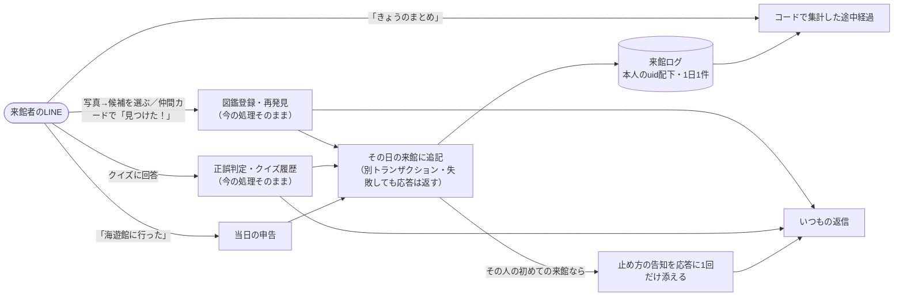
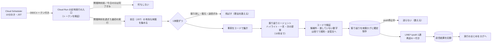
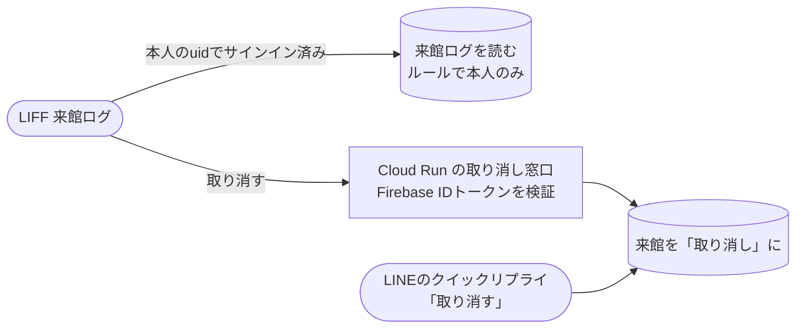

Issue: https://github.com/4geru/tweet-bookmark/issues/830

# 設計: 年パスの人向けの来館ログ（海遊館の来館を記録し、翌日の開館時刻に振り返りを届ける）

承認済みの [requirements.md](./requirements.md) を満たす設計。requirements 末尾の未決論点1〜5は推奨案で決定済みとして扱う。

| 未決論点 | 決定 |
| --- | --- |
| 1 開館時刻の置き場所・変動 | `backend/data/kansai-aquariums.json` の海遊館の項目に `openTime` を足す。休館日・季節変動は扱わない（文言で開館を断定しない） |
| 2 当日の導線 | 併用。当日は LINE「きょうのまとめ」と LIFF でコード集計の途中経過、翌日の開館時刻に確定版の振り返りを push |
| 3 申告の範囲 | 当日だけ |
| 4 位置情報 | 使わない（`handleLocationMessage` は変更しない） |
| 5 push の既定 | 最初からオン。その人の最初の来館が記録された時に1回だけ止め方を告知 |

## 1. 方針（一言）

**来館は「ユーザー × JST日付 × 館ID」を ID にした1ドキュメント（`users/{uid}/visits/kaiyukan_2026-10-08`）に、既存の処理の後ろから“ベストエフォートで”追記する。翌朝は Cloud Scheduler が10分おきに Cloud Run の専用エンドポイントを OIDC 付きで叩き、開館時刻を過ぎた最初の実行で「集計（コード）→ 振り返り（エージェント、10秒）→ 検証（コード）→ push（1通・再送キー付き）」を1来館ずつ行う。**

- 事実（日付・発見数・新種数・正答数・通算回数・前回日）はすべてコードが Firestore から数える。エージェントは「どれをハイライトにするか・どう振り返るか・次に何を勧めるか」だけを、コードが絞った候補の中から決める
- 既存の LINE の操作は応答の中身・順序を変えない。来館ログへの書き込みは既存トランザクションと分離し、失敗しても応答は返す（受け入れ基準37）

### 1.1 受け入れ基準との対応

| 受け入れ基準 | 設計の該当箇所 |
| --- | --- |
| 1 来館の単位・館ID | 3.1 ドキュメントID `{aquariumId}_{YYYY-MM-DD}` |
| 2〜4 自動記録（初回発見・再発見・クイズ） | 4.1〜4.3 フック位置、3.1 `finds` / `quizzes` |
| 5〜6 申告（当日のみ） | 4.4、6.1 テキストコマンド |
| 7 自動／申告の区別 | 3.1 `sources` |
| 8 重複しない | 3.1 決定的ID＋トランザクション、`finds` を animalId キー・`quizzes` を履歴IDキーのマップにする |
| 9 取り消し | 4.5、6.2、7.3 |
| 10 過去データの復元 | 4.6 `scripts/backfill-visits.ts` |
| 11〜17 振り返りエージェント | 5章 |
| 18〜23 翌日の開館時刻の push | 6.3〜6.6 |
| 24 停止／再開 | 6.2 |
| 25〜26 失敗の記録・ログ | 6.6、9章 |
| 27 定時実行の仕組み・生成タイミング | 6.3（Scheduler→Cloud Run エンドポイント、送信直前に生成） |
| 28〜32 LIFF | 7章 |
| 33 本人のみ読める | 3.3 firestore.rules |
| 34〜36 プライバシー | 3.1（座標・写真・pendingQuiz を持たない）、4章 |
| 37〜38 互換性 | 4.1 分離トランザクション、7.2 空表示 |

---

## 2. アーキテクチャ

### 2.1 来館の記録（当日）



### 2.2 翌日の開館時刻の振り返り



### 2.3 LIFF での閲覧と取り消し



---

## 3. データモデル

### 3.1 `users/{uid}/visits/{visitId}`（新規）

`visitId = "{aquariumId}_{YYYY-MM-DD}"`（例 `kaiyukan_2026-10-08`）。日付は JST。**IDが決定的なので、Webhook 再送・連続操作・自動と申告の重複でも1件にしかならない**（基準8）。

| フィールド | 型 | 内容 |
| --- | --- | --- |
| `aquariumId` | string | `"kaiyukan"` 固定（`kansai-aquariums.json` の `id`） |
| `date` | string | `"2026-10-08"`（JST）。一覧の並び替え・定時実行の絞り込みキー |
| `status` | `"active"` \| `"cancelled"` | 取り消すと `cancelled`。データは消さない |
| `sources` | `{ auto: boolean, declared: boolean, restored: boolean }` | 自動・申告・復元の区別（基準7・10）。両方あれば両方 true |
| `finds` | map&lt;animalId, FindEntry&gt; | その日に見つけた生きもの。キーが animalId なので同じ種は1件 |
| `quizzes` | map&lt;historyId, QuizEntry&gt; | その日の回答。キーは `quizHistory` の自動ID（同じ回答は1件） |
| `findCount` / `newSpeciesCount` / `quizAnswered` / `quizCorrect` | number | 書き込みのたびにトランザクション内で `finds` / `quizzes` から再計算して保存（LIFF 一覧用。LLM には数えさせない） |
| `createdAt` / `updatedAt` | Timestamp | |
| `cancelledAt` / `cancelledVia` | Timestamp / `"line"` \| `"liff"` | 取り消し時のみ |
| `digest` | Digest | 翌日の振り返りと送信状態（5章・6章） |

```ts
interface FindEntry {
  name: string;               // animalMaster の name（表示用）
  isNewSpecies: boolean;      // その日のどれかの操作が初回発見だったか
  firstSeenAt: Timestamp;     // その日最初に記録した時刻（再送でも上書きしない）
  lastSeenAt: Timestamp;
  seenCount: number;          // その日に記録した回数（再送で増えうる。集計には使わない）
  restored?: true;            // 復元由来
}
interface QuizEntry {
  animalId: string;
  category: string;           // QuizCategory
  isCorrect: boolean;
  answeredAt: Timestamp;
}
```

- **持たないもの**: 座標（基準34）、写真・写真URL・`messageId`（基準35）、問題文・選択肢・正解番号（基準36。正誤だけ。問題文は既存の `quizHistory` にある）
- `finds` / `quizzes` をサブコレクションにせずマップにする理由: 1来館を1回の読み取りで表示でき、LIFF のルールも1パスで済む。1日の操作は多くても数十件で、1MiB 制限には届かない。念のため `finds` 200 件・`quizzes` 300 件を上限とし、超えたら追記をやめて warn ログ（記録しないだけで応答は止めない）

`digest`:

```ts
interface Digest {
  // 生成（5章）。generatedAt があれば確定版。作り直さない（基準17）
  generatedAt?: Timestamp;
  facts?: DigestFacts;                         // エージェントに渡した事実（コード集計）
  highlight?: { animalId: string; name: string; reason: string; decidedBy: "agent" | "rule" } | null;
  reflection?: { kawausoLine: string; jinbeiLine: string; basedOn: string[]; decidedBy: "agent" | "template" };
  suggestion?: { kind: "animal" | "exhibition" | "none"; targetId: string | null; name: string | null;
                 line: string; reason: string; decidedBy: "agent" | "rule" };
  rejections?: { field: "highlight" | "reflection" | "suggestion"; value: string; reason: string }[];
  agent?: { model: string; outcome: "ok" | "timeout" | "error" | "invalid_json"; latencyMs: number };
  // 送信（6章）
  send?: {
    status: "claimed" | "sent" | "failed" | "skipped_disabled" | "skipped_restored" | "skipped_cancelled";
    claimedAt?: Timestamp; sentAt?: Timestamp;
    failReason?: string;       // HTTPステータスとLINEのエラーメッセージ（ユーザー識別子は含めない）
  };
}
```

### 3.2 `users/{uid}`（既存ドキュメントにフィールドを追加）

| フィールド | 型 | 内容 |
| --- | --- | --- |
| `visitDigest.enabled` | boolean | 無ければ true 扱い（既定オン）。停止で false |
| `visitDigest.announcedAt` | Timestamp | 止め方の告知を出した時刻。あれば二度と出さない |
| `visitDigest.lastSentDate` | string | 最後に振り返りを送った来館日。1日1通の二重防御（基準21） |
| `visitDigest.updatedAt` | Timestamp | |

LIFF からは今でも `users/{uid}` を get できる（`firestore.rules` 16行目）。上記に機密は無いので、そのまま読ませる（LIFF で「まとめ通知: オン／オフ」を表示できる）。

### 3.3 `visitDigestRuns/{date}`（新規・トップレベル）

定時実行の進捗。`date` は「送る日」（JST、来館日の翌日）。`{ startedAt, runningUntil, completedAt, counts }`。`completedAt` があればその日の以降の実行は1回の読み取りで終わる。クライアントからは読ませない（既定の拒否ルールで足りる）。

### 3.4 firestore.rules の変更

`match /users/{userId}` の中に1ブロック足すだけ。書き込みは今どおりすべて拒否（取り消しはバックエンド経由。基準32・33）。

```
      match /visits/{visitId} {
        allow get, list: if isOwner(userId);   // 来館ログは本人だけが読める
      }
```

先頭のコメントに「visits は来館ログ（日付・見つけた生きもの・クイズの正誤・振り返り）。座標・写真・出題中の正解は含まない」を追記する。

### 3.5 インデックス（`backend/firestore.indexes.json` 新規）

定時実行の対象抽出は collection group クエリ `collectionGroup("visits").where("date","==",Y).where("status","==","active")`。collection group の等価2条件は**コレクショングループ範囲**のインデックスが要るため、複合インデックスを1本定義する。

```json
{
  "indexes": [
    {
      "collectionGroup": "visits",
      "queryScope": "COLLECTION_GROUP",
      "fields": [
        { "fieldPath": "date", "order": "ASCENDING" },
        { "fieldPath": "status", "order": "ASCENDING" }
      ]
    }
  ],
  "fieldOverrides": []
}
```

- 復元・送信ずみ・停止中の除外はコードで行う（対象は「前日に来館した人」だけなので件数が小さい）
- ユーザー単位の読み取り（LIFF の一覧 `orderBy("date","desc")`、通算回数・前回日の `where("date","<=",D)`）は単一フィールドの自動インデックスで足りる
- `backend/firebase.json` に `"indexes": "firestore.indexes.json"` を足し、`make deploy-rules` を `--only firestore:rules,firestore:indexes` にする

---

## 4. 来館の自動記録・申告・取り消し（`backend/src/visitLog.ts` 新規）

### 4.1 JST の日付境界

- 既存の `toJstDateTime`（`nearestAquarium.ts` 35〜51行目、`Intl.DateTimeFormat` で `Asia/Tokyo`）を再利用し、`jstDateKey(now: Date): string` で `"YYYY-MM-DD"` を作る。プロセスTZ（UTC）に依存しない
- 「前日」は `jstDateKey(new Date(now.getTime() - 24 * 60 * 60 * 1000))`。JST は夏時間が無いので 24時間引けば正しい
- **日付は操作の時刻で決める**。クイズを 23:58 に出題され 0:01 に答えたら、回答した日の来館に入る。写真の解析は既存どおり push 後にユーザーが候補を選んだ時刻（`handleSelectFish` の時刻）で決まる
- 来館日が過ぎれば、その日の来館に新しい自動記録は入らない（記録は常に「今日」の来館へ）。申告も当日だけ（基準6）なので、前日の来館は翌朝には内容が締まっている。これが「翌日に作るものを確定版とする」（基準17）の根拠

### 4.2 図鑑登録・再発見のフック（`handleSelectFish`、`server.ts` 144〜192行目）

既存のトランザクション（155〜170行目）は**変更しない**。その直後に別の短いトランザクションで来館ログに追記する。

```ts
const isFirstFind = await db.runTransaction(/* 既存のまま */);
const visit = await recordVisitActivity(userId, {
  kind: "find", animalId, name: animal.name, isFirstFind,
}).catch(logAndIgnore);   // 失敗しても undefined で続行（基準37）
// 以降、既存どおり返信を組み立てる。visit?.announce なら告知を末尾に添える（4.7）
```

同じトランザクションに入れない理由:

1. 来館ログの書き込み失敗（上限超え・想定外のデータ）で図鑑登録まで巻き戻るのを避ける（基準37）
2. 既存トランザクションは「`colRef` を読む → 書く」の2手で、来館側の読み取り（`visitRef`・`users/{uid}`）を混ぜると「全部読んでから書く」の並びを崩しやすい（CLAUDE.md の過去障害）。分ければ各トランザクションが「読む→書く」の1往復で閉じる
3. 来館ログは「図鑑登録が成功したとき」だけ書けばよい。分離しても順序は保てる（コミット後に追記）

代償は「図鑑はコミットされたが来館ログはコミットされない」窓がありうること。発見1件が来館ログから欠けるだけで、`firstFoundAt` は残るので致命的ではない（warn ログで追える）。

`recordVisitActivity` のトランザクションの中身（**読み取り2件 → 書き込み最大2件**）:

```
読む: visitRef（users/{uid}/visits/kaiyukan_{today}）, userRef（users/{uid}）
計算: finds / quizzes を既存値とマージ → 集計値を再計算
書く: tx.set(visitRef, 全フィールド, { merge: true })
      初めての来館で visitDigest.announcedAt が無ければ tx.set(userRef, { visitDigest: { announcedAt, updatedAt } }, { merge: true })
返す: { visitId, created: boolean, announce: boolean }
```

- `firstSeenAt` は既にあれば上書きしない（再送対策で、読み取りが必要な理由）。`isNewSpecies` は OR で更新
- `status: "cancelled"` の来館に自動の記録が来た場合は、**中身は追記するが `active` には戻さない**（家で写真を整理していて取り消した日に、また操作しても蘇らない）。戻すのは申告（4.4）だけ
- `announce` は「来館ドキュメントを新規作成し、かつ `announcedAt` が無い」とき true。既存ユーザー（復元済み）も最初の新しい来館で1回だけ告知される
- 仲間カードの「見つけた！」（`flexMessages.ts` 363行目）も `selectFish` に入るので来館として記録される。図鑑登録と同じ扱いにし、家での誤記録は取り消しで直す（requirements のユーザー決定どおり）

### 4.3 クイズ回答のフック（`handleAnswerQuiz`、`server.ts` 394〜481行目）

既存トランザクション（411〜438行目）の戻り値に、来館ログに要る値を足す（読み書きの並びは変えない）。

```ts
return { isCorrect, correctChoice, historyId: historyRef.id, category: quiz.category, answeredAt: now };
```

トランザクションの後（`result` が `"stale"` でも `undefined` でもないとき）に

```ts
const visit = await recordVisitActivity(userId, {
  kind: "quiz", animalId, historyId: result.historyId, category: result.category,
  isCorrect: result.isCorrect, answeredAt: result.answeredAt,
}).catch(logAndIgnore);
```

- 履歴IDをキーにするので、同じ回答が二重に入らない
- `pendingQuiz` の `correctIndex`・問題文は渡さない（基準36）
- 日付は `answeredAt` から決める（4.1）

### 4.4 申告（当日のみ）

`recordDeclaredVisit(userId, now)`: 読む visitRef・userRef → `sources.declared = true`、`status = "active"`（取り消し済みなら戻す）、無ければ `finds: {}`・`quizzes: {}`・集計0で作る。戻り値 `{ result: "created" | "already" | "reactivated", announce }`。日付を引数で受け取らない（当日しか作れない形にする。基準6）。

### 4.5 取り消し

`cancelVisit(userId, visitId, via)`: `visitId` を `^kaiyukan_\d{4}-\d{2}-\d{2}$` で検証 → 読む → 無ければ `not_found` → `status: "cancelled"`、`cancelledAt`、`cancelledVia`。図鑑・クイズ履歴には触らない（基準9）。通算回数・振り返りの対象は `status == "active"` だけで数えるので自動的に外れる。送信ずみの振り返りがあっても取り消せる（LIFF の一覧から消える）。

### 4.6 過去データの復元（`backend/scripts/backfill-visits.ts` 新規）

- `db.collection("users").listDocuments()`（親ドキュメントが無いユーザーも返る）→ ユーザーごとに `collection` の `firstFoundAt`、`users/{uid}/animals` の `listDocuments()` → 各 `quizHistory` の `askedAt` を読む
- JST 日付でまとめ、`finds`（`isNewSpecies: true, restored: true`）・`quizzes`（履歴ID キー）を作る
- 書き込みは**来館ドキュメントが無い日だけ** `tx.create` 相当（既にある日は触らない＝導入後の自動記録と競合しない）。`sources: { auto: false, declared: false, restored: true }`、`digest.send.status: "skipped_restored"` を最初から入れる（基準10。復元した来館に push を送らない。導入当日に前日分を復元しても翌朝送られない）
- `--dry-run`（既定。件数だけ表示）／`--apply`。`--user=<uid>` で1人だけ。使用後も残す
- 再発見の履歴は元データに無いので、復元来館の LIFF 表示に「この日は記録の復元です（再発見は含まれません）」と出す

### 4.7 止め方の告知（初回の来館時に1回）

`recordVisitActivity` / `recordDeclaredVisit` が `announce: true` を返したら、その場の返信（reply）の末尾にカワウソの1行を足す（push 通数を使わない）。

> 「研究員さんの海遊館の来館、記録したっす！次の日の海遊館の開館時刻ごろに、その日のまとめを送るっす。いらないときは『まとめ停止』って送ってほしいっす！」

- `handleSelectFish` は今2メッセージ、`handleAnswerQuiz` は2メッセージなので、足しても上限5に収まる
- 探検のクイックリプライは `withExploreQuickReply` が**最後のメッセージ**に付ける（`flexMessages.ts` 290〜296行目）。告知を最後に置き、その後で `withExploreQuickReply` を通すので、クイックリプライはそのまま出る

---

## 5. 振り返りエージェント（`backend/src/visitDigestAgent.ts` 新規）

### 5.1 役割と縛り

| 判断 | 担当 | 候補・縛り | 外れたとき |
| --- | --- | --- | --- |
| 事実の集計 | コード | — | — |
| ハイライト（1種） | エージェント | その日の `finds` ∪ `quizzes` の animalId だけ（スキーマの enum で絞る＋コードで再検証） | 規則: その日の新種のうち `firstSeenAt` が最も早いもの → 無ければ `finds` で最も早いもの → 無ければ最初のクイズの種 |
| 振り返りの一言（カワウソ・ジンベエ） | エージェント | コードが渡した `facts.signals` を根拠に（`basedOn` に kind を返させる）。数字は `allowedNumbers` のみ | 定型文 |
| 次の提案 | エージェント | コードが作った候補（未発見の展示中の種 最大8／まだ1種も見つけていない展示エリア 最大5）の ID だけ | 規則: 候補の先頭 |
| 申告だけの日（基準16） | — | ハイライトをスキーマから外す | — |

### 5.2 入力（集計値のみ）

```ts
interface DigestFacts {
  visitId: string;
  date: string;                       // "2026-10-08"
  visitNumber: number;                // 通算（active な来館を date 昇順で数えたときの順番）
  previousVisitDate: string | null;   // その前の active な来館
  daysSincePrevious: number | null;
  declaredOnly: boolean;              // finds も quizzes も 0
  findCount: number; newSpeciesCount: number;
  quizAnswered: number; quizCorrect: number; longestCorrectStreak: number;  // その日の回答を時刻順に並べた連続正解
  finds: { animalId: string; name: string; exhibitionName: string; isNewSpecies: boolean; order: number }[]; // 最大30、firstSeenAt順
  quizAnimals: { animalId: string; name: string; correct: number; answered: number }[];                    // 最大10
  signals: { kind: SignalKind; text: string }[];   // 前回との差など、コードが判定した「振り返りの根拠」
  suggestionCandidates: {
    animals: { animalId: string; name: string; exhibitionName: string }[];   // 最大8
    exhibitions: { slug: string; name: string }[];                          // 最大5
  };
  allowedNumbers: number[];           // 一言・提案に書いてよい数字
}
type SignalKind =
  | "first_visit" | "long_gap" | "new_species" | "no_new_species" | "more_finds_than_last"
  | "all_correct" | "correct_streak" | "declared_only";
```

- `signals` の判定（コード）: `first_visit`（visitNumber=1）、`long_gap`（daysSincePrevious ≥ 30）、`new_species`／`no_new_species`、`more_finds_than_last`（前回の findCount より多い）、`all_correct`（2問以上で全問正解）、`correct_streak`（連続正解 ≥ 3）、`declared_only`。`text` は数字を `allowedNumbers` の値だけで書いた短文（例「10日ぶりの来館」）
- `allowedNumbers` = {visitNumber, findCount, newSpeciesCount, quizAnswered, quizCorrect, longestCorrectStreak, daysSincePrevious, 来館日・前回日の月と日}
- 提案候補（コード）: `animalMaster`（`loadKaiyukanAnimals()`）のうち `exhibitionStatus === "display"`（展示終了の47種を除く）かつ本人の `collection` に無い種。「まだ1種も見つけていない展示エリア」の種を優先し、同順位は `visitId` を種にした決定的シャッフルで選ぶ（同じ来館なら同じ候補＝再現できる）。展示エリア名は `getExhibitionName`。図鑑が埋まっていて候補が空なら `suggestion.kind = "none"` の定型（エージェントには提案を求めない）
- ユーザー名・userId・時刻（時分）はエージェントに渡さない

### 5.3 出力スキーマ（zod/v3。既存エージェントと同じ import）

候補に応じてスキーマを毎回組み立て、enum で候補外を選べないようにする（`quizAgent.ts` 43〜71行目と同じ方式）。

```ts
function buildDigestOutputSchema(f: DigestFacts) {
  const highlightIds = uniq([...f.finds.map((x) => x.animalId), ...f.quizAnimals.map((x) => x.animalId)]);
  const suggestionIds = [
    ...f.suggestionCandidates.animals.map((a) => `animal:${a.animalId}`),
    ...f.suggestionCandidates.exhibitions.map((e) => `exhibition:${e.slug}`),
  ];
  return z.object({
    // 推論を先に、結論を後に（quizAgent と同じ並べ方。順序は保証されない前提で、検証はコードで行う）
    reflection: z.object({
      basedOn: z.array(z.enum(signalKinds(f))).min(1).max(3).describe("根拠にした signals の kind"),
      kawausoLine: z.string().max(60).describe("カワウソ助教授。語尾「〜っす」。渡した数字以外を書かない"),
      jinbeiLine: z.string().max(80).describe("ジンベエ名誉教授。語尾「〜じゃ」「〜のう」。渡した数字以外を書かない"),
    }),
    ...(f.declaredOnly ? {} : {
      highlight: z.object({
        animalId: z.enum(highlightIds as [string, ...string[]]),
        reason: z.string().max(80),
      }),
    }),
    ...(suggestionIds.length ? {
      suggestion: z.object({
        targetId: z.enum(suggestionIds as [string, ...string[]]),
        line: z.string().max(60).describe("次の来館で見てほしい理由をジンベエの口調で"),
        reason: z.string().max(80),
      }),
    } : {}),
  });
}
```

### 5.4 ツール

**持たせない。** 必要な事実・候補はすべて入力に入れる。理由: (1) 10秒の制限内で往復を増やさない、(2) 読める範囲を入力に限ることで「渡していない事実を書く」余地を減らす、(3) 事実の取得はコードの責務（requirements の表）。エージェントの仕事は「候補からの選択と言語化」で、ツールを使う判断が要らない。

### 5.5 プロンプトの要点

- 役割: 「海遊館に年パスで通う研究員さんの、きのうの来館を振り返る2人の掛け合いを書く」。キャラ設定は `docs/charactor/dialogue-scenarios.md` のトーン（既存 `characterChat.ts` と同じ要約）を短く入れる
- 事実はすべて JSON で渡し、「**ここに無い数字・日付・生きものの名前を書かない**」「数字は `allowedNumbers` のものだけ」「開館している・混んでいる等、館の状況を断定しない」（基準15・20）
- ハイライト: 新種・クイズの成績・前回との差を見て「研究員さんにとってきのう一番の出来事」になる1種を選び、理由を書く
- 提案: 候補の中から、きのう見た生きものとのつながり（同じエリア・近い仲間）や、まだ行っていないエリアを考えて1つ
- 申告だけの日: ハイライトを求めず「来てくれたこと」と通算回数・次の提案だけ

### 5.6 コード側の検証（`validateDigest(facts, raw)`。純粋関数、ローカルスクリプトで検証できる）

1. JSON パース・zod parse に失敗 → 全項目を規則・定型（`agent.outcome = "invalid_json"`）
2. `highlight.animalId` が `highlightIds` に無い → 捨てて規則で選び直し、`rejections` に `{field:"highlight", value, reason:"not_in_day_records"}`（基準13）
3. `suggestion.targetId` が候補に無い → 捨てて候補の先頭、`rejections` に記録（基準13）
4. `kawausoLine` / `jinbeiLine` / `suggestion.line` を NFKC 正規化し、`/\d+/g` で拾った数字がすべて `allowedNumbers` に含まれるか。含まれなければ**一言は両方とも定型文**に切り替え（提案の line だけ外れたら提案の line を定型に）、`rejections` に記録（基準15）。漢数字は判定対象外（「一番」「一言」などの誤検出を避ける。プロンプトで算用数字を指示）
5. 長さ: スキーマの max を超えた場合は `…` で切る。空文字なら定型
6. 決めた主体を `decidedBy` に入れる（`agent` / `rule` / `template`）

定型文（数字・開館の断定を含まない）:

| 場面 | カワウソ | ジンベエ |
| --- | --- | --- |
| 通常 | 「きのうの海遊館の記録、まとめておいたっす！」 | 「ふむ、よう観察したのう。また会いに来ておくれ。」 |
| 申告だけ | 「きのうは海遊館に行ったんすね！記録しておいたっす！」 | 「ふむ、通うほどに見えてくるものがあるぞい。」 |
| 提案の line | — | 「次は {name} にも会いに行ってみんか。」 |

### 5.7 タイムアウト・失敗（基準14）

- `stationAquariumAgent.ts`（365〜369行目）と同じ `Promise.race` で **10秒**（`VISIT_DIGEST_AGENT_TIMEOUT_MS`、既定 10000）。モデルは `VISIT_DIGEST_MODEL`（既定 `gemini-2.5-flash`）
- タイムアウト・例外 → 規則のハイライト＋定型の一言＋規則の提案で振り返りを作り、push は続ける。`agent.outcome` に `timeout` / `error`
- 生成結果は `digest.generatedAt` 付きで保存（確定版）。同じ来館の次の実行では再生成しない

### 5.8 記録（可観測性）

- 来館ドキュメントの `digest` に、`facts`（渡した入力）・各項目の `reason`・`decidedBy`・`rejections`・`agent.{model,outcome,latencyMs}` を残す。LIFF の詳細で「ジンベエ教授がこれを選んだ理由」として `highlight.reason` を出せる
- ログ（構造化 JSON 1行）: `{"event":"visit_digest_generated","outcome":"ok","latencyMs":…, "rejections":["highlight"], "decidedBy":{…}}`。**userId・visitId は出さない**（`lineAuth.ts` と同じ方針）

---

## 6. LINE 側の操作と翌日の push

### 6.1 テキストコマンド（既存の意図判定より前で完全一致）

`server.ts` の text 分岐（570行目）で、`classifyStationAquariumIntent`（572行目、Gemini 呼び出し）の**前**に `matchVisitCommand(text)` を置く。NFKC → 空白・「！!。、」を除いた完全一致だけを拾い、それ以外は今までどおり意図判定へ流す（基準37。LLM 呼び出しも増えない）。

| コマンド（表記ゆれ） | 動作 |
| --- | --- |
| `きょうのまとめ` `今日のまとめ` `まとめ` | 当日の途中経過（6.2） |
| `海遊館に行った` `今日は海遊館に行った` `来館` | 当日の申告（4.4） |
| `まとめ停止` `まとめを止める` | push 停止 |
| `まとめ再開` `まとめを再開` | push 再開 |

### 6.2 停止／再開・取り消しの操作

**クイックリプライ（postback）を主、テキストコマンドを補助**にする。

- 理由: 振り返りの push・「きょうのまとめ」・告知にボタンが付いていれば、コマンドを覚えなくてよい。テキストコマンドは、告知文で案内する「打てば効く」入口として残す（リッチメニューは画像の作り直しが要るので今回は触らない）
- postback（`handlePostback`、505〜553行目に分岐を追加）:

| data | 動作 |
| --- | --- |
| `action=visitSummary` | きょうのまとめ |
| `action=declareVisit` | 当日の申告 |
| `action=cancelVisitAsk&visitId=…` | 「この日の来館を取り消す？」＋［取り消す］［やめておく］ |
| `action=cancelVisit&visitId=…` | 取り消し（4.5、`via:"line"`） |
| `action=digestOff` / `action=digestOn` | `users/{uid}.visitDigest.enabled` を false / true |

- 取り消しは誤タップ防止に確認を1段挟む。`visitId` は postback の値でも、書き込み先は常にイベントの userId 配下なので他人の来館は触れない
- 「きょうのまとめ」の返信: 当日の来館があれば「きょう（10/8）見つけた生きもの n種（新種 m）・クイズ a問中 c問正解・通算 k回目」（コード集計だけ。基準31）＋クイックリプライ［来館ログを見る（LIFF の uri）］［きょうの来館を取り消す］［まとめ停止 or 再開］。無ければ「きょうの記録はまだ無いっす」＋［今日海遊館に行った］

### 6.3 定時実行の方式（基準27）

| 観点 | A. Cloud Scheduler → Cloud Run サービスのエンドポイント（OIDC） | B. Cloud Scheduler → Cloud Run Jobs |
| --- | --- | --- |
| デプロイ | 今の `make deploy` 1本。同じイメージ・同じ secret | ジョブを別に `gcloud run jobs deploy`。secret・env を二重管理 |
| 認証 | サービスが `--allow-unauthenticated` なので、**アプリで OIDC トークンを検証**する必要がある | IAM（`run.jobs.run`）で閉じる。公開入口が増えない |
| 実行時間 | リクエストのタイムアウト（既定300秒、最大60分）。Scheduler の HTTP の締め切りは最大30分 | タスク最大24時間 |
| 頻繁なポーリング | 軽い（起動ずみのインスタンスなら Firestore 1読み取りで終わる） | 毎回コンテナ起動。10分おきには重い |
| 既存との一貫性 | 既存の非同期処理と同じプロセス・同じヘルパー（`client`・`characterLine`）をそのまま使える | エントリポイントを別に作る |

**推奨: A。** 対象は「前日に来館した人」だけで、1来館あたり最大約10秒（エージェント）＋ push。並列5で処理すれば100人でも約200秒に収まる。サービスの `--timeout` を 600 秒にし、Scheduler の `--attempt-deadline=600s` と揃える。公開入口が増える点は OIDC 検証（6.4）で閉じる。

**送信時刻の決め方（開館時刻はマスタ、Scheduler はポーリング）**: Scheduler は `*/10 5-14 * * *`（Asia/Tokyo）で10分おきに起動するだけにし、**送るかどうかはエンドポイントが `openTime` を見て決める**。

1. `now(JST) < openTime` → 何もしない（200 `{"skipped":"before_open"}`）
2. `now ≥ openTime + 3時間` → 何もしない（送り損ねても昼過ぎ以降には送らない。基準25「同じ日に何度も再送しない」と、届く時刻の意味を守る）
3. `visitDigestRuns/{today}.completedAt` あり → 何もしない
4. それ以外 → 実行（`runningUntil` でリース。並行実行は後から来た方が抜ける）

- これで開館時刻はマスタの1か所だけが正（基準19）。Scheduler の時刻をマスタと二重に持たずに済み、途中で落ちても次の10分で続きから再開できる（来館ごとの送信状態が冪等なので）
- 誤差は最大10分（開館10:00 なら 10:00〜10:10 に届く）。`openTime` をウィンドウ（5〜14時）の外に変えるときだけ Scheduler の時刻も直す（Makefile のコメントに書く）
- 振り返りの生成は**送信の直前**（同じ実行の中で、1来館ずつ「生成→保存→送信」）。前夜に生成する案は、Scheduler が2本になり、前夜の生成が失敗したときの扱いが増えるだけで利点が小さい。来館日は翌0時に締まっているので、朝に作っても内容は確定版になる

### 6.4 エンドポイントと認証（`backend/src/visitApi.ts` 新規）

`POST /tasks/visit-digest`

- `Authorization: Bearer <OIDC IDトークン>` を `google-auth-library` の `OAuth2Client.verifyIdToken({ idToken, audience })` で検証し、`payload.email === VISIT_DIGEST_INVOKER_EMAIL` かつ `email_verified` を確認。`audience` は `VISIT_DIGEST_AUDIENCE`（`{サービスURL}/tasks/visit-digest`）
- env が未設定なら 503 で拒否（閉じる側に倒す。`/webhook` の起動は止めない）
- `google-auth-library` は今 `node_modules` に間接依存（9.15.1）としてあるだけなので、`package.json` の dependencies に明示する
- 本文は読まない（日付は常にサーバの「今」から決める。外から任意の日付を送らせない）。手動での検証はローカルスクリプト（10章）で行う

`POST /visits/:visitId/cancel`（LIFF からの取り消し）

- `Authorization: Bearer <Firebase IDトークン>`（LIFF で `auth.currentUser.getIdToken()`）を `getAuth().verifyIdToken` で検証し、`uid`（= LINE userId）配下の来館だけを取り消す
- CORS は既存の `corsMiddleware`（`lineAuth.ts` 116〜130行目）を使う。今は `Allow-Headers: Content-Type` だけなので `Authorization` を足す（`/auth/line` には影響しない）
- `express.json` は使わない（本文なし）。応答 `{ status: "cancelled" | "not_found" }`

### 6.5 対象の絞り込みと二重送信防止（基準21〜23）

1. `collectionGroup("visits").where("date","==",yesterday).where("status","==","active")`（3.5 のインデックス）
2. 親パスから uid を取り出し、コードで除外: `sources.restored && !auto && !declared`（復元のみ）、`digest.send.status` が `sent` / `failed` / `skipped_*`（終端）
3. 1来館ごとに**送信の確保トランザクション**: 読む visitRef・userRef → `status` が `active` でない（直前に取り消された）なら `skipped_cancelled`／`enabled === false` なら `skipped_disabled`／`lastSentDate === yesterday` なら終端扱い → それ以外は `send.status = "claimed"`、`claimedAt` を書く。`claimed` が15分より古ければ取り直してよい（落ちた実行の続き）
4. 生成（5章。`generatedAt` があれば再利用）→ 保存
5. push: `client.pushMessage({ to, messages }, retryKey)`（`@line/bot-sdk` 11.2.0 の第2引数 `xLineRetryKey`）。`retryKey` は `sha256("visit-digest:" + uid + ":" + visitId)` を UUID 形式に整形した決定的な値。**同じ来館は何度呼んでも LINE 側で1通**になる（409 は「受付ずみ」なので `sent` として扱う）
6. 成功 → `send.status = "sent"`・`sentAt`、`users/{uid}.visitDigest.lastSentDate = yesterday`
7. 失敗 → 5xx・ネットワークは同じ再送キーで1回だけ即時再試行。それでも失敗、または 4xx（ブロック・通数上限など）→ `send.status = "failed"`・`failReason`（終端。その日はもう送らない。振り返りは保存ずみなので LIFF で見られる。基準25）

停止中のユーザー（基準24）も**振り返りは生成して保存する**（LIFF で見られる価値のため。費用は 1来館1回の Flash 呼び出し）。

### 6.6 push の中身（`backend/src/visitFlexMessages.ts` 新規）

3メッセージを1リクエスト（= 1通）で送る。

1. カワウソ `reflection.kawausoLine`
2. Flex（bubble）: ヘッダ「きのうの海遊館 10/8」／ヒーローにハイライトの公式画像（`toAbsoluteImageUrl(animal.img)`。ユーザーの写真は使わない＝基準35）とその名前・理由／本文「見つけた n種（新種 m）」「クイズ a問中 c問正解」「通算 k回目の来館」「つぎは: {提案の名前}（{エリア}）」／フッタのボタン「来館ログを見る」（uri: `VISIT_LOG_LIFF_URL?visitId=…`）。申告だけの日はヒーローを付けない
3. ジンベエ `reflection.jinbeiLine` ＋ `suggestion.line`。クイックリプライ［この来館を取り消す］［まとめ停止］

- 文言で開館を断定しない（「今日も開いとる」等を書かない。基準20）。定型の見出しは「きのうの海遊館」
- Flex の `layout: 'baseline'` 直下に box を置かない（CLAUDE.md の過去障害）
- `VISIT_LOG_LIFF_URL` は env（既定 `https://miniapp.line.me/2011666398-2s9KLmu9/visits.html`。`index.html` が `liff.state` で二次リダイレクトする既存の仕組みに乗る）

---

## 7. LIFF（`frontend/visits.html` 新規）

### 7.1 画面

- **一覧**（`?visitId` なし）: 上部に「通算 k回」（`status=="active"` の件数。基準30）と「まとめ通知: オン／オフ」（`users/{uid}.visitDigest.enabled`、表示のみ。変更は LINE で）。新しい順に日付・発見数（新種数）・ハイライトの公式画像と名前（基準28）。当日の来館には「きょう・途中経過」、前日で未生成なら「開館時刻ごろにまとめが届くよ」のラベル。取り消し済みは出さない
- **詳細**（`?visitId=…`）: その日に見つけた生きもの（公式画像・名前・新種の印。基準29）、クイズの結果（種ごとの正答数／回答数）、振り返り（カワウソ・ジンベエの一言、ハイライトの理由、次の提案）、復元来館なら注記、［この来館を取り消す］（確認つき）
- 途中経過はドキュメントの集計値（`findCount` など）をそのまま出す。エージェントの振り返りは `digest.generatedAt` があるときだけ出す（基準31）
- 生きものの画像・名前は既存の `lookupAnimal`（`shared/animals-lookup.js`）で解決する
- 図鑑から辿れるよう、`zukan.html` のヘッダ（292〜302行目）に「来館ログ」へのリンクを1つ足す
- 来館ログが空（復元できるデータも無い人）は「まだ来館の記録が無いよ。海遊館で生きものを見つけると自動で記録されるよ」を出す（基準38）

### 7.2 データの読み方（`shared/firestore-client.js` に追加）

```js
// users/{userId}/visits を date の新しい順でリアルタイム購読する（最大120件）
export function watchVisits(userId, onChange, onError) { /* watchCollection と同じ形 */ }
// users/{userId}/visits/{visitId} を取得する。無ければ null
export async function getVisit(userId, visitId) { /* getCollectionEntry と同じ形 */ }
// バックエンド経由で取り消す（Firestore に直接書かない。基準32）
export async function cancelVisit(userId, visitId) { /* ensureSignedIn → auth.currentUser.getIdToken() → POST VISITS_API_BASE/visits/{id}/cancel */ }
```

- `shared/config.js` に `VISITS_API_BASE`（`AUTH_API_URL` と同じ Cloud Run のオリジン）を足す
- `shared/firestore-mock.js` に `test-user` の来館2件（通常・申告だけ）と `mockWatchVisits` / `mockGetVisit` / `mockCancelVisit` を足し、localhost で確認できるようにする
- `frontend/Makefile` の `build-liff` に `visits.html` のコピーを足す

### 7.3 ルール（3.4 の再掲）

`visits` は本人だけ get/list 可、書き込みは全拒否。取り消しは 6.4 のバックエンド経由。

---

## 8. 変更・新規ファイル一覧

| ファイル | 種別 | 変更内容 |
| --- | --- | --- |
| `backend/src/visitLog.ts` | 新規 | `jstDateKey`・`visitIdFor`・`visitRef`、`recordVisitActivity`（find/quiz）、`recordDeclaredVisit`、`cancelVisit`、`setDigestEnabled`、`getTodaySummary`、`computeVisitNumber`（通算・前回日）。型 `FindEntry`/`QuizEntry`/`Visit` |
| `backend/src/visitDigestAgent.ts` | 新規 | `buildDigestFacts`（集計・signals・提案候補・allowedNumbers）、`buildDigestOutputSchema`、`generateVisitDigest`（ADK、10秒）、`validateDigest`・`ruleHighlight`・`ruleSuggestion`・定型文（純粋関数） |
| `backend/src/visitDigestJob.ts` | 新規 | `runVisitDigest(now)`: 開館時刻判定・run ドキュメントのリース・対象抽出・確保トランザクション・生成・push（再送キー）・結果記録・並列5・実行まとめログ |
| `backend/src/visitApi.ts` | 新規 | `handleVisitDigestTask`（OIDC 検証→`runVisitDigest`）、`handleCancelVisit`（Firebase IDトークン検証→`cancelVisit`） |
| `backend/src/visitFlexMessages.ts` | 新規 | 振り返り push の3メッセージ、きょうのまとめ、告知、取り消し確認、停止／再開の返事、各クイックリプライ |
| `backend/src/server.ts` | 変更 | `handleSelectFish`・`handleAnswerQuiz` の後ろに来館記録と告知（4.2・4.3、`handleAnswerQuiz` のトランザクションの戻り値に3項目追加）、text 分岐の先頭で `matchVisitCommand`、`handlePostback` に6アクション、ルート `POST /tasks/visit-digest`・`OPTIONS/POST /visits/:visitId/cancel` |
| `backend/src/lineAuth.ts` | 変更 | `corsMiddleware` の `Access-Control-Allow-Headers` に `Authorization` を追加 |
| `backend/src/aquariumData.ts` | 変更 | `Aquarium` に `openTime?: string`（"HH:MM"、JST）。`getOpenTime(aquariumId)` を追加 |
| `backend/data/kansai-aquariums.json` | 変更 | 海遊館の項目に `"openTime"`（値は実装時に公式サイトで確認して入れる）。他館は付けない |
| `backend/firestore.rules` | 変更 | `visits` の本人読み取り（3.4） |
| `backend/firestore.indexes.json` | 新規 | 3.5 |
| `backend/firebase.json` | 変更 | `"indexes": "firestore.indexes.json"` |
| `backend/Makefile` | 変更 | deploy に `--timeout=600`、env `VISIT_DIGEST_INVOKER_EMAIL`・`VISIT_DIGEST_AUDIENCE`・`VISIT_LOG_LIFF_URL`。`deploy-rules` を rules+indexes に。新ターゲット `scheduler`（SA 作成・`gcloud scheduler jobs create/update http visit-digest --schedule="*/10 5-14 * * *" --time-zone=Asia/Tokyo --oidc-service-account-email=… --oidc-token-audience=… --attempt-deadline=600s`）、`backfill-visits` |
| `backend/Dockerfile` | 変更なし | `data/` は既にコピーしている（`openTime` は data 内）。新しいソースは `src` に入るので追加不要 |
| `backend/package.json` | 変更 | `google-auth-library` を dependencies に明示。scripts に `try:visit-digest`・`backfill:visits` |
| `backend/env.sample` | 変更 | 新しい env の説明 |
| `backend/scripts/backfill-visits.ts` | 新規 | 4.6 |
| `backend/scripts/try-visit-log.ts` | 新規 | JST 境界・記録・取り消しの検証（10章） |
| `backend/scripts/try-visit-digest-agent.ts` | 新規 | エージェントと検証の確認（10章） |
| `backend/scripts/run-visit-digest.ts` | 新規 | 1ユーザー・1日を指定して生成のみ／自分に push（10章） |
| `backend/scripts/verify-auth-rules.mjs` | 変更 | `visits` の本人読み取り可・他人不可・書き込み不可を追加 |
| `frontend/visits.html` | 新規 | 7.1 |
| `frontend/zukan.html` | 変更 | ヘッダに「来館ログ」リンク |
| `frontend/shared/firestore-client.js` | 変更 | `watchVisits`・`getVisit`・`cancelVisit` |
| `frontend/shared/config.js` | 変更 | `VISITS_API_BASE` |
| `frontend/shared/firestore-mock.js` | 変更 | 来館のモック |
| `frontend/Makefile` | 変更 | `build-liff` に `visits.html` |

`card.html` は変更しない（来館ログから個別カードへ飛ぶリンクは `card.html?animalId=` を使うだけ）。

---

## 9. エラー・タイムアウト時の振る舞い、費用

### 9.1 振る舞い

| 場面 | 振る舞い |
| --- | --- |
| 来館ログの書き込み失敗（図鑑登録・クイズ） | warn ログ（userId を出さない）、応答は今どおり返す。告知は出ない（次の来館で出る） |
| きょうのまとめ・申告・取り消しの失敗 | ジンベエ「むむ、記録帳がうまく開けなんだ。少ししてからもう一度試しておくれ。」 |
| エージェントのタイムアウト（10秒）・失敗・不正 | 規則＋定型文で振り返りを作り、push は続ける（5.6・5.7） |
| push 失敗 | 5xx は同じ再送キーで1回再試行。4xx・再試行失敗は `failed`＋`failReason` で終端（その日は再送しない） |
| 実行が途中で落ちた | 次の10分の実行で、`claimed` の古いもの・未処理の来館から続ける。再送キーで二重に届かない |
| 開館時刻＋3時間を過ぎた | その日の未送信は送らない（`visitDigestRuns` に未処理件数を残す）。振り返りは LIFF で見られないまま → 未生成の来館は LIFF で「途中経過」表示のまま。必要ならローカルスクリプトで生成だけ行う |
| OIDC 不正・env 未設定 | 401／503。何もしない |

### 9.2 ログ（基準26）

実行ごとに構造化 JSON を1行:

```json
{"event":"visit_digest_run","date":"2026-10-09","visitDate":"2026-10-08","targets":12,"sent":9,"failed":1,"skippedDisabled":1,"skippedCancelled":1,"skippedAlreadySent":0,"agentFallbacks":2,"durationMs":41230}
```

`make logs` に加え、`gcloud logging read 'jsonPayload.event="visit_digest_run"'` で月の通数を後から数えられる。

### 9.3 費用・通数

- **Gemini**: 1来館（前日の active な来館）につき 1回（停止中のユーザーも生成する）。入力は事実 JSON＋指示で約1,500〜2,500トークン、出力は約300トークン（`gemini-2.5-flash`）。再実行では再生成しない
- **LINE push**: 前日に来館した人だけ、1人1日最大1通（3メッセージを1リクエストで送るので1通）。来館の無い日・取り消し・停止中・復元は0通。既存の push（写真の解析結果・クイズの出題）に**1来館日あたり最大1通**が上乗せされる。月の上限は契約プランに依存するので、実装時に `get_message_quota` で確認する
- **Firestore**: 記録1回あたり読み2・書き1〜2。定時実行は10分おき×10時間で60回/日、完了後は1読み取りで終わる
- **Cloud Scheduler**: ジョブ1本

---

## 10. テスト・検証方法

自動テストの仕組みは無いので、既存の流儀（ローカルスクリプト＋実機）で行う。

1. `scripts/try-visit-log.ts`（テスト用 uid `test-visit-<日時>` 配下だけに書き、最後に削除）
   - `jstDateKey`: `2026-10-08T14:59:59.999Z` → `2026-10-08`、`2026-10-08T15:00:00.000Z` → `2026-10-09`、前日計算
   - 同じ animalId を3回記録 → `finds` は1件・`firstSeenAt` 不変・`findCount=1`。同じ historyId を2回 → `quizzes` 1件
   - 申告のみ → 集計0の active。取り消し → `cancelled`。取り消し後に自動記録 → 中身は増えるが `cancelled` のまま。申告 → `active` に戻る
   - 初回のみ `announce: true`、2回目以降 false
2. `scripts/try-visit-digest-agent.ts`
   - 固定の `DigestFacts`（通常／申告だけ／図鑑コンプで提案候補なし／初来館）でエージェントを呼び、出力・`decidedBy`・`latencyMs` を表示。10秒に収まるかを5回ずつ測る
   - `validateDigest` に細工した出力を渡す: 候補外のハイライト、候補外の提案、渡していない数字（「15種」など）、全角数字、空文字 → それぞれ規則・定型に切り替わり `rejections` が付くこと
3. `scripts/backfill-visits.ts --dry-run` で件数を確認 → `--user=<自分>` で適用 → LIFF で復元来館を確認 → 全体に `--apply`
4. `scripts/run-visit-digest.ts --user=<自分のuid> --date=<来館日> [--push]`: 生成だけ（既定）／自分にだけ push。再実行で再生成も二重送信もしないこと（2回目は `already_sent`）
5. ルール: `node scripts/verify-auth-rules.mjs` に `visits` のケースを足す（本人 get/list 可・他人不可・本人でも書き込み不可）
6. エンドポイント: トークンなし → 401、`gcloud auth print-identity-token`（本人のユーザー資格情報。email が違う）→ 403、`gcloud scheduler jobs run visit-digest` → 開館前なら `before_open`
7. LIFF: `http://localhost:…/visits.html?debugUserId=test-user`（モック）で一覧・詳細・空表示。dev サイト（`make deploy-liff-dev`）で実データ・取り消し
8. 実機（dev チャネル）:
   - 写真→候補選択で初回の告知が出る／クイズ回答／「きょうのまとめ」で途中経過／「海遊館に行った」／取り消しの確認
   - 「まとめ停止」→ 翌朝届かない（`skipped_disabled`）→「まとめ再開」
   - 翌朝の開館時刻〜10分後に1通届く。Flex が崩れない（LINE が 400 を返さない）。押した LIFF リンクでその日の詳細が開く
   - 既存の操作（写真→識別→図鑑登録、クイズ、位置情報、駅からの水族館調査、雑談）が変わらない

---

## 11. 実装の分担案

ファイルの重なりを避けた単位。**同時に動かすのは2体まで**（過去のファンアウトでの上限焼き切れを避ける）。各単位は 3章・5.2・5.3・8章の型と関数名を契約として実装する。

| 波 | 単位 | 担当 | ファイル | 依存 |
| --- | --- | --- | --- | --- |
| 1 | U1 来館ログの記録 | Sonnet | `visitLog.ts`、`scripts/try-visit-log.ts`、`scripts/backfill-visits.ts` | なし |
| 1 | U2 設定・ルール・インフラ | Haiku | `firestore.rules`、`firestore.indexes.json`、`firebase.json`、`backend/Makefile`、`env.sample`、`package.json`、`kansai-aquariums.json`、`aquariumData.ts`、`verify-auth-rules.mjs` | なし |
| 2 | U3 振り返りエージェント | Sonnet | `visitDigestAgent.ts`、`scripts/try-visit-digest-agent.ts` | U1 の型（`Visit`） |
| 2 | U4 LIFF | Sonnet | `visits.html`、`zukan.html`、`shared/firestore-client.js`・`config.js`・`firestore-mock.js`、`frontend/Makefile` | 3章のデータ形のみ |
| 3 | U5 定時実行と push | Sonnet | `visitDigestJob.ts`、`visitApi.ts`、`visitFlexMessages.ts`、`scripts/run-visit-digest.ts` | U1・U2（`getOpenTime`）・U3 |
| 3 | U6 LINE への組み込み | Sonnet | `server.ts`、`lineAuth.ts` | U1・U5（`visitFlexMessages.ts` と `visitApi.ts` の関数） |

- U6 は U5 の公開関数名（`buildVisitDigestMessages`・`buildTodaySummaryMessage`・`buildVisitNotice`・`buildCancelConfirm`・`handleVisitDigestTask`・`handleCancelVisit`）に依存する。U5 を先に終えるか、U5 の関数シグネチャだけ先に置いてから並行する
- **#829（クイズの難易度とヒント）も `handleAnswerQuiz` を変える**。U6 は #829 の実装と同時に進めず、どちらか後の方が合わせる

---

## 12. 未決の論点（推奨案つき）

1. **海遊館の開館時刻の値**: 推奨は実装時に公式サイトの通常の開館時刻を確認して `openTime` に入れる（休館日・季節変動は扱わない＝決定済み）
2. **来館ログを既存トランザクションと分けるか**: 推奨は分ける（4.2）。図鑑登録だけ残り来館ログが欠ける窓は許容する。同じトランザクションに入れれば欠けないが、来館ログの失敗で図鑑登録まで失敗する（基準37に反する）
3. **送信時刻をマスタで決めるためのポーリング（10分おき）**: 推奨はポーリング。代案は Makefile がマスタの `openTime` から Scheduler の cron を作る方式（起動は1日1回で済むが、マスタを変えたら Scheduler も作り直す必要がある・落ちたときの続きが無い）
4. **仲間カード・エリア一覧の「見つけた！」も来館として数えるか**: 推奨は数える（図鑑登録と同じ扱い。家での誤記録は取り消しで直す）。数えないなら `selectFish` の postback に `via=photo` を足して写真経由だけを数える
5. **停止中のユーザーにも振り返りを生成するか**: 推奨は生成する（LIFF で見られる。費用は1来館1回の Flash）。生成しなければ LIFF は集計だけの表示になる
6. **取り消しの「元に戻す」**: 今回は作らない（LINE の申告で当日分は戻せる。過去分を戻す手段は無い）。要望があれば次の Issue で


## 決定事項（2026-10-08 ユーザー回答）

- 来館ログは既存のトランザクションと分ける／Scheduler は10分おきに起動して開館時刻を判定（最大10分遅れ）／仲間カードの「見つけた！」も来館に数える／push を止めている人にも振り返りを作る — すべて推奨案で決定
- 実装順: #829 のあとに実装する（どちらも `handleAnswerQuiz` を変えるため）
