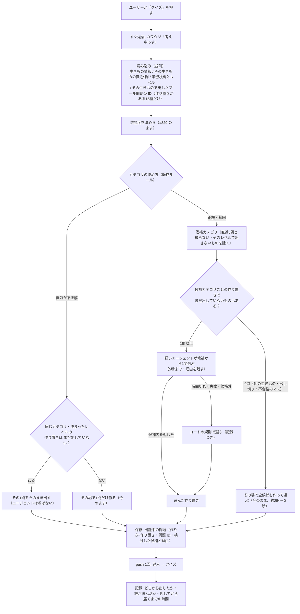
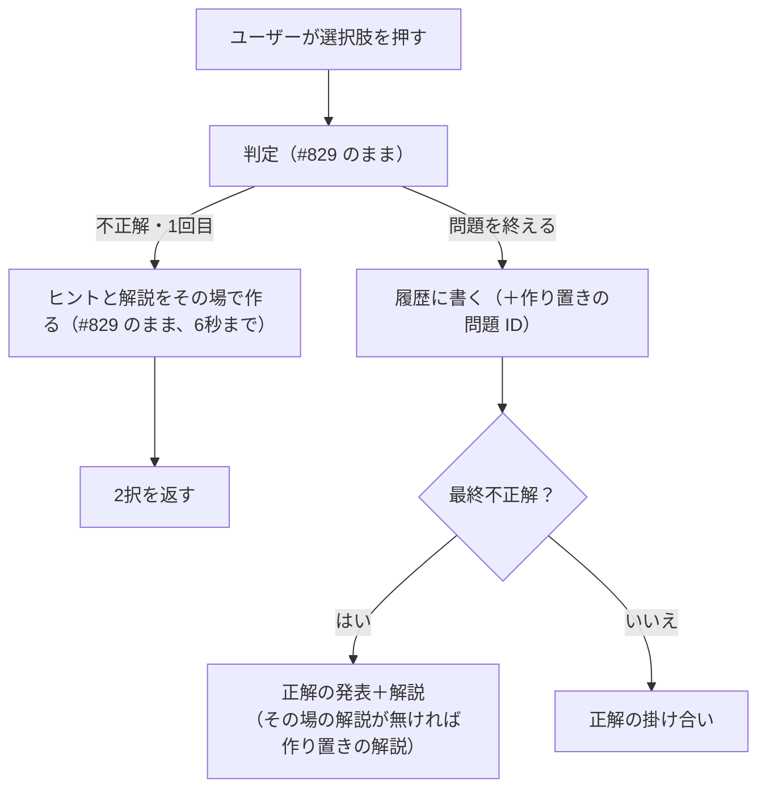

Issue: https://github.com/4geru/tweet-bookmark/issues/831

# 設計: クイズの作り置き（事前生成プール）

承認済みの [requirements.md](./requirements.md) の「ユーザーの決定（2026-10-08）」と、2026-10-08 の最新の決定（下記 0章）を満たす設計。作り置きの作り方・記録は [pool-format.md](./pool-format.md)・[pool-progress.md](./pool-progress.md)、費用の実測は [cost-comparison.md](./cost-comparison.md)。

## 0. 前提: 2026-10-08 の最新の決定（requirements より優先）

- 作り置きは **Claude（Sonnet）が作ってレビューした15種だけ**。`backend/data/quiz-pool/{48,206,209,30,178,33,202,186,220,57,59,237,44,46,50}.jsonl`（各60マス・1マス1問）のうち `review.status === "approved"` の **790問** を使う。`rejected`（110問）は使わない
- **ほかの生きもの・プールに無いマス（rejected のマスを含む）は、今までどおりその場で作る**（#829 で実装済みの経路）
- 出題時の選択は **軽いエージェント**（候補から5秒以内に1問選び、理由を残す。間に合わなければコードの規則で選ぶ）
- 補充は**手動だけ**（定時実行・補充ジョブはスコープ外）。プールの作り直し・追加は手動の手順として書く（11章）
- 記事・動画には「現状の実装」をそのまま書く

ファイルごとの実数（2026-10-08 時点、`grep -c '"status":"approved"'`）:

| 種 | 48 | 206 | 209 | 30 | 178 | 33 | 202 | 186 | 220 | 57 | 59 | 237 | 44 | 46 | 50 | 計 |
|---|---|---|---|---|---|---|---|---|---|---|---|---|---|---|---|---|
| 合格 | 55 | 54 | 54 | 53 | 52 | 49 | 54 | 50 | 54 | 53 | 54 | 49 | 51 | 53 | 55 | **790** |

## 1. 方針

**人気の15種は、レビュー済みの作り置きから「軽いエージェントが選ぶだけ」で出す。それ以外（他の生きもの・プールに無いマス・その人がもう解いたマス）は、今の「その場で作る」に落ちる。プールはコンテナに同梱し、起動後の最初の出題で読み込む。**

- プールの差し込み口は #829 が用意した `obtainQuiz`（`server.ts`）の**先頭1か所**。レベル（難易度コーチ）とカテゴリの候補（`planQuizCategory`）の決め方は変えず、**決まったレベル・候補カテゴリのマスをプールで引く**
- 1マス1問なので、「その人にまだ出していない」＝「その人の `quizHistory` にそのプール問題の ID（`poolId`）が無い」。出し切ったマスは自動でその場生成になる
- 自律性は「出題時の選択（軽いエージェント）」に残す。候補外は選べない（コードで検査）・5秒で打ち切り・失敗は規則で選ぶ。記録は #832 の `agent_run`（`agent: "quiz_pool"`。`agentRun.ts` の `AgentName` に既に予約済み）
- ヒントは #829 のとおり不正解のときにその場で作る。最終不正解の解説は、LLM の解説が無いときだけプールの `explanation`（レビュー済み）を使う
- 停止スイッチ `quiz_pool` を1つ足し、プールを丸ごと止めて今の挙動に戻せるようにする（障害時・before/after 計測用）

### 受け入れ基準との対応

最新の決定で範囲が変わった基準は「差分」に書く（requirements.md の改訂案は 13章）。

| 基準 | 対応する設計 | 備考 |
| --- | --- | --- |
| 1 マス単位・一意の ID | 4.1 `id = <animalId>-<category>-<level>` | N=1（1マス1問） |
| 2 1問ごとの記録 | 4.1 JSONL の項目＋ `QUIZ_POOL_VERSION` | 差分: モデル名は `generatedBy`、版はコード定数、ジョブ ID は無し（手作業） |
| 3 在庫数・範囲を設定で | 4.1 置いたファイルが範囲 | 差分: N=1 固定。範囲はファイルの追加で広げる（コード変更不要・再デプロイ要） |
| 4 作れないマス | 3.3 `rejected`・欠けたマスはその場生成 | 差分: 補充ジョブが無いので「補充対象から外す」は不要 |
| 5 その場生成の全候補をプールへ戻す | — | **スコープ外**（最新の決定） |
| 6 作り置きは今のエージェントで | — | **差分**: Claude（Sonnet）で作問（pool-format.md） |
| 7 プールの候補からエージェントが選び、理由と候補 ID を残す | 5章、4.2 `consideredPoolIds`・`selectionReason` | |
| 8 5秒・候補外・失敗は規則 | 5.5 | |
| 9 検証エージェント | — | **差分**: Sonnet のレビュー（`review.status`）で代替 |
| 10 機械的な検査 | `scripts/validate-quiz-pool.ts`（既存）＋ 3.2 起動時の検査 | |
| 11 不合格は使わず残す | 3.2 `approved` 以外は読まない。JSONL に残る | |
| 12 未検証は使わない | 3.2 `pending` も読まない | |
| 13 一覧・手で「使わない」 | 9.3 `scripts/report-quiz-pool.ts`・Log Analytics、11.3 手で `rejected` に | |
| 14 まだ出していないものだけ | 3.4 `poolId` を `quizHistory` に残して突き合わせ | |
| 15 retry はコードで選ぶ | 3.3 retry の分岐 | 1マス1問なので同レベルでは出し切り→その場生成が普通 |
| 16 プール切れはその場生成・記録 | 3.3、9.1 `poolMissReason` | |
| 17 10秒以内 | 7.1 見込み 2〜4秒 | 実測で確認（10章） |
| 18 2段階応答を保つ | 2章（「考え中」→ push のまま） | 1段階化は論点 2 |
| 19〜25 補充ジョブ | 11章（手動の手順） | **差分**: ジョブは作らない。24 の停止は 3.6 `quiz_pool` スイッチで代替 |
| 26 出どころ・ID・選択の主体・時間 | 9.1 `quiz_generated`・`quiz_delivered`・`agent_run` | |
| 27 LIFF から読めない | 4.4（コンテナ同梱。Firestore に置かない） | |
| 28 `quizHistory` は回答後だけ | 4.3（今の書き方のまま `poolId` を足す） | |
| 29 レベル別・コーチのレベル | 3.3（決まったレベルのマスだけ引く。代用しない） | |
| 30 版を区別 | 4.1 `QUIZ_POOL_VERSION`（例 `"831-pool-v1"`） | |
| 31 ヒント・解説は不正解時 | 6章 | 解説のフォールバックにだけプールの `explanation` を使う |
| 32〜34 互換性 | 2章・3.3（操作・規則は不変、プールが空なら今と同じ） | |
| 35〜38 記事・動画 | 12章 | 実測値だけを使う |

## 2. アーキテクチャ（リクエストの旅）

### 2.1 出題の旅（「クイズ」を押してから問題が届くまで）



- 停止スイッチ `quiz_pool` が入っているときは、作り置きを見ずに「その場で作る」へ進む（今と同じ）
- 停止スイッチ `quiz`（既存）が入っているときは、作り置きは使うが軽いエージェントは呼ばず規則で選ぶ

### 2.2 回答の旅（変更点だけ）



## 3. プールの置き場所と出題時の選び方

### 3.1 置き場所の比較（推奨: コンテナに同梱）

| 観点 | A: JSONL をコンテナに同梱し、メモリに読む（推奨） | B: Firestore に入れる（例 `quizPool/{id}`） |
| --- | --- | --- |
| 費用 | 0（イメージが約0.6MB増えるだけ） | 投入 790 書き込み＋出題ごとに読み取り（候補最大13件）。無料枠内だが 0 ではない |
| 出題の速さ | メモリ参照（ミリ秒未満） | Firestore クエリ 1回ぶん（数十〜100ms 程度） |
| 更新のしやすさ | JSONL を直して `make deploy`（数分）。差分が git に残り、レビューが PR でできる | 投入スクリプトを流せば即反映。ただし git の JSONL と本番の中身がずれうる |
| 本番の読み取り回数 | 0 | 出題ごとに 1クエリ |
| `firestore.rules` | 影響なし（Firestore に置かない） | 新しいトップレベルのコレクションは既存の `match /{document=**} { allow read, write: if false; }` で拒否される。ルールの変更は不要だが、パスを誤って `users/{uid}` 配下に置くと読めてしまうので注意が要る |
| 正解の漏れ | 置き場所が LIFF から到達不能 | ルールで拒否（既定拒否に依存） |
| 補充が手動・15種・790問という今の規模との相性 | 良い | 過剰 |

**推奨: A**。補充は手動で、作問から反映まで PR とデプロイを経るので「再デプロイが要る」は欠点にならない。JSONL がそのまま正本になり、記事にも「レビュー済みの JSONL を同梱」と書ける。

- `Dockerfile` は既に `COPY data ./data` しているので変更不要。`data/quiz-pool/input/`（作問の入力、約3.8MB）は実行時に不要なので `.dockerignore` に `data/quiz-pool/input/` を足す（任意。入れても動く）
- 読み込みは `kaiyukanData.ts` と同じく遅延・キャッシュ（`let cache: Promise<...>`）。パスは `join(dirname(fileURLToPath(import.meta.url)), "../data/quiz-pool")`（`src/` から `tsx` で動かしても、`dist/` から動かしても同じ場所を指す）

### 3.2 読み込みと起動時の検査（`quizPool.ts`）

1. `data/quiz-pool/*.jsonl` をすべて読む（ファイル名の一覧をコードに持たない。ファイルを足せば範囲が広がる）
2. 1行ずつ `JSON.parse` → zod（4.1）で検査。次に当たる行は**読み飛ばして** `quiz_pool_invalid` を WARNING で1行ずつ出す:
   - 形式違反（必須項目・型）
   - `review.status !== "approved"`（`rejected`・`pending` は数えるだけで使わない）
   - `category` が `QUIZ_CATEGORIES` に無い、`level` が 1〜5 でない
   - `choices` が3つでない・重複・空文字、`correctIndex` が 0〜2 でない
   - `id` が `${animalId}-${category}-${level}` と一致しない、`id` の重複（2つ目以降を捨てる）
   - `level === 1` で `LEVEL_EXCLUDED_CATEGORIES[1]` のカテゴリ
3. 索引 `Map<animalId, Map<"category|level", PoolQuestion>>` を作る
4. 読み終えたら `quiz_pool_loaded`（INFO）を1行: `files`・`approved`・`rejected`・`pending`・`invalid`・`animals`・`poolVersion`・`latencyMs`
5. ファイルが無い・読めないときは空のプールとして続ける（基準34: 今と同じ体験）。`quiz_pool_load_failed`（ERROR）

- 読み込みは最初の出題で1回（`Promise` をキャッシュ）。失敗時のキャッシュは捨てず、そのインスタンスの間は空のプールで動く（再デプロイで直す）
- `validate-quiz-pool.ts`（既存、漢字・雛形・長さ・偏りまで見る）は作問時の検査。起動時の検査は「壊れた行で出題が落ちない」ための最小限で、二重に持つ

### 3.3 出題時の選び方（`handleStartQuiz` → `obtainQuiz`）

レベル・カテゴリの決め方の順番は **#829 のまま**（難易度コーチ → `planQuizCategory` → `filterCategoriesForLevel`）。プールはその**後**に、決まった条件でマスを引くだけ。

```
level      = decideQuizLevel(profile).to                       // #829（変更なし）
plan       = planQuizCategory(recent)                          // 791（変更なし）
retry のとき:
  cell = pool[animalId][plan.category|level]
  cell があり、cell.id ∉ askedPoolIds → その1問（selectedBy: "rule", fallbackCause: "retry_by_code"）
  それ以外 → 今の generateRuleQuiz（poolMissReason を記録）
fresh のとき:
  allowed    = filterCategoriesForLevel(plan.candidates, level)
  poolCands  = allowed の各カテゴリについて pool[animalId][category|level] で、id ∉ askedPoolIds のもの
  poolCands が 1件以上 → 5章の選択（2件以上はエージェント、1件は規則でそのまま）
  0件 → 今の generateQuizWithAgent（失敗時は今の規則の出題）
```

- **レベルは代用しない**（#829 8.1）。そのレベルのマスが無ければその場で作る
- `poolMissReason`（9.1 で記録）: `"no_pool_for_animal"`（15種以外）／`"no_cell"`（rejected・欠けたマス。retry のみ）／`"all_asked"`（マスはあるが全部出した）／`"kill_switch"`／`"load_failed"`。プールから出したときは `"none"`
- fresh で候補が1件だけでも、その場生成には落とさない（速さを優先）。何件以上でプールを使うかは論点 3
- **1マス1問の帰結**: retry（直前が不正解）では、同じカテゴリ・同じレベルの作り置きはさっき外した問題そのものなので出し切り済みになり、その場で1問作る。ただし難易度コーチが不正解を受けてレベルを下げた場合は、下のレベルのマスが未出題ならプールから即答できる

### 3.4 同じ人に同じ問題を出さない（`quizHistory` との突き合わせ）

- 回答時に `quizHistory` へ `poolId` を書く（4.3）。出題時はその生きものの `quizHistory` から `generatedBy == "pool"` のものだけを読み、`poolId` の集合を作る:

```ts
quizHistoryCollection(userId, animalId).where("generatedBy", "==", "pool").select("poolId").get()
```

- 1つの等号条件だけなので複合インデックスは不要（単一フィールドの自動インデックス）。1つの生きものの作り置きは最大60問なので、読み取りは最大60件（多くは数件）
- **作り置きがある15種のときだけ**読む（`hasPool(animalId)` で判定）。他の生きものは読み取りが増えない
- `handleStartQuiz` の既存の `Promise.all`（生きもの・直近5問・学習状況）に並べて読むので、待ち時間はほぼ増えない
- 読み取りに失敗したら**プールを使わない**（`poolMissReason: "history_read_failed"`）。同じ問題を出すより、その場で作るほうを選ぶ
- 「考え中」の間にもう一度「クイズ」を押されて `pendingQuiz` が上書きされた問題は `quizHistory` に入らないので、再び候補になりうる（今のその場生成と同じ扱い。許容）

### 3.5 出し切ったときの切り替え条件

| 状況 | 結果 |
| --- | --- |
| fresh で、候補カテゴリ×決まったレベルのマスが全部 `askedPoolIds` に入っている／無い | その場で全候補を作って選ぶ（`poolMissReason: "all_asked"` または `"no_cell"`） |
| retry で、そのマスが出題済み／無い | その場で1問作る |
| 15種の1人が1つの生きものを解き続けた場合 | レベル2なら最大13問（そのレベルのマス数）までプール、以降は直近5問と被らないカテゴリのマスが尽きた時点でその場生成 |

切り替えはマスごとに毎回判定するので、「プールを使い切ったフラグ」は持たない。

### 3.6 停止スイッチ

- `guards.ts` の `KillSwitchTarget` に `"quiz_pool"` を足す（`config/runtime.disabledAgents` に `"quiz_pool"` を入れると、作り置きを使わず今と同じ動きになる。60秒キャッシュ）
- 使いどころ: 作り置きにまずい問題が見つかったとき（再デプロイを待たずに止める）、before/after の計測（10.2）
- 既存の `"quiz"` を入れたときは、作り置きは使い、選択のエージェントだけ規則に置き換える（`agent_run.outcome: "kill_switch"`）。その場生成に落ちたときは今の規則の出題（既存の動き）

## 4. データモデル

### 4.1 作り置きの1行（`backend/data/quiz-pool/<animalId>.jsonl`、既存の形のまま）

pool-format.md の形をそのまま読む（ファイルの形は変えない）。

```ts
// quizPool.ts
import { z } from "zod/v3";
export const QUIZ_POOL_VERSION = "831-pool-v1"; // 作問ルール（pool-format.md）を変えて作り直したら上げる

export const poolLineSchema = z.object({
  id: z.string(),                        // "<animalId>-<category>-<level>"
  animalId: z.string(),
  category: z.enum(QUIZ_CATEGORIES),
  level: z.number().int().min(1).max(5),
  question: z.string().min(1),
  choices: z.array(z.string().min(1)).length(3),
  correctIndex: z.number().int().min(0).max(2),
  explanation: z.string(),
  factSource: z.enum(["official", "wikipedia", "general", "none"]),
  groundingNames: z.array(z.string()),
  generatedBy: z.string(),               // 作問したモデル名（例 "claude-sonnet-5-5"）
  generatedAt: z.string(),
  review: z.object({
    status: z.enum(["approved", "rejected", "pending"]),
    reviewer: z.string().optional(),
    issues: z.array(z.string()).optional(),
    reviewedAt: z.string().optional(),
  }),
});
export type PoolQuestion = z.infer<typeof poolLineSchema> & { category: QuizCategory; level: QuizLevel };
```

- 版: 行に版の項目は無いので、コード定数 `QUIZ_POOL_VERSION` を `promptVersion` として記録する。作り直しで版を上げるときは、JSONL に `"poolVersion"` を足す（任意項目として zod に `optional()` で用意しておく）

### 4.2 `users/{userId}/pendingQuiz/{animalId}`（既存・読み取り不可。フィールド追加）

| フィールド | 型 | 説明 |
| --- | --- | --- |
| （既存）category / question / choices / correctIndex / level / `generatedBy` / `promptVersion` / selectionReason / consideredCategories / runId / guard … | | プールから出したときは `generatedBy: "pool"`、`promptVersion: QUIZ_POOL_VERSION` |
| `poolId` | string \| null | 出した作り置きの ID。その場生成は null |
| `consideredPoolIds` | string[] \| null | 選択で検討した作り置きの ID（基準7） |
| `selectedBy` | "agent" \| "rule" \| null | 作り置きを誰が選んだか。その場生成は null |
| `poolExplanation` | string \| null | 作り置きの解説（正解の根拠を含むので、読めないここにだけ置く） |

- `consideredCategories` は、作り置きの候補を既存の `AgentQuizCandidate` の形（`category`・`groundedInOfficialData = factSource が official/wikipedia`・`question`・`choices`・`correctIndex`）に詰めて入れる。`quizHistory` へは既存の `toHistoryCandidates` が選択肢・正解を落として写すので、#832 B2（選ばれなかった候補の答えを残さない）がそのまま守られる。**作り置きでは選ばれなかった候補が後で出題されるので、この落とし方が特に重要**

### 4.3 `users/{userId}/animals/{animalId}/quizHistory/{id}`（既存・本人のみ読める。フィールド追加）

| フィールド | 型 | 説明 |
| --- | --- | --- |
| `poolId` | string \| null | 出した作り置きの ID（基準14 の突き合わせ） |
| `selectedBy` | "agent" \| "rule" \| null | |
| `consideredPoolIds` | string[] \| null | 検討した作り置きの ID（ID だけなので答えは漏れない） |

- 書くのは今と同じく `handleAnswerQuiz` のトランザクションの finished のときだけ（基準28）
- `poolId` は「その人が答え終えた問題」の ID で、答えは同じ文書に既にある（`correctIndex`）。新しく漏れる情報は無い
- 既存の履歴には `poolId` が無いが、`generatedBy == "pool"` で絞るので影響しない

### 4.4 `firestore.rules`

- **ルールの変更はしない**。作り置きは Firestore に置かない（3.1 A）。`quizHistory` に足す項目は ID と選択の主体だけで、本人だけが読める既存の範囲に収まる
- 冒頭コメントに「#831: quizHistory に poolId（作り置きの ID）を足す。作り置き本体はコンテナ同梱で Firestore には無い」を1行足す（任意。`make deploy-rules` は不要だがコメントだけでも反映するならする）

## 5. 選択のエージェント（`quizPoolSelector.ts`）

### 5.1 役割

候補（作り置き、最大13問）から、**この人の今の流れに合う1問**を選び、理由を一文で残す。作るのではなく選ぶだけなので、思考なし（`thinkingBudget: 0`）・出力は ID と理由だけ。

### 5.2 入力（コードが組み立てる）

```ts
export interface PoolSelectorInput {
  animal: { name: string };
  level: QuizLevel;                         // 決まったレベル（呼び名つきで渡す）
  recentForAnimal: { category: string; isCorrect: boolean }[];  // その生きものの直近5問（既存の getRecentQuizHistory の値）
  recentOverall: { category: string; isCorrect: boolean; hintUsed: boolean }[]; // quizProfile.recent（全生きもの横断、最大5）
  candidates: { id: string; category: string; question: string; grounded: boolean }[]; // シャッフル済み
}
```

- 候補には**選択肢と正解を渡さない**（選ぶのに要らない。トークンを減らし、エージェントの出力に答えが混ざる余地をなくす）
- 候補の並びは毎回シャッフル（`quizAgent.ts` の実測: 固定順だと5回中4回同じカテゴリに寄った）
- 利用者 ID・自由文は入れない（#832 の個人情報の扱い）

### 5.3 出力スキーマ（zod）

```ts
export const poolSelectorOutputSchema = z.object({
  id: z.string().describe("選んだ候補の id（候補の一覧にあるものだけ）"),
  reason: z.string().describe("選んだ理由（記録用、40字以内）"),
});
```

### 5.4 プロンプトの要点（`QUIZ_POOL_SELECTOR_INSTRUCTION`、版 `QUIZ_POOL_SELECTOR_VERSION = "831-selector-v1"`）

- 役割: 海遊館の LINE クイズの出題係。作り置きの候補から1問だけ選ぶ
- 判断の材料は渡した JSON だけ
- 選び方の目安:
  - 直前に外したカテゴリ・直近で続いている切り口は避け、流れに変化をつける
  - 全体で外しが続いているなら、公式データに基づく（`grounded: true`）分かりやすい切り口を優先
  - 正解が続いているなら、その生きものならではの意外性がある問題を優先
  - ダジャレは続けない
- 出力: JSON のみ（`id`・`reason`）。`id` は候補の一覧から写す

### 5.5 コードの縛り（`selectPoolQuestion(input, deps)`）

`runAgent({ agent: "quiz_pool", model, promptVersion: QUIZ_POOL_SELECTOR_VERSION, timeoutMs: 5000, fields: { animalId, level } }, …)` で包む。`deps.selector` は評価用に差し替えられるようにする（`quizLevelAgent.ts` の `deps.coach` と同じ形）。

| 状況 | 動き | 記録 |
| --- | --- | --- |
| 候補が1件 | 呼ばずにそれを出す | `selectedBy: "rule"`、`fallbackCause: "single_candidate"`（`agent_run` は出さない。`quiz_generated` に残る） |
| 停止スイッチ `quiz` | 呼ばずに規則 | `agent_run.outcome: "kill_switch"`、`guard: kill_switch` |
| 5秒以内に候補内の `id` | それを出す | `selectedBy: "agent"`、`outcome: "ok"` |
| `id` が候補外 | 規則で選び直す | `guard: candidate_replaced`（`replaced`）、`outcome: "fallback_rule"` |
| JSON 不正・空応答 | 規則 | `guard: schema_invalid`（`fell_back`）、`outcome: "fallback_rule"` |
| 5秒で返らない | 規則 | `runAgent` が `outcome: "timeout"`・`guard: timeout` を出す → 呼び出し側で規則 |
| 例外 | 規則 | `outcome: "error"` |

- **規則**（`rulePickPoolQuestion`、純粋関数）: 候補から、`recentForAnimal` の先頭（直前）と同じカテゴリ・ダジャレの連続を除いた中から一様に1つ。除いて空なら全候補から一様に1つ。乱数は引数で受ける（評価で固定する）
- `reason` は 40字で切る。規則で選んだときの理由は「規則: 時間切れのため候補からランダム」のように原因を入れる
- **出題は止めない**: `selectPoolQuestion` は例外を投げない（規則で必ず1問返す）
- 既定モデル: `gemini-2.5-flash`（`thinkingBudget: 0`）。`QUIZ_POOL_SELECTOR_MODEL` で上書き可。実装は `quizLevelAgent.ts` と同じ ADK `Agent`＋`outputSchema`＋`InMemoryRunner.runEphemeral`。`ctx.addUsage(event.usageMetadata)` でトークンを数える

### 5.6 記録（#832 の `agent_run` と揃える）

```json
{
  "severity": "INFO", "event": "agent_run", "agent": "quiz_pool", "runId": "a1b2c3d4e5f6",
  "animalId": "48", "level": 2, "outcome": "ok", "latencyMs": 1480,
  "model": "gemini-2.5-flash", "promptVersion": "831-selector-v1",
  "toolCalls": 0, "inputTokens": 420, "outputTokens": 40,
  "decision": {
    "candidates": ["48-食物連鎖-2", "48-深度-2", "48-ダジャレ-2", "48-豆知識-2"],
    "candidateCategories": ["食物連鎖", "深度", "ダジャレ", "豆知識"],
    "chosen": "48-深度-2", "proposed": "48-深度-2", "replaced": false,
    "reason": "直前は食物連鎖で正解。切り口を変えて深さを問う",
    "generatedBy": "pool"
  },
  "message": "作り置きの4候補から「深度」を選びました"
}
```

- `decision` の項目名は `agent: "quiz"` の要約（`candidates`・`chosen`・`proposed`・`replaced`・`reason`・`generatedBy`）と揃える。`candidates` は ID、カテゴリは `candidateCategories` に分ける
- `runId` を `pendingQuiz`／`quizHistory` の `runId` に入れる（既存の項目。ログと1問をつなぐ）

## 6. ヒントと解説（#829 との関係）

- **ヒントは作り置かない**（基準31・#829 の実装どおり）。プールの問題でも、不正解の1回目に `generateQuizHint` を6秒まで待って作り、`checkHint` で検査する。`hintSource` は `"llm"`／`"fallback"` のまま（`"pool"` の予約は使わない）
  - 理由: 最新の決定の範囲（15種・790問）で、作り置きのヒント（誤答2つ分×790問＝1,580本）を作ってレビューするのは締切までに重い。#829 の 8.3 案B は将来の拡張として残す（論点 4）
- **最終不正解の解説**: 今は `pending.explanation`（ヒントと一緒に LLM が作った解説）→ 無ければ `animal.description` の先頭80字。プールの問題では、その間に `pending.poolExplanation` を挟む: `pending.explanation ?? pending.poolExplanation ?? factoid`
  - LLM の解説はレベルに合わせた言い回しなので優先。プールの解説はレビュー済みだが言い回しはレベルを問わないので、2番手にする
- ヒントの呼び出しに渡す `quizForHint` は今のまま（question・choices・correctIndex・category）。プールの問題でも同じ形なので変更不要

## 7. 待ち時間・費用・LINE の通数

### 7.1 待ち時間の見込み（実測は 10章で取る）

| 経路 | 内訳（cost-comparison.md・#829 の実測） | 見込み |
| --- | --- | --- |
| プール・初回（コーチを呼ばない） | Firestore 読み取り（並列）＋選択 D 1.5秒（中央値） | 約2秒 |
| プール・2問目以降（コーチを呼ぶ） | コーチ（#829、8秒上限）＋選択 1.5秒 | 約3〜5秒（コーチの実測次第） |
| プール・retry（コードで選ぶ） | コーチ＋Firestore | コーチの時間だけ |
| その場生成・fresh（今） | A 36.6秒（成功 4/6） | 変わらず |
| その場生成・retry（今） | B1 10.2秒 | 変わらず |

記事・動画に書く「約2秒」は、10章の実測（`quiz_delivered.totalMs` の中央値）で置き換える。

### 7.2 費用（1回あたり、cost-comparison.md の単価）

| 経路 | LLM 呼び出し | 費用 |
| --- | --- | --- |
| プール（候補2件以上） | 選択 D 1回 | 約 $0.00044 |
| プール（候補1件・retry） | 0回 | $0 |
| その場生成・fresh | A 1回 | 約 $0.0173 |

- 15種のプールから出た分だけ、1回あたり約 1/40 になる。他の228種の費用は変わらない
- 作り置きの作成費は Claude Code の利用枠（Sonnet）で、Gemini API の費用は発生していない（pool-progress.md）
- 難易度コーチ・ヒントの費用は #829 のまま（変わらない）
- Firestore: 15種のときだけ、出題ごとに `quizHistory` のクエリ1回（読み取り 最大60件、多くは数件）

### 7.3 LINE の push 通数

- **変わらない**。今と同じ「reply（考え中）→ push 1回」。プール経路でも push は1回
- 1段階（reply だけで出す）にすれば push が1回減るが、論点 2 のとおり今回は見送る

## 8. エラー時・タイムアウト時の振る舞い

| 失敗 | 振る舞い |
| --- | --- |
| JSONL が読めない・全部壊れている | 空のプールで続行（全部その場生成）。`quiz_pool_load_failed` ERROR |
| 一部の行が壊れている | その行だけ捨てる。`quiz_pool_invalid` WARNING |
| `quizHistory` のプール用クエリが失敗 | プールを使わない（同じ問題を出さないことを優先）。`poolMissReason: "history_read_failed"` |
| 選択エージェントの時間切れ（5秒）・失敗・候補外 | 規則で選ぶ（5.5）。出題は続く |
| 停止スイッチの読み取り失敗 | 既存どおり fail-open（スイッチ無しとして動く） |
| その場生成の失敗 | 既存どおり（規則の出題→それも失敗なら「うまく作れなかった」＋探検クイックリプライ） |
| ヒントの失敗 | #829 のまま（定型セリフ） |

## 9. 観測（#832 の Log Analytics・ログ指標に合わせる）

### 9.1 ログの追加・変更

| `event` | いつ | 追加する項目 |
| --- | --- | --- |
| `quiz_generated`（既存） | 問題が決まった | `poolId`・`selectedBy`・`poolCandidateCount`（候補の作り置きの数）・`poolMissReason`（3.3、出せたら `"none"`）。`generatedBy`・`latencyMs`・`runId` は既存 |
| `quiz_delivered`（新規） | push が成功した直後 | `generatedBy`・`poolId`・`level`・`category`・`totalMs`（「クイズ」の postback を受けてから push 完了まで） |
| `quiz_answer`（既存） | 回答 | `generatedBy`・`poolId` を足す（作り置きとその場生成の正答率を比べる） |
| `agent_run`（既存） | 選択エージェント1回 | `agent: "quiz_pool"`（5.6） |
| `quiz_pool_loaded` / `quiz_pool_invalid` / `quiz_pool_load_failed`（新規） | 読み込み時 | 3.2 |

- `totalMs` の起点は `handleStartQuiz` の先頭（「考え中」の reply より前）。`quiz_generated.latencyMs`（`obtainQuiz` だけ）と分けて持つ

### 9.2 ログベースの指標（`ops/metrics/`、`make metrics` で作る）

| 名前 | 種類 | フィルタ | ラベル |
| --- | --- | --- | --- |
| `quiz_source` | カウンタ | `jsonPayload.event="quiz_generated"` | `generatedBy`・`poolMissReason` |
| `quiz_delivery_latency` | 分布（ms） | `jsonPayload.event="quiz_delivered"` | `generatedBy`（値は `totalMs`。バケットは `agent_latency.json` と同じ指数） |

- `Makefile` の `METRICS` に2つ足す。ダッシュボード（`ops/dashboard.json`）に「出どころ別の件数（積み上げ）」「出どころ別の p50/p95」を2枚足す（任意）

### 9.3 Log Analytics（SQL）の例

**出どころの割合と待ち時間（過去7日）**

```sql
SELECT
  JSON_VALUE(json_payload.generatedBy) AS source,
  COUNT(*) AS quizzes,
  ROUND(COUNT(*) / SUM(COUNT(*)) OVER (), 3) AS share,
  APPROX_QUANTILES(CAST(JSON_VALUE(json_payload.totalMs) AS INT64), 100)[OFFSET(50)] AS p50_ms,
  APPROX_QUANTILES(CAST(JSON_VALUE(json_payload.totalMs) AS INT64), 100)[OFFSET(95)] AS p95_ms
FROM `kaiyukan-gacha-hackathon.global._Default._AllLogs`
WHERE JSON_VALUE(json_payload.event) = 'quiz_delivered'
  AND timestamp > TIMESTAMP_SUB(CURRENT_TIMESTAMP(), INTERVAL 7 DAY)
GROUP BY source
```

**プールに落ちなかった理由の内訳（15種だけに絞るなら `poolMissReason != 'no_pool_for_animal'`）**

```sql
SELECT JSON_VALUE(json_payload.poolMissReason) AS reason, COUNT(*) AS n
FROM `kaiyukan-gacha-hackathon.global._Default._AllLogs`
WHERE JSON_VALUE(json_payload.event) = 'quiz_generated'
  AND timestamp > TIMESTAMP_SUB(CURRENT_TIMESTAMP(), INTERVAL 7 DAY)
GROUP BY reason ORDER BY n DESC
```

**選択エージェントの成否と所要時間**: #832 6.1 の `agent_run` の SQL に `agent = 'quiz_pool'` で絞る

**作り置きの問題ごとの出題回数・正答率（基準13）**

```sql
SELECT JSON_VALUE(json_payload.poolId) AS poolId,
       COUNT(*) AS answered,
       AVG(IF(JSON_VALUE(json_payload.isCorrect) = 'true', 1, 0)) AS correct_rate
FROM `kaiyukan-gacha-hackathon.global._Default._AllLogs`
WHERE JSON_VALUE(json_payload.event) = 'quiz_answer'
  AND JSON_VALUE(json_payload.kind) = 'finished'
  AND JSON_VALUE(json_payload.generatedBy) = 'pool'
GROUP BY poolId ORDER BY answered DESC
```

Logs Explorer の簡易クエリ: `jsonPayload.event="quiz_generated" AND jsonPayload.generatedBy="pool"`／`jsonPayload.agent="quiz_pool"`。`Makefile` に `logs-quiz-pool`（`agent_run` の `quiz_pool` と `quiz_generated` を直近20件）を足す（任意）。

### 9.4 在庫の一覧（`scripts/report-quiz-pool.ts`、新規・LLM なし）

JSONL を読み、種ごと・レベルごと・カテゴリごとの `approved`／`rejected`／`pending` 件数、`rejected` の `issues` の先頭、起動時の検査（3.2）で捨てられる行の有無を表で出す。出題回数・正答率は 9.3 の SQL で見る（Firestore を集計しない）。

## 10. テスト・検証方法

### 10.1 ローカルスクリプト（自動テストは無いので、今の流儀どおりスクリプトで確かめる）

`scripts/try-quiz-pool.ts`（新規）:

1. **読み込み**: 790問が `approved` として読まれ、`rejected` 110件が除かれ、`invalid` が0であること。`hasPool("48") === true`、`hasPool("1") === false`
2. **マスの引き方**（純粋関数、Firestore を使わない）:
   - fresh・レベル2・既出なし → 候補が `allowed` のカテゴリ数と同じ（rejected のマスを除く）
   - 既出 ID を与えると候補から消える／全部与えると0件で `poolMissReason: "all_asked"`
   - retry・既出 → `"all_asked"`、rejected のマス → `"no_cell"`
   - レベル1 で除外カテゴリが候補に出ない
3. **選択（偽物）**: `deps.selector` に「候補外の ID を返す」「6秒待つ」「例外」を差し込み、規則で1問返ること・`agent_run` の `outcome`／`guard` が 5.5 の表どおりであること（標準出力のログを目で確認）
4. **選択（実物）**: 48・206・33 の3種×レベル2・3 で各3回、本物の Gemini を呼び、所要時間（中央値・最大）・候補外の率・`reason` を表で出す。結果は `docs/specs/831-quiz-pool/measurements/selector-*.json` に保存（記事の実数に使う）

既存のスクリプトで回帰を見る:
- `scripts/try-quiz-answer.ts`・`try-quiz-hint.ts`（回答とヒントが変わらないこと）
- `scripts/verify-auth-rules.mjs`（ルールは変えないが、`quizHistory` に `poolId` 入りの文書が本人だけ読めることを1件足して確認）

### 10.2 実機確認の手順（dev の Bot で）

1. ジンベエザメ（48）の案内板写真 → 「クイズ」→ 約2秒で届くこと。Logs Explorer で `quiz_generated.generatedBy="pool"`・`agent_run(agent="quiz_pool")` の `reason` を確認
2. わざと外す → ヒント付き2択（#829 のまま）→ また外す → 解説（`poolExplanation` が出る場合あり）
3. 続けて「クイズ」→ retry。レベルが下がったら下のレベルのマスから即答／同じレベルならその場で1問作る（`poolMissReason="all_asked"`）
4. 15種以外（例: イワシ）で「クイズ」→ 今どおり約25〜40秒・`poolMissReason="no_pool_for_animal"`
5. `config/runtime.disabledAgents` に `"quiz_pool"` → 48 でもその場生成になる（60秒以内に反映）。外して元に戻す
6. 同じ人で48を15回ほど続ける → 出した `poolId` が重複しないこと（Firestore の `quizHistory` で確認）
7. before/after: 48 で `quiz_pool` スイッチ ON/OFF を各5回ずつ交互に押し、`quiz_delivered.totalMs` を 9.3 の SQL で比べる → 記事・動画の数値にする

## 11. プールの作り直し・追加の手順（手動）

### 11.1 種を足す

1. `npx tsx scripts/build-quiz-pool-input.ts <animalId...>` で入力を作る（既存）
2. Claude Code で**1種につき1体**の Sonnet に作問させる（pool-format.md のルール。他の種のファイルを読ませない）→ `data/quiz-pool/<animalId>.jsonl`
3. `npx tsx scripts/validate-quiz-pool.ts` で機械的な検査（全問合格まで直す）
4. 別の Sonnet にレビューさせ、`review.status` を `approved`／`rejected` に書く（pool-format.md「レビュー」）
5. `npx tsx scripts/report-quiz-pool.ts` で件数を確認 → `pool-progress.md` に追記
6. PR → マージ → `make deploy`（`data/` ごと同梱されるので、コードの変更は不要）

### 11.2 作問ルールを変えて作り直す

- 対象の JSONL を作り直し、`QUIZ_POOL_VERSION` を上げる（例 `"831-pool-v2"`）。古い版で出した問題は `quizHistory.promptVersion` で区別できる
- ID は `<animalId>-<category>-<level>` のままなので、**作り直したマスは、既に出した人には出ない**（同じ ID のため）。作り直した問題を既出の人にも出したい場合は、ID に版を付ける（`48-生息地-2-v2`）。今回は不要（論点 5）

### 11.3 問題を手で止める

- その行の `review.status` を `"rejected"` にし、`issues` に理由を書いて再デプロイ。急ぐときは停止スイッチ `quiz_pool` で全体を止めてから直す

## 12. 審査・デモでの見せ方（記事・動画）

**一言**: 「人気の15種は、レビュー済みの作り置きから選ぶだけなので約2秒（実測値で置き換える）。それ以外の生きものは、今までどおりその場で13問作って選ぶ」。どちらの経路でも「候補を並べて、エージェントが1つ選び、理由を残す」は同じ。

### 12.1 提出記事（`articles/ikimono-gacha-zukan-submission.md`）

| 箇所（行は 2026-10-08 時点） | 書き換え |
| --- | --- |
| 163行 費用対効果の表 | 「人気の15種はレビュー済みの作り置き790問から選ぶだけ（1回 約 $0.00044、その場生成 約 $0.0173 の約1/40）」を足す。数値は cost-comparison.md の実測。作り置きの作成は Claude Code（Sonnet）で行い、Gemini の費用は0 |
| 173行 既知の制約「クイズの生成に約25秒」 | 「15種は約N秒（10.2 の実測の中央値）。それ以外の228種とプールを出し切ったマスは従来どおり約25〜40秒」 |
| 構成図・技術スタック | 「作り置き（JSONL、コンテナ同梱）」と「選択のエージェント（gemini-2.5-flash、思考なし、5秒で打ち切り）」を足す。**補充ジョブは書かない**（実装していない） |
| 191行 今後の課題「並列化して速くする」 | 「作り置きの対象を広げる（今は15種）」「その場で作った候補をプールへ戻す」に置き換え（実装していないことは今後の課題として書く） |

### 12.2 クイズ解説記事（`articles/quiz-agent-adk-category-selection.md`）

「次にやること」（333行付近）の続きに1節:
- 速さと自律性の交換をどう解いたか: 「作る」と「選ぶ」を分け、作るのは事前（Claude で作問・別の Claude でレビュー）、選ぶのは出題時（思考なしの軽いエージェント、5秒で打ち切り）
- 品質: 第1波レビューの合格率 63〜76% → 追加ルール（漢字・使い回し・ダジャレ・数値）→ 最終 790/900（pool-progress.md の実数）。不合格の理由の内訳
- before/after の表: 10.2 の手順7の実測（中央値・p95）と cost-comparison.md の1回の費用
- 正直に書くこと: 対象は15種だけ、補充は手動、1マス1問なので同じ人が解き続けるとその場生成に戻る

### 12.3 紹介動画（`video/`、クイズの場面 30.1秒の中で置き換え）

- 既存の「全部作って、見比べて一問を選び、理由も残す」のセリフの1文を、「人気の生きものは、事前に作ってレビューした問題から選ぶだけ。だから約N秒」に置き換える（総尺 179.0秒を超えない）
- 画面: Logs Explorer の `agent_run(agent="quiz_pool")` の `decision`（候補 ID と `reason`）を1カット。数値は 10.2 の実測だけを使う

## 13. requirements.md との差分（requirements.md は変えていない。改訂するなら次のとおり）

| 基準 | 改訂案 |
| --- | --- |
| 2 | 「生成ジョブの実行 ID」を削除。「プロンプトの版」は作問ルールの版（`QUIZ_POOL_VERSION`）とする |
| 3 | 「N はマスあたり1問。範囲は同梱する JSONL のファイルで決まる（追加は手動の手順）」に |
| 4 | 「rejected・欠けたマスはその場で作る」に（補充対象の話を削除） |
| 5 | スコープ外へ移す（その場生成の候補をプールへ戻すのは今後の課題） |
| 6・9 | 「作問は Claude（Sonnet）、検証は別の Claude（Sonnet）のレビューと機械的な検査（`validate-quiz-pool.ts`）」に |
| 15 | 「1マス1問なので、同じマスが出題済みならその場で1問作る」を明記 |
| 19〜25 | 補充ジョブは作らず、手動の手順（design 11章）に置き換え。24 は停止スイッチ `quiz_pool` に |
| 30 | `QUIZ_PROMPT_VERSION`（Gemini のプロンプト）ではなく `QUIZ_POOL_VERSION` で区別 |
| 未決の論点1 | 「15種・全レベル・1マス1問（Claude で作問）」で確定 |

## 14. 変更・新規ファイル

| ファイル | 種別 | 内容 |
| --- | --- | --- |
| `backend/src/quizPool.ts` | 新規 | `QUIZ_POOL_VERSION`・`poolLineSchema`・`PoolQuestion`・`loadQuizPool()`（3.2）・`hasPool(animalId)`・`findPoolCandidates({ animalId, plan, level, allowed, askedPoolIds })` → `{ candidates, missReason }`（3.3、純粋関数）・`toAgentCandidates(pool[])`（4.2 の `consideredCategories` 用） |
| `backend/src/quizPoolSelector.ts` | 新規 | 5章。`QUIZ_POOL_SELECTOR_VERSION`・`QUIZ_POOL_SELECTOR_INSTRUCTION`・`poolSelectorOutputSchema`・`rulePickPoolQuestion`（純粋）・`selectPoolQuestion(input, deps)`（例外を投げない）。候補の型は自前で持つ（`{ id, category, question, grounded }`）ので `quizPool.ts` に依存しない |
| `backend/src/server.ts` | 変更 | `handleStartQuiz`: 起点時刻・`Promise.all` に「プール用の既出 ID の読み取り」を追加、`quiz_generated` の項目追加、push 後に `quiz_delivered`。`obtainQuiz`: 引数に `askedPoolIds`・`recent`・`profile` を足し、先頭でプール → 無ければ今の処理。`ObtainedQuiz` に `poolId`・`consideredPoolIds`・`selectedBy`・`poolExplanation`・`poolMissReason`。`savePendingQuiz`: 4.2 の項目。`PendingQuizDoc`・`handleAnswerQuiz`: 4.3 の項目を `quizHistory` へ写す、`quiz_answer` に `generatedBy`・`poolId`、解説のフォールバック（6章） |
| `backend/src/guards.ts` | 変更 | `KillSwitchTarget` と `KILL_SWITCH_TARGETS` に `"quiz_pool"` |
| `backend/scripts/try-quiz-pool.ts` | 新規 | 10.1 |
| `backend/scripts/report-quiz-pool.ts` | 新規 | 9.4 |
| `backend/ops/metrics/quiz_source.json`・`quiz_delivery_latency.json` | 新規 | 9.2 |
| `backend/Makefile` | 変更 | `METRICS` に2つ追加。`logs-quiz-pool`（任意） |
| `backend/.dockerignore` | 変更（任意） | `data/quiz-pool/input/` |
| `backend/firestore.rules` | コメントのみ（任意） | 4.4 |
| `CLAUDE.md`（プロジェクト） | 完了後 | アーキテクチャの「クイズ」に作り置きの経路を1段落（SDD の完了後の転記） |
| 記事2本・`video/` | 計測後 | 12章 |

- `agentRun.ts` は変更不要（`AgentName` に `"quiz_pool"` が既にある）。`quiz.ts` の `QuizQuestion.generatedBy` も `"pool"` を既に持つ
- `Dockerfile` は変更不要（`COPY data ./data` 済み）

## 15. 実装の分担（Sonnet 向け）と締切

ファイルが重ならないように分ける。T1〜T3 は並列、T4 は T1・T2 のあと、T5 は T4 のあと。

| # | 担当 | 内容 | ファイル | 依存 |
| --- | --- | --- | --- | --- |
| T1 | Sonnet | プールの読み込み・検査・マスの引き方（純粋関数）＋在庫レポート | `src/quizPool.ts`・`scripts/report-quiz-pool.ts` | なし |
| T2 | Sonnet | 選択のエージェントと規則 | `src/quizPoolSelector.ts` | なし（候補の型は自前） |
| T3 | Haiku | ログ指標・Makefile・.dockerignore | `ops/metrics/*.json`・`Makefile`・`.dockerignore` | なし |
| T4 | Sonnet | 出題・回答への接続、停止スイッチ | `src/server.ts`・`src/guards.ts` | T1・T2 |
| T5 | Sonnet | 評価スクリプトと実測（10.1 の 1〜4） | `scripts/try-quiz-pool.ts`・`measurements/` | T1・T2（4 は T4 不要） |
| T6 | 人 | デプロイ・実機確認（10.2）・`make metrics`・before/after の計測 | — | T4 |
| T7 | Sonnet | 記事2本・動画のセリフ（12章、T6 の実測値で） | `articles/*`・`video/` | T6 |

**締切 2026-10-15 までの目安**

| 日 | やること |
| --- | --- |
| 10/09 | T1・T2・T3（並列）。T5 の 1〜3 |
| 10/10 | T4。T5 の 4（選択の実測）。typecheck |
| 10/11 | T6（デプロイ・実機・before/after） |
| 10/12〜13 | T7（記事・動画）。`article-review` で最終確認 |
| 10/14 | 予備（バグ修正・撮り直し） |

間に合わないときに削る順: ダッシュボードの追加（9.2 任意）→ `report-quiz-pool.ts` → `quiz_answer` への `poolId`（正答率の集計）。**削らないもの**: `poolId` を `quizHistory` に書くこと（同じ問題を出さない）・5秒の打ち切りと規則・`quiz_delivered.totalMs`（記事の数値の根拠）。

## 16. 論点（推奨案つき）

1. **置き場所** → 推奨: **コンテナ同梱（3.1 A）**。Firestore は「再デプロイ無しで差し替えたい」需要が出てから
2. **プール経路を1段階（reply だけ）にするか** → 推奨: **今回はしない**（基準18 のまま「考え中」→ push）。コーチが最大8秒かかるうえ、プールに当たるかは読み込み後にしか分からず、分岐を作ると失敗時の応答が複雑になる。push 通数は今と同じ
3. **fresh で作り置きの候補が何件以上ならプールを使うか** → 推奨: **1件以上**（速さ優先）。候補が少ないと選択の幅は狭まるが、カテゴリの規則（直近5問と被らない）は守られる。不満が出たら `QUIZ_POOL_MIN_CANDIDATES`（環境変数、既定1）で上げる
4. **ヒントを作り置くか（#829 8.3 案B）** → 推奨: **今回は作り置かない**。不正解の返信はヒント待ちの最大6秒のまま。解説だけプールのものをフォールバックに使う
5. **作り直したマスを既出の人に出すか** → 推奨: **出さない**（ID は版を付けずマス単位のまま）。作り直しが頻繁になったら ID に版を付ける
6. **選択エージェントに選択肢を見せるか** → 推奨: **見せない**（5.2）。問題文とカテゴリで流れの判断はでき、トークンも減る。`reason` の質が低ければ見せる版を試す
