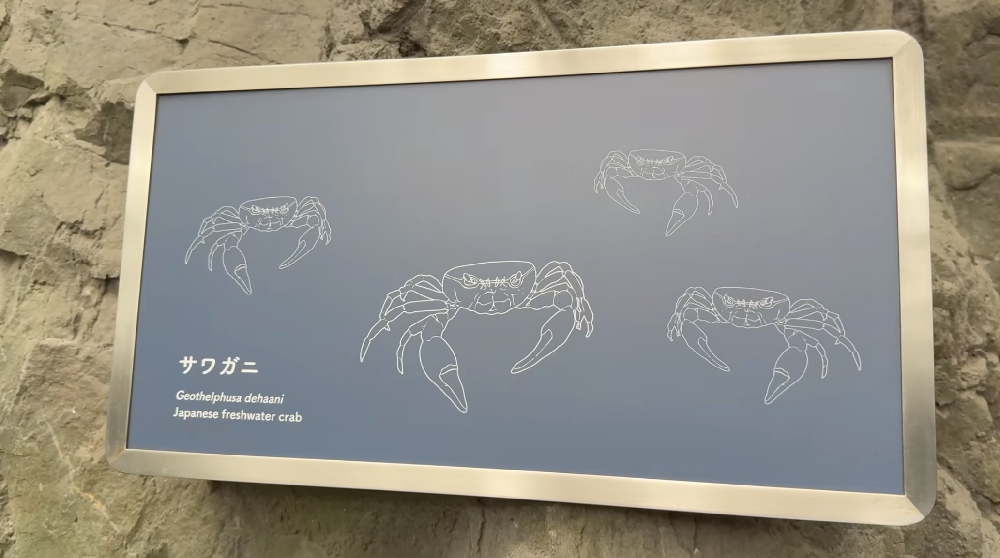
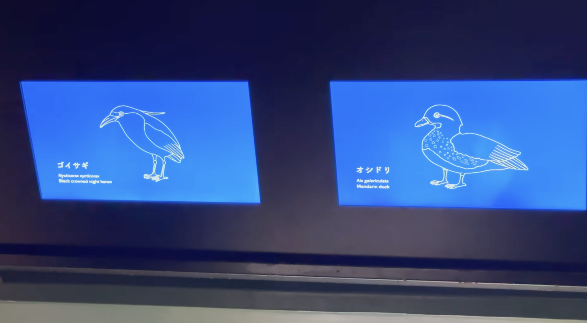
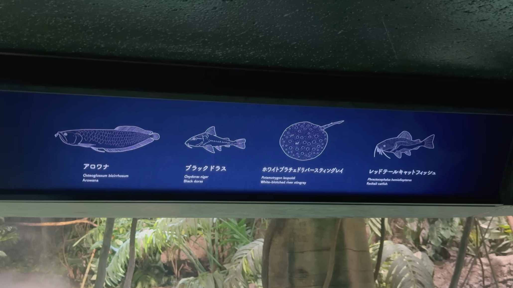
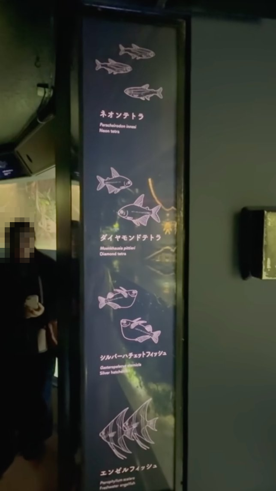

# 動作確認用のサンプル写真

海遊館で撮った展示の写真です。海遊館に行けなくても、この写真を LINE Bot に送れば、現地で撮ったときと同じように動きます。

まだ Bot を追加していなければ、先に LINE で友だち追加してください（Bot ID: `@894sfbup`、スマホなら https://line.me/R/ti/p/@894sfbup を開いて「追加」）。

## 送り方（コピーして LINE に貼り付ける）

### スマホ

1. 下の写真をタップして開き、写真を長押しして「コピー」を選ぶ
2. LINE アプリで Bot とのトークを開く
3. メッセージの入力欄を長押しして「ペースト」を選び、送信する

※ 長押しでコピーできないときは、「写真を保存」してから、LINE のトークで写真ボタンから送ってください。

### PC

1. 写真を右クリックして「画像をコピー」を選ぶ
2. PC 版 LINE で Bot とのトークを開き、入力欄に貼り付けて（Ctrl+V / ⌘V）送信する

## サンプル

### 01 サワガニ（日本の森）

1種だけの解説パネルです。送ると、サワガニの候補カードが出ます。

### 02 ゴイサギ・オシドリ（日本の森）

2種が並んだパネルです。送ると、2種の候補カードが出ます。

### 03 アロワナなど4種（エクアドル熱帯雨林）

4種が横に並んだパネルです。送ると、アロワナ・ホワイトブラチェドリバースティングレイ・レッドテールキャットフィッシュの候補カードが出ます。

### 04 ネオンテトラなど4種（エクアドル熱帯雨林）

縦長のパネルです。送ると、エンゼルフィッシュの候補カードが出ます。

### 05 日本海溝（すいそうの看板）

生きものの名前ではなく、すいそうの名前だけが書かれた看板です。送ると、日本海溝のすいそうにいる生きものが出ます（メニューの「水槽から探す」と同じ動き）。

## 補足

- 図鑑に登録できるのは、海遊館の 243 種です。パネルに書かれていても 243 種に入っていない種（03 のブラックドラス、04 のネオンテトラなど）は、候補に出ません。
- 写真がなくても、「ジンベエ」のような生きものの名前や、「太平洋」のようなすいそうの名前を文字で送っても探せます。
